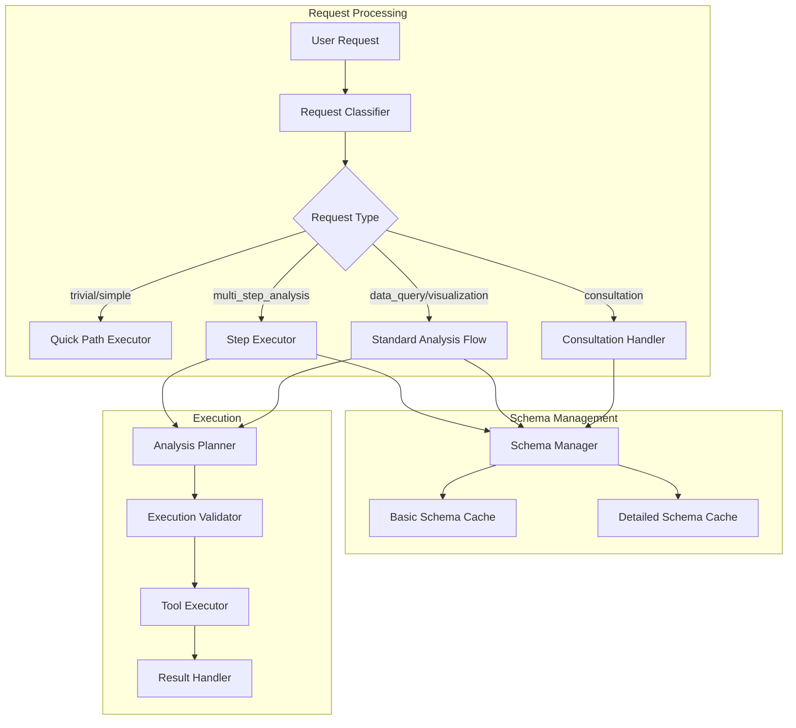

# Design Document: Agent Analysis Optimization

## Overview

本设计文档描述了Agent分析流程优化的技术实现方案。优化目标是提高agent分析效率，减少不必要的工具调用，并支持更智能的请求分类和分步执行机制。

基于对现有代码（`analysis_planner.go`、`eino.go`、`datasource_tool.go`）和执行轨迹的分析，本设计将：
1. 增强 `AnalysisPlanner` 以支持新的请求类型分类
2. 优化 `DataSourceContextTool` 以支持分级Schema获取
3. 新增 `StepExecutor` 组件支持分步执行
4. 新增 `ExecutionValidator` 组件验证执行计划

## Architecture



## Components and Interfaces

### 1. Enhanced Request Classifier

扩展现有的 `AnalysisPlanner` 中的请求分类逻辑。

```go
// RequestType represents the classification of a user request
type RequestType string

const (
    RequestTypeTrivial          RequestType = "trivial"           // 无需工具调用
    RequestTypeSimple           RequestType = "simple"            // 1次工具调用
    RequestTypeDataQuery        RequestType = "data_query"        // 数据查询
    RequestTypeVisualization    RequestType = "visualization"     // 可视化
    RequestTypeCalculation      RequestType = "calculation"       // 计算
    RequestTypeWebSearch        RequestType = "web_search"        // 网络搜索
    RequestTypeConsultation     RequestType = "consultation"      // 咨询建议
    RequestTypeMultiStepAnalysis RequestType = "multi_step_analysis" // 多步骤分析
)

// RequestClassifier classifies user requests
type RequestClassifier struct {
    consultationKeywords []string
    multiStepKeywords    []string
}

// ClassifyRequest analyzes the request and returns its type
func (c *RequestClassifier) ClassifyRequest(query string, dataSourceInfo string) RequestType

// IsConsultationRequest checks if the request is asking for suggestions/advice
func (c *RequestClassifier) IsConsultationRequest(query string) bool
```

### 2. Schema Manager

新增Schema管理器，支持分级获取和缓存。

```go
// SchemaLevel represents the detail level of schema information
type SchemaLevel string

const (
    SchemaLevelBasic    SchemaLevel = "basic"    // 只有表名和描述
    SchemaLevelDetailed SchemaLevel = "detailed" // 完整字段信息
)

// SchemaCache represents cached schema information
type SchemaCache struct {
    DataSourceID string
    Level        SchemaLevel
    Content      string
    CachedAt     time.Time
    TTL          time.Duration
}

// SchemaManager manages schema fetching and caching
type SchemaManager struct {
    dsService    *DataSourceService
    basicCache   map[string]*SchemaCache
    detailedCache map[string]*SchemaCache
    defaultTTL   time.Duration // 30 minutes
    mu           sync.RWMutex
}

// GetSchema returns schema at the appropriate level based on request type
func (m *SchemaManager) GetSchema(ctx context.Context, dataSourceID string, level SchemaLevel) (string, bool, error)

// GetSchemaLevel determines the appropriate schema level for a request type
func (m *SchemaManager) GetSchemaLevel(requestType RequestType) SchemaLevel

// InvalidateCache invalidates cache for a data source
func (m *SchemaManager) InvalidateCache(dataSourceID string)
```

### 3. Step Executor

新增分步执行器，支持复杂分析的分步执行。

```go
// StepResult represents the result of a single step execution
type StepResult struct {
    StepNum     int
    Success     bool
    Output      string
    Duration    time.Duration
    ShouldRetry bool
    NextAction  StepAction // proceed, modify, skip
}

// StepAction represents what to do after a step
type StepAction string

const (
    StepActionProceed StepAction = "proceed"
    StepActionModify  StepAction = "modify"
    StepActionSkip    StepAction = "skip"
    StepActionAbort   StepAction = "abort"
)

// StepExecutor executes analysis steps with intermediate validation
type StepExecutor struct {
    planner    *AnalysisPlanner
    validator  *ExecutionValidator
    maxRetries int
    logger     func(string)
}

// ExecuteSteps executes a multi-step analysis plan
func (e *StepExecutor) ExecuteSteps(ctx context.Context, plan *AnalysisPlan, onProgress func(step int, total int, result *StepResult)) (*AnalysisResult, error)

// EvaluateStepResult evaluates a step result and determines next action
func (e *StepExecutor) EvaluateStepResult(step *PlanStep, result *StepResult) StepAction
```

### 4. Execution Validator

新增执行验证器，验证计划合理性并跟踪偏差。

```go
// ExecutionMetrics tracks execution statistics
type ExecutionMetrics struct {
    PlannedCalls   int
    ActualCalls    int
    PlannedSteps   []string
    ActualSteps    []string
    DeviationScore float64 // 0.0 = perfect match, 1.0 = completely different
    Warnings       []string
}

// ExecutionValidator validates execution plans and tracks deviations
type ExecutionValidator struct {
    logger func(string)
}

// ValidatePlan validates that a plan is consistent with request type
func (v *ExecutionValidator) ValidatePlan(plan *AnalysisPlan, requestType RequestType) (*AnalysisPlan, []string)

// TrackExecution records actual tool calls during execution
func (v *ExecutionValidator) TrackExecution(plan *AnalysisPlan, toolName string, stepNum int)

// GetMetrics returns execution metrics after completion
func (v *ExecutionValidator) GetMetrics() *ExecutionMetrics

// LogDeviations logs warnings if execution deviated significantly from plan
func (v *ExecutionValidator) LogDeviations()
```

### 5. Enhanced Analysis Planner

扩展现有的 `AnalysisPlan` 结构。

```go
// Enhanced AnalysisPlan with new fields
type AnalysisPlan struct {
    // Existing fields
    TaskType       string     `json:"task_type"`
    Complexity     string     `json:"complexity"`
    Steps          []PlanStep `json:"steps"`
    EstimatedCalls int        `json:"estimated_calls"`
    IsQuickPath    bool       `json:"is_quick_path"`
    QuickPathCode  string     `json:"quick_path_code,omitempty"`
    NeedsSchema    bool       `json:"needs_schema"`
    NeedsSQL       bool       `json:"needs_sql"`
    NeedsPython    bool       `json:"needs_python"`
    NeedsWebSearch bool       `json:"needs_web_search"`
    OutputFormat   string     `json:"output_format"`
    
    // New fields
    RequestType    RequestType `json:"request_type"`
    SchemaLevel    SchemaLevel `json:"schema_level"`
    IsMultiStep    bool        `json:"is_multi_step"`
    Checkpoints    []int       `json:"checkpoints,omitempty"` // Step numbers that are checkpoints
}

// Enhanced PlanStep with more precise information
type PlanStep struct {
    StepNum          int      `json:"step_num"`
    Tool             string   `json:"tool"`              // Exact tool name
    Purpose          string   `json:"purpose"`
    Input            string   `json:"input"`
    DependsOn        []int    `json:"depends_on"`
    EstimatedDuration int     `json:"estimated_duration_ms,omitempty"`
    SchemaLevel      string   `json:"schema_level,omitempty"`      // For get_data_source_context
    QueryType        string   `json:"query_type,omitempty"`        // For execute_sql
    IsCheckpoint     bool     `json:"is_checkpoint,omitempty"`
}
```

## Data Models

### Request Classification Patterns

```go
// ConsultationPatterns defines patterns for consultation requests
var ConsultationPatterns = []string{
    "建议",
    "分析方向",
    "可以做什么分析",
    "分析思路",
    "怎么分析",
    "分析维度",
    "有什么洞察",
    "suggest",
    "recommendation",
    "what analysis",
    "how to analyze",
}

// MultiStepPatterns defines patterns for multi-step analysis
var MultiStepPatterns = []string{
    "全面分析",
    "深入分析",
    "综合分析",
    "多维度分析",
    "详细分析",
    "complete analysis",
    "comprehensive analysis",
    "in-depth analysis",
}
```

### Schema Level Mapping

```go
// SchemaLevelMapping maps request types to schema levels
var SchemaLevelMapping = map[RequestType]SchemaLevel{
    RequestTypeTrivial:           SchemaLevelBasic,
    RequestTypeSimple:            SchemaLevelBasic,
    RequestTypeConsultation:      SchemaLevelBasic,
    RequestTypeDataQuery:         SchemaLevelDetailed,
    RequestTypeVisualization:     SchemaLevelDetailed,
    RequestTypeCalculation:       SchemaLevelBasic,
    RequestTypeWebSearch:         SchemaLevelBasic,
    RequestTypeMultiStepAnalysis: SchemaLevelDetailed,
}
```


## Correctness Properties

*A property is a characteristic or behavior that should hold true across all valid executions of a system—essentially, a formal statement about what the system should do. Properties serve as the bridge between human-readable specifications and machine-verifiable correctness guarantees.*

### Property 1: Request Classification Validity

*For any* user request string, the Request_Classifier SHALL return a value that is one of the defined RequestType constants (`trivial`, `simple`, `data_query`, `visualization`, `calculation`, `web_search`, `consultation`, `multi_step_analysis`).

**Validates: Requirements 1.1**

### Property 2: Consultation Requests Exclude SQL

*For any* request classified as `consultation`, the resulting AnalysisPlan SHALL NOT contain any PlanStep with Tool equal to `execute_sql`.

**Validates: Requirements 1.2, 5.1**

### Property 3: Multi-Step Requests Have Checkpoints

*For any* request classified as `multi_step_analysis`, the resulting AnalysisPlan SHALL have at least one checkpoint (Checkpoints array is non-empty).

**Validates: Requirements 1.3**

### Property 4: Quick Path Detection Consistency

*For any* request string that matches quick path patterns (time queries, simple calculations, unit conversions), the Request_Classifier SHALL return either `trivial` or `simple`.

**Validates: Requirements 1.4**

### Property 5: Consultation Keyword Detection

*For any* request string containing consultation keywords ("建议", "分析方向", "可以做什么分析", etc.), the Request_Classifier SHALL return `consultation`.

**Validates: Requirements 1.5**

### Property 6: Schema Level Mapping Correctness

*For any* RequestType, the SchemaManager.GetSchemaLevel method SHALL return `basic` for types (`trivial`, `simple`, `consultation`, `calculation`, `web_search`) and `detailed` for types (`data_query`, `visualization`, `multi_step_analysis`).

**Validates: Requirements 2.1, 2.2, 2.4**

### Property 7: Schema Cache Round-Trip

*For any* data source ID and schema level, if GetSchema is called twice within the TTL period, the second call SHALL return the same content as the first call and indicate a cache hit.

**Validates: Requirements 2.3, 7.1, 7.2, 7.4**

### Property 8: Single-Call Detailed Schema Fetch

*For any* detailed schema fetch request, the Schema_Manager SHALL make at most one call to get_data_source_context with the table_names parameter populated.

**Validates: Requirements 2.5**

### Property 9: Sequential Step Execution Order

*For any* multi-step analysis execution, the Step_Executor SHALL execute steps in ascending StepNum order, and no step N+1 SHALL begin before step N completes.

**Validates: Requirements 3.1**

### Property 10: Step Evaluation Completeness

*For any* completed step in a multi-step execution, the Step_Executor SHALL call EvaluateStepResult and return a valid StepAction.

**Validates: Requirements 3.2**

### Property 11: Progress Update Emission

*For any* step execution in a multi-step analysis, the onProgress callback SHALL be invoked after the step completes.

**Validates: Requirements 3.3**

### Property 12: Step Retry Limit Enforcement

*For any* step that fails, the Step_Executor SHALL retry at most 3 times before marking the step as failed.

**Validates: Requirements 3.4, 3.5**

### Property 13: Plan Validation and Correction

*For any* AnalysisPlan created for a `consultation` request that incorrectly contains `execute_sql`, the Execution_Validator.ValidatePlan SHALL remove the SQL step and return a warning.

**Validates: Requirements 4.1, 4.2**

### Property 14: Execution Tracking Completeness

*For any* tool call made during plan execution, the Execution_Validator SHALL record it in ActualSteps.

**Validates: Requirements 4.3, 4.4**

### Property 15: Deviation Warning Threshold

*For any* execution where DeviationScore exceeds 0.5, the Execution_Validator SHALL log a warning.

**Validates: Requirements 4.5**

### Property 16: Consultation Suggestion Content

*For any* consultation response, the generated suggestions SHALL include at least one analysis dimension, one visualization recommendation, and one example query.

**Validates: Requirements 5.3**

### Property 17: Consultation Tool Call Limit

*For any* consultation request execution, the total number of tool calls SHALL be at most 1.

**Validates: Requirements 5.4**

### Property 18: Exact Tool Names in Plans

*For any* PlanStep in an AnalysisPlan, the Tool field SHALL be one of the exact tool names: `get_data_source_context`, `execute_sql`, `python_executor`, `web_search`, `web_fetch`.

**Validates: Requirements 6.1**

### Property 19: Plan Step Completeness

*For any* PlanStep with Tool `get_data_source_context`, the SchemaLevel field SHALL be non-empty. *For any* PlanStep with Tool `execute_sql`, the QueryType field SHALL be non-empty.

**Validates: Requirements 6.2, 6.3, 6.4**

### Property 20: Cache Invalidation on Structure Change

*For any* data source whose structure has changed (detected via metadata), calling InvalidateCache SHALL result in subsequent GetSchema calls fetching fresh data.

**Validates: Requirements 7.3**

### Property 21: Cache Hit Logging

*For any* cache hit in GetSchema, the system SHALL log a message containing "cache hit" or "[Using cached schema]".

**Validates: Requirements 7.5**

## Error Handling

### Request Classification Errors

| Error Condition | Handling Strategy |
|----------------|-------------------|
| Empty request string | Return `trivial` type with warning |
| Unrecognized request pattern | Fall back to `data_query` type |
| LLM classification failure | Use rule-based fallback classification |

### Schema Management Errors

| Error Condition | Handling Strategy |
|----------------|-------------------|
| Data source not found | Return error with clear message |
| Schema fetch timeout | Return cached schema if available, else error |
| Cache corruption | Invalidate cache and retry fetch |
| Database connection failure | Return error with retry suggestion |

### Step Execution Errors

| Error Condition | Handling Strategy |
|----------------|-------------------|
| Step execution timeout | Mark step as failed, attempt retry |
| Tool call failure | Log error, attempt retry up to 3 times |
| Intermediate result validation failure | Adjust next step or skip |
| All retries exhausted | Mark step as failed, continue with remaining steps if possible |

### Execution Validation Errors

| Error Condition | Handling Strategy |
|----------------|-------------------|
| Plan validation failure | Log warning, attempt auto-correction |
| Tracking data inconsistency | Log warning, continue execution |
| Metrics calculation error | Log error, return partial metrics |

## Testing Strategy

### Unit Tests

Unit tests will focus on specific examples and edge cases:

1. **Request Classifier Tests**
   - Test classification of known consultation keywords
   - Test quick path pattern detection
   - Test edge cases (empty strings, mixed patterns)

2. **Schema Manager Tests**
   - Test cache hit/miss scenarios
   - Test TTL expiration
   - Test separate basic/detailed caching

3. **Step Executor Tests**
   - Test sequential execution order
   - Test retry behavior
   - Test progress callback invocation

4. **Execution Validator Tests**
   - Test plan validation rules
   - Test deviation calculation
   - Test warning threshold

### Property-Based Tests

Property-based tests will verify universal properties across all inputs. Each test will run a minimum of 100 iterations.

**Testing Framework**: Go's `testing/quick` package for property-based testing.

**Test Configuration**:
- Minimum 100 iterations per property test
- Each test tagged with property reference

**Property Test Implementation**:

```go
// Feature: agent-analysis-optimization, Property 1: Request Classification Validity
func TestProperty_RequestClassificationValidity(t *testing.T) {
    classifier := NewRequestClassifier()
    validTypes := map[RequestType]bool{
        RequestTypeTrivial: true, RequestTypeSimple: true,
        RequestTypeDataQuery: true, RequestTypeVisualization: true,
        RequestTypeCalculation: true, RequestTypeWebSearch: true,
        RequestTypeConsultation: true, RequestTypeMultiStepAnalysis: true,
    }
    
    f := func(query string) bool {
        result := classifier.ClassifyRequest(query, "")
        return validTypes[result]
    }
    
    if err := quick.Check(f, &quick.Config{MaxCount: 100}); err != nil {
        t.Error(err)
    }
}

// Feature: agent-analysis-optimization, Property 2: Consultation Requests Exclude SQL
func TestProperty_ConsultationExcludesSQL(t *testing.T) {
    planner := NewAnalysisPlanner(nil, nil)
    
    f := func(query string) bool {
        // Ensure query is classified as consultation
        query = "请给我一些分析建议: " + query
        plan, _ := planner.PlanAnalysis(context.Background(), query, "")
        if plan.RequestType != RequestTypeConsultation {
            return true // Skip non-consultation requests
        }
        for _, step := range plan.Steps {
            if step.Tool == "execute_sql" {
                return false
            }
        }
        return true
    }
    
    if err := quick.Check(f, &quick.Config{MaxCount: 100}); err != nil {
        t.Error(err)
    }
}

// Feature: agent-analysis-optimization, Property 7: Schema Cache Round-Trip
func TestProperty_SchemaCacheRoundTrip(t *testing.T) {
    manager := NewSchemaManager(mockDSService, 30*time.Minute)
    
    f := func(dataSourceID string, level SchemaLevel) bool {
        if dataSourceID == "" {
            return true // Skip empty IDs
        }
        
        // First call
        content1, cached1, err1 := manager.GetSchema(context.Background(), dataSourceID, level)
        if err1 != nil {
            return true // Skip errors
        }
        
        // Second call (should be cached)
        content2, cached2, err2 := manager.GetSchema(context.Background(), dataSourceID, level)
        if err2 != nil {
            return true
        }
        
        return content1 == content2 && !cached1 && cached2
    }
    
    if err := quick.Check(f, &quick.Config{MaxCount: 100}); err != nil {
        t.Error(err)
    }
}

// Feature: agent-analysis-optimization, Property 12: Step Retry Limit Enforcement
func TestProperty_StepRetryLimit(t *testing.T) {
    executor := NewStepExecutor(nil, nil, 3, nil)
    
    f := func(stepNum int) bool {
        step := &PlanStep{StepNum: stepNum, Tool: "execute_sql"}
        retryCount := 0
        
        // Simulate failures
        for i := 0; i < 10; i++ {
            result := &StepResult{Success: false, ShouldRetry: true}
            action := executor.EvaluateStepResult(step, result)
            if action == StepActionProceed {
                retryCount++
            } else {
                break
            }
        }
        
        return retryCount <= 3
    }
    
    if err := quick.Check(f, &quick.Config{MaxCount: 100}); err != nil {
        t.Error(err)
    }
}
```

### Integration Tests

Integration tests will verify end-to-end flows:

1. **Consultation Request Flow**
   - Submit consultation request
   - Verify only basic schema is fetched
   - Verify no SQL execution
   - Verify suggestions are generated

2. **Multi-Step Analysis Flow**
   - Submit complex analysis request
   - Verify step-by-step execution
   - Verify progress updates
   - Verify checkpoint handling

3. **Cache Integration**
   - Verify cache across multiple requests
   - Verify cache invalidation
   - Verify TTL behavior
