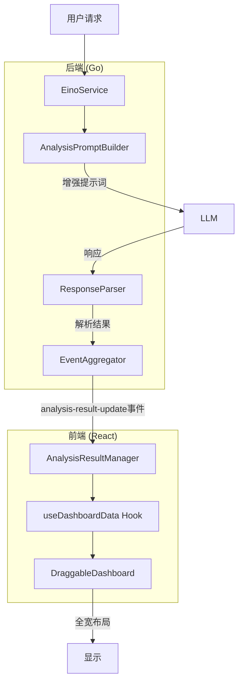

# Design Document: Analysis Dashboard Optimization

## Overview

本设计文档描述了分析逻辑与仪表盘数据显示优化功能的技术实现方案。该功能通过三个主要改进来提升用户体验：

1. **增强分析提示词** - 在AnalysisPromptBuilder中添加更强的可视化生成指令
2. **优化数据传递链路** - 确保EventAggregator到AnalysisResultManager的数据完整性
3. **全宽布局优化** - 修改DraggableDashboard的默认布局配置

## Architecture



## Components and Interfaces

### 1. AnalysisPromptBuilder (增强)

**文件**: `src/agent/analysis_prompt_builder.go`

**职责**: 构建发送给LLM的分析提示词，强调可视化生成要求

**接口变更**:

```go
// BuildPromptWithHints 构建带有分类提示的提示词
// 增强：添加更强的可视化生成指令
func (b *AnalysisPromptBuilder) BuildPromptWithHints(
    userRequest string, 
    schemaContext *UnifiedSchemaContext, 
    outputFormat string, 
    hints *ClassificationResult,
) string

// 新增：获取可视化强调级别
func (b *AnalysisPromptBuilder) GetVisualizationEmphasis(hints *ClassificationResult) string
```

**关键改进**:
- 在"分析要求"部分添加⭐⭐⭐标记强调可视化必须生成
- 添加具体的图表类型推荐（折线图、柱状图、饼图等）
- 添加完整的代码示例展示正确的图表保存模式
- 添加"重要警告"部分强调FILES_DIR的使用

### 2. EventAggregator (验证增强)

**文件**: `src/event_aggregator.go`

**职责**: 聚合分析结果并发送到前端

**接口变更**:

```go
// ValidateItem 验证分析结果项
// 增强：添加更详细的验证日志
func (ea *EventAggregator) ValidateItem(
    sessionID, messageID, requestID string, 
    itemType string, 
    data interface{},
) ItemValidationResult

// AddItem 添加项目到待处理批次
// 增强：添加数据完整性检查
func (ea *EventAggregator) AddItem(
    sessionID, messageID, requestID string, 
    itemType string, 
    data interface{}, 
    metadata map[string]interface{},
)
```

**关键改进**:
- 增强验证日志，记录所有添加的数据项
- 添加数据类型检查，确保数据格式正确
- 优化批量刷新逻辑，确保数据不丢失

### 3. DraggableDashboard (布局优化)

**文件**: `src/frontend/src/components/DraggableDashboard.tsx`

**职责**: 显示分析结果的可拖拽仪表盘

**接口变更**:

```typescript
// LayoutItem 布局项接口
interface LayoutItem {
    id: string;
    type: 'metric' | 'insight' | 'chart' | 'table' | 'image' | 'file_download';
    x: number;
    y: number;
    w: number;  // 默认改为100（全宽）
    h: number;
    data: any;
}

// 默认布局配置
const defaultLayout: LayoutItem[] = [
    { id: 'metric-area', type: 'metric', x: 0, y: 0, w: 100, h: 72, data: null },
    { id: 'chart-area', type: 'chart', x: 0, y: 90, w: 100, h: 96, data: null },
    { id: 'insight-area', type: 'insight', x: 0, y: 200, w: 100, h: 67, data: null },
    { id: 'table-area', type: 'table', x: 0, y: 290, w: 100, h: 67, data: null },
    { id: 'image-area', type: 'image', x: 0, y: 370, w: 100, h: 72, data: null },
    { id: 'file_download-area', type: 'file_download', x: 0, y: 450, w: 100, h: 67, data: null },
];
```

**关键改进**:
- 所有布局项默认宽度设为100（全宽）
- 垂直堆叠布局，每个组件占满整行
- 保持编辑模式下的调整能力

### 4. ResponseParser (app.go中的解析逻辑)

**文件**: `src/app.go`

**职责**: 解析LLM响应，提取可视化数据

**关键改进**:
- 确保所有json:echarts代码块都被提取
- 确保所有base64图片都被提取
- 确保所有json:table代码块都被提取
- 添加对Python生成的图表文件的检测

## Data Models

### AnalysisResultItem

```typescript
interface AnalysisResultItem {
    id: string;
    type: 'echarts' | 'image' | 'table' | 'csv' | 'metric' | 'insight' | 'file';
    data: any;
    metadata: {
        sessionId: string;
        messageId: string;
        timestamp: number;
        fileName?: string;
    };
    source: 'realtime' | 'completed' | 'cached' | 'restored';
}
```

### AnalysisResultBatch

```typescript
interface AnalysisResultBatch {
    sessionId: string;
    messageId: string;
    requestId: string;
    items: AnalysisResultItem[];
    isComplete: boolean;
    timestamp: number;
}
```

### LayoutConfiguration

```typescript
interface LayoutConfiguration {
    id: string;
    userId: string;
    isLocked: boolean;
    items: LayoutItem[];
    createdAt: number;
    updatedAt: number;
}
```


## Correctness Properties

*A property is a characteristic or behavior that should hold true across all valid executions of a system—essentially, a formal statement about what the system should do. Properties serve as the bridge between human-readable specifications and machine-verifiable correctness guarantees.*

### Property 1: Prompt Content Completeness

*For any* user analysis request and schema context, the generated prompt SHALL contain:
- A "分析要求" section with ⭐⭐⭐ markers for visualization
- plt.savefig() instructions for chart saving
- FILES_DIR and os.path.join() usage instructions
- A "重要警告" section about file saving
- Code examples showing correct chart saving patterns

**Validates: Requirements 1.1, 1.5, 1.6, 2.1, 2.3, 2.4, 2.5**

### Property 2: Classification Hints Affect Prompt

*For any* classification result with NeedsVisualization=true, the generated prompt SHALL include chart type recommendations based on SuggestedChartType.

**Validates: Requirements 2.2**

### Property 3: EventAggregator Data Capture

*For any* valid data item (echarts, image, or table), when added to EventAggregator and flushed, the item SHALL appear in the emitted batch with correct type and data.

**Validates: Requirements 3.1, 3.2, 3.3**

### Property 4: AnalysisResultManager Data Storage

*For any* AnalysisResultBatch received by AnalysisResultManager, all items SHALL be stored with their original sessionId and messageId preserved.

**Validates: Requirements 3.4**

### Property 5: Graceful Degradation on Empty IDs

*For any* data item with empty sessionId or messageId, the EventAggregator SHALL log a warning but still process the item without throwing an error.

**Validates: Requirements 3.5**

### Property 6: Response Parsing Completeness

*For any* LLM response containing N json:echarts blocks, M base64 images, and K json:table blocks, the parser SHALL extract exactly N + M + K items (all items, not just the first of each type).

**Validates: Requirements 4.1, 4.2, 4.3, 4.6**

### Property 7: JSON Error Logging

*For any* invalid JSON content in a response, the parser SHALL log an error message containing at most the first 500 characters of the problematic content.

**Validates: Requirements 4.5**

### Property 8: Layout Configuration Integrity

*For any* LayoutItem, the configuration SHALL include valid x, y, w, h numeric values, and new items SHALL default to w=100.

**Validates: Requirements 5.2, 5.3, 6.5**

### Property 9: Layout Persistence Round-Trip

*For any* valid LayoutConfiguration, saving then loading SHALL produce an equivalent configuration (round-trip property).

**Validates: Requirements 6.1, 6.2**

### Property 10: Error Events Include Recovery Suggestions

*For any* error emitted by EventAggregator, the error event SHALL include a non-empty recoverySuggestions array.

**Validates: Requirements 7.4**

### Property 11: Session Switching Clears Data

*For any* session switch from sessionA to sessionB, the AnalysisResultManager SHALL clear all data from sessionA before loading sessionB data.

**Validates: Requirements 7.5**

### Property 12: Data Type Processing

*For any* metric, insight, or file data item, the AnalysisResultManager SHALL correctly normalize and store the data with all required fields preserved.

**Validates: Requirements 8.4, 8.5, 8.6**

## Error Handling

### Backend Error Handling

1. **Prompt Generation Errors**
   - If schema context is invalid, log error and use minimal prompt
   - If hints are malformed, ignore hints and generate default prompt

2. **EventAggregator Errors**
   - If data validation fails, log warning but continue (graceful degradation)
   - If flush fails, retry once then log error

3. **Response Parsing Errors**
   - If JSON parsing fails, log error with truncated content
   - If regex matching fails, continue to next pattern
   - If file reading fails, skip file and continue

### Frontend Error Handling

1. **AnalysisResultManager Errors**
   - If data normalization fails, log warning and skip item
   - If storage fails, emit error event with recovery suggestions

2. **Dashboard Errors**
   - If layout loading fails, use default layout
   - If component rendering fails, show error placeholder

## Testing Strategy

### Unit Tests

1. **AnalysisPromptBuilder Tests**
   - Test prompt contains required sections
   - Test hints affect prompt content
   - Test default behavior without hints

2. **EventAggregator Tests**
   - Test AddItem with valid data
   - Test AddItem with empty IDs (graceful degradation)
   - Test FlushNow returns all items
   - Test batch aggregation completeness

3. **Response Parser Tests**
   - Test extraction of json:echarts blocks
   - Test extraction of base64 images
   - Test extraction of json:table blocks
   - Test multiple items extraction

4. **AnalysisResultManager Tests**
   - Test data storage with correct IDs
   - Test session switching clears data
   - Test data normalization

5. **Layout Tests**
   - Test default layout has w=100
   - Test layout save/load round-trip

### Property-Based Tests

Property-based tests will use:
- **Go**: `testing/quick` package for backend tests
- **TypeScript**: `fast-check` library for frontend tests

Each property test will run minimum 100 iterations.

**Test Configuration**:
```go
// Go property test example
func TestPromptContentCompleteness(t *testing.T) {
    // Feature: analysis-dashboard-optimization, Property 1: Prompt Content Completeness
    f := func(userRequest string, hasHints bool) bool {
        // Generate prompt and verify required sections
        // ...
    }
    if err := quick.Check(f, nil); err != nil {
        t.Error(err)
    }
}
```

```typescript
// TypeScript property test example
describe('EventAggregator Data Capture', () => {
    // Feature: analysis-dashboard-optimization, Property 3: EventAggregator Data Capture
    it('should capture all data items', () => {
        fc.assert(fc.property(
            fc.array(fc.record({
                type: fc.constantFrom('echarts', 'image', 'table'),
                data: fc.string()
            })),
            (items) => {
                // Add items and verify all are captured
                // ...
            }
        ), { numRuns: 100 });
    });
});
```

### Integration Tests

1. **End-to-End Data Flow**
   - Test complete flow from user request to dashboard display
   - Verify no data loss in the pipeline

2. **Layout Persistence**
   - Test layout save and restore across sessions
   - Verify layout survives application restart
