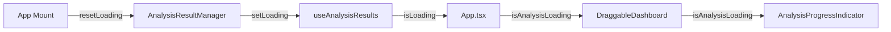

# Design Document: Analysis Progress Indicator

## Overview

本设计文档描述了在智能分析仪表盘标题右侧添加分析进行中指示器的技术实现方案。

**重要变更**: 由于现有的 `isAnalysisLoading` 状态管理不可靠（取消分析后关闭程序仍会显示加载状态），本设计采用新的可靠状态管理方案。

## 问题分析

### 现有状态管理的问题

1. **状态依赖多个事件清除**: `isLoading` 状态依赖 `analysis-completed`、`analysis-cancelled`、`analysis-error` 等多个事件来清除
2. **事件可能丢失**: 如果用户取消分析后快速关闭程序，事件可能没有被正确处理
3. **无启动时重置**: 应用启动时没有重置加载状态的机制
4. **状态不持久但也不重置**: 状态存储在内存中，重启后应该是 false，但实际可能因为事件处理顺序问题导致状态不正确

### 解决方案

采用**前端本地状态 + 应用启动时重置**的方案：

1. 在 `AnalysisResultManager` 初始化时确保 `isLoading` 为 `false`
2. 在 App.tsx 组件挂载时显式重置加载状态
3. 添加超时机制：如果加载状态持续超过一定时间（如 60 秒），自动重置

## Architecture

### 组件层次结构

```
DraggableDashboard
├── Dashboard Header (顶部标题栏)
│   ├── 左侧区域
│   │   ├── 编辑布局按钮
│   │   ├── 分隔线
│   │   └── 标题区域
│   │       ├── 标题文字 "智能分析仪表盘"
│   │       ├── 编辑中标签 (编辑模式)
│   │       └── **AnalysisProgressIndicator** (新增)
│   └── 右侧区域
│       └── 导出按钮
└── Dashboard Content
```

### 数据流



## Components and Interfaces

### AnalysisProgressIndicator 组件

由于该组件非常简单，将直接在 DraggableDashboard 组件内部实现，无需创建独立组件文件。

#### Props Interface

```typescript
// 内联实现，使用父组件的 isAnalysisLoading prop
interface DraggableDashboardProps {
    // ... 现有 props
    isAnalysisLoading?: boolean;  // 已存在
}
```

#### 渲染逻辑

```typescript
// 在标题区域内，标题文字后面添加
{isAnalysisLoading && (
    <div className="flex items-center gap-2 ml-3 px-3 py-1 bg-blue-50 border border-blue-200 rounded-full">
        <div className="w-4 h-4 border-2 border-blue-200 border-t-blue-600 rounded-full animate-spin" />
        <span className="text-sm text-blue-600 font-medium">
            {t('analysis_in_progress')}
        </span>
    </div>
)}
```

### 国际化配置

在 `src/frontend/src/i18n.ts` 中添加翻译键：

```typescript
// English
'analysis_in_progress': 'Analysis in progress',

// 简体中文
'analysis_in_progress': '分析进行中',
```

## Data Models

本功能不涉及新的数据模型。使用现有的 `isAnalysisLoading` boolean 状态，但增加可靠性保障。

### 状态来源

- **isAnalysisLoading**: 从 `useAnalysisResults` hook 获取，由 `AnalysisResultManager` 管理
- 状态变化触发场景：
  - 分析开始时设置为 `true`
  - 分析完成时设置为 `false`
  - 分析取消时设置为 `false`
  - 分析出错时设置为 `false`
  - **应用启动时重置为 `false`**（新增）
  - **超时自动重置为 `false`**（新增，60秒超时）

### 状态可靠性保障

```typescript
// 在 App.tsx 组件挂载时重置加载状态
useEffect(() => {
    // 应用启动时，确保加载状态为 false
    manager.setLoading(false);
    logger.info('Loading state reset on app mount');
}, []);

// 加载状态超时保护
useEffect(() => {
    if (analysisResults.isLoading) {
        const timeoutId = setTimeout(() => {
            logger.warn('Loading state timeout - auto resetting');
            manager.setLoading(false);
        }, 60000); // 60秒超时
        
        return () => clearTimeout(timeoutId);
    }
}, [analysisResults.isLoading]);
```

## Correctness Properties

*A property is a characteristic or behavior that should hold true across all valid executions of a system—essentially, a formal statement about what the system should do. Properties serve as the bridge between human-readable specifications and machine-verifiable correctness guarantees.*

### Property 1: Indicator Visibility Matches Loading State

*For any* boolean value of `isAnalysisLoading`, the Analysis_Progress_Indicator visibility SHALL match the loading state: visible when true, hidden when false.

**Validates: Requirements 1.1, 1.2, 4.1, 4.2, 4.3, 4.4**

### Property 2: Internationalization Text Correctness

*For any* supported language (English or Chinese), the Analysis_Progress_Indicator text SHALL display the correct translation for the key 'analysis_in_progress'.

**Validates: Requirements 3.1, 3.2**

### Property 3: Loading State Reset on App Mount

*For any* application startup, the loading state SHALL be reset to `false` immediately after the App component mounts.

**Validates: Requirements 4.2, 4.3, 4.4**

### Property 4: Loading State Timeout Protection

*For any* loading state that persists longer than 60 seconds, the loading state SHALL be automatically reset to `false`.

**Validates: Requirements 4.2, 4.3, 4.4**

## Error Handling

### 边界情况

1. **isAnalysisLoading 为 undefined**: 组件应将其视为 `false`，不显示指示器
2. **翻译键缺失**: 使用 i18n 的 fallback 机制，显示键名本身

### 错误恢复

由于该组件是纯展示组件，不涉及复杂的错误处理。主要依赖 React 的错误边界机制。

## Testing Strategy

### 单元测试

1. **组件渲染测试**
   - 测试 `isAnalysisLoading=true` 时指示器可见
   - 测试 `isAnalysisLoading=false` 时指示器不可见
   - 测试 `isAnalysisLoading=undefined` 时指示器不可见

2. **国际化测试**
   - 测试英文环境下显示 "Analysis in progress"
   - 测试中文环境下显示 "分析进行中"

### 属性测试

1. **Property 1 测试**: 生成随机 boolean 值，验证指示器可见性与状态一致
2. **Property 2 测试**: 遍历所有支持的语言，验证翻译文本正确

### 测试框架

- 使用 Vitest 作为测试运行器
- 使用 React Testing Library 进行组件测试
- 使用 fast-check 进行属性测试（可选）

### 测试配置

- 每个属性测试运行最少 100 次迭代
- 测试标签格式: **Feature: analysis-progress-indicator, Property {number}: {property_text}**
