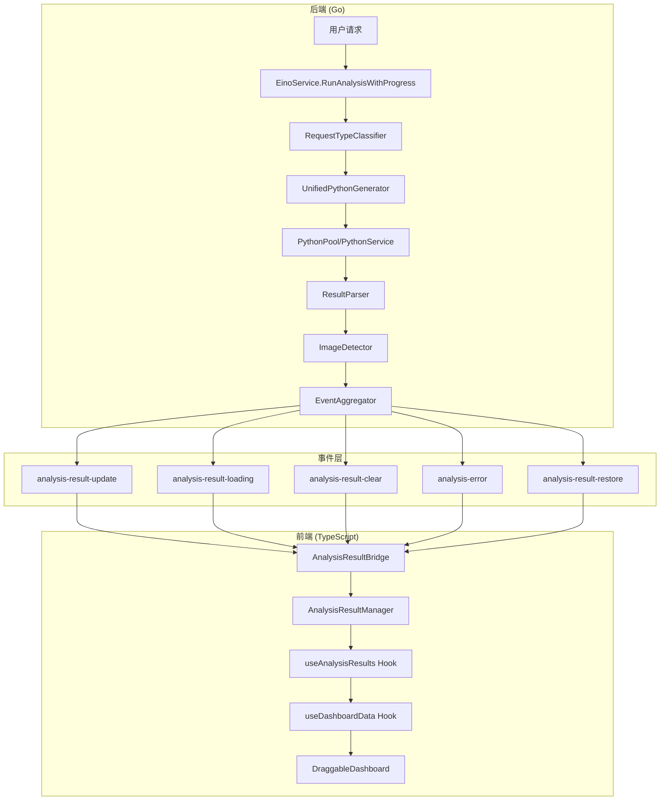

# 设计文档：分析结果显示流程优化

## 概述

本设计文档描述了从 Agent 分析到仪表盘显示的完整数据流程架构，并针对已识别的问题提出具体的优化方案。

## 架构

### 整体数据流架构



### 数据类型流转


## 组件和接口

### 1. 后端组件

#### 1.1 ResultParser (src/agent/result_parser.go)

负责解析 Python 执行输出，提取结构化数据。

```go
type ResultParser struct {
    logger func(string)
}

type ExecutionResult struct {
    Success     bool
    TextOutput  string
    Tables      []ParsedTable
    ChartFiles  []FileInfo
    ExportFiles []FileInfo
    ErrorMsg    string
    Warnings    []string
}

// 主要方法
func (p *ResultParser) ParseOutput(output string, sessionDir string) *ExecutionResult
func (p *ResultParser) detectGeneratedFiles(sessionDir string) ([]FileInfo, []FileInfo)
```

#### 1.2 ImageDetector (src/agent/image_detector.go)

负责检测各种格式的图片引用。

```go
type ImageDetector struct {
    base64Pattern        *regexp.Regexp
    markdownPattern      *regexp.Regexp
    fileReferencePattern *regexp.Regexp
    sandboxPattern       *regexp.Regexp
}

type ImagePattern struct {
    Type string  // "base64", "markdown", "file_reference", "sandbox"
    Data string
    Raw  string
}

// 主要方法
func (id *ImageDetector) DetectAllImages(text string) []ImagePattern
func (id *ImageDetector) DetectBase64Images(text string) []ImagePattern
func (id *ImageDetector) DetectMarkdownImages(text string) []ImagePattern
func (id *ImageDetector) DetectFileReferences(text string) []ImagePattern
func (id *ImageDetector) DetectSandboxPaths(text string) []ImagePattern
```

#### 1.3 EventAggregator (src/event_aggregator.go)

负责聚合事件并批量发送到前端。

```go
type EventAggregator struct {
    ctx          context.Context
    pendingItems map[string]*pendingBatch
    mutex        sync.Mutex
    flushTimers  map[string]*time.Timer
    flushDelay   time.Duration  // 默认 50ms
}

type AnalysisResultItem struct {
    ID       string
    Type     string      // echarts, image, table, csv, metric, insight, file
    Data     interface{}
    Metadata map[string]interface{}
    Source   string      // realtime, completed, cached, restored
}

// 主要方法
func (ea *EventAggregator) AddECharts(sessionID, messageID, requestID string, chartData string)
func (ea *EventAggregator) AddImage(sessionID, messageID, requestID string, imageData string, fileName string)
func (ea *EventAggregator) AddTable(sessionID, messageID, requestID string, tableData interface{})
func (ea *EventAggregator) FlushNow(sessionID string, isComplete bool) []AnalysisResultItem
```

### 2. 前端组件

#### 2.1 AnalysisResultBridge (src/frontend/src/utils/AnalysisResultBridge.ts)

负责监听后端事件并转发到 AnalysisResultManager。

```typescript
interface EventHandlers {
  'analysis-result-update': (payload: AnalysisResultBatch) => void;
  'analysis-result-clear': (payload: { sessionId: string; messageId?: string }) => void;
  'analysis-result-loading': (payload: { sessionId: string; loading: boolean; requestId?: string }) => void;
  'analysis-result-error': (payload: { sessionId: string; error: string }) => void;
  'analysis-result-restore': (payload: { sessionId: string; messageId: string; items: AnalysisResultItem[] }) => void;
}

function initAnalysisResultBridge(
  getCurrentSessionId: () => string | null,
  getCurrentMessageId: () => string | null
): () => void;
```

#### 2.2 AnalysisResultManager (src/frontend/src/managers/AnalysisResultManager.ts)

单例状态管理器，作为所有分析结果的单一数据源。

```typescript
interface IAnalysisResultManager {
  // 数据更新
  updateResults(batch: AnalysisResultBatch): void;
  clearResults(sessionId: string, messageId?: string): void;
  clearAll(): void;
  
  // 数据查询
  getResults(sessionId: string, messageId: string): AnalysisResultItem[];
  getResultsByType(sessionId: string, messageId: string, type: AnalysisResultType): AnalysisResultItem[];
  
  // 会话管理
  switchSession(sessionId: string): void;
  selectMessage(messageId: string): void;
  
  // 状态订阅
  subscribe(callback: StateChangeCallback): () => void;
  on<K extends keyof AnalysisResultEvents>(event: K, callback: AnalysisResultEventCallback<K>): () => void;
  
  // 加载状态
  setLoading(loading: boolean, requestId?: string, messageId?: string): void;
  isLoading(): boolean;
}
```

#### 2.3 useDashboardData Hook (src/frontend/src/hooks/useDashboardData.ts)

为 DraggableDashboard 提供数据访问的 Hook。

```typescript
interface DashboardDataSource {
  // 图表数据
  hasECharts: boolean;
  echartsData: any | null;
  allEChartsData: any[];
  
  // 图片数据
  hasImages: boolean;
  images: string[];
  
  // 表格数据
  hasTables: boolean;
  tableData: NormalizedTableData | null;
  allTableData: NormalizedTableData[];
  
  // 指标和洞察
  hasMetrics: boolean;
  metrics: NormalizedMetricData[];
  hasInsights: boolean;
  insights: NormalizedInsightData[];
  
  // 文件数据
  hasFiles: boolean;
  files: AnalysisResultItem[];
  
  // 状态
  isLoading: boolean;
  error: string | null;
  hasRealAnalysisResults: boolean;
}
```

## 数据模型

### 分析结果类型

```typescript
type AnalysisResultType = 
  | 'echarts'    // ECharts 图表配置对象
  | 'image'      // Base64 图片数据
  | 'table'      // 表格数据数组
  | 'csv'        // CSV 数据
  | 'metric'     // 关键指标
  | 'insight'    // 智能洞察
  | 'file';      // 可下载文件

type ResultSource = 
  | 'realtime'   // 实时流式更新
  | 'completed'  // 分析完成后的完整数据
  | 'cached'     // 从缓存加载
  | 'restored';  // 从持久化存储恢复
```

### 数据结构

```typescript
// 分析结果项
interface AnalysisResultItem {
  id: string;
  type: AnalysisResultType;
  data: any;
  metadata: ResultMetadata;
  source: ResultSource;
}

// 批量结果
interface AnalysisResultBatch {
  sessionId: string;
  messageId: string;
  requestId: string;
  items: AnalysisResultItem[];
  isComplete: boolean;
  timestamp: number;
}

// 状态结构
interface AnalysisResultState {
  currentSessionId: string | null;
  currentMessageId: string | null;
  isLoading: boolean;
  pendingRequestId: string | null;
  error: string | null;
  data: Map<string, Map<string, AnalysisResultItem[]>>;
}
```


## 正确性属性

*正确性属性是一种应该在系统所有有效执行中保持为真的特征或行为——本质上是关于系统应该做什么的形式化陈述。属性作为人类可读规范和机器可验证正确性保证之间的桥梁。*

### 属性 1: 数据类型规范化一致性

*对于任意*有效的分析结果数据，经过 DataNormalizer 规范化后再反规范化，应该产生等价的数据结构。

**验证: 需求 1.1, 2.1**

### 属性 2: 事件批量聚合完整性

*对于任意*一组添加到 EventAggregator 的数据项，在 FlushNow 调用后，所有项都应该被包含在发送的批次中，且不会丢失任何项。

**验证: 需求 4.2**

### 属性 3: 会话数据隔离

*对于任意*两个不同的会话 ID，一个会话的分析结果更新不应该影响另一个会话的数据。

**验证: 需求 5.1, 5.2**

### 属性 4: 消息数据隔离

*对于任意*同一会话下的两个不同消息 ID，切换消息后仪表盘只应显示当前选中消息的分析结果。

**验证: 需求 5.2, 5.3**

### 属性 5: 图片检测覆盖性

*对于任意*包含图片引用的文本（base64、markdown、文件引用、sandbox 路径），ImageDetector 应该能够检测到所有图片引用。

**验证: 需求 1.2**

### 属性 6: 加载状态一致性

*对于任意*分析请求，当 setLoading(true) 被调用后，isLoading() 应该返回 true，直到 setLoading(false) 或分析完成。

**验证: 需求 4.1, 4.3**

### 属性 7: 历史数据恢复完整性

*对于任意*保存的分析结果，恢复后应该与原始数据等价，且仪表盘应该正确显示恢复的数据。

**验证: 需求 5.3**

## 错误处理

### 后端错误处理

1. **Python 执行错误**
   - ResultParser 检测错误模式（Error:, Exception:, Traceback 等）
   - 提取错误消息并通过 EventAggregator.EmitError 发送
   - 前端显示友好的错误信息

2. **文件检测错误**
   - 文件不存在或无法读取时记录警告日志
   - 继续处理其他文件，不中断整体流程

3. **事件发送错误**
   - 使用 mutex 保护并发访问
   - 定时器确保数据最终被发送

### 前端错误处理

1. **数据规范化错误**
   - DataNormalizer 返回 { success: false, error: string }
   - 记录警告日志，跳过无效数据项

2. **状态更新错误**
   - 订阅者回调异常被捕获并记录
   - 不影响其他订阅者

3. **事件监听错误**
   - 每个事件处理器独立 try-catch
   - 错误不会传播到其他处理器

## 测试策略

### 单元测试

1. **ResultParser 测试**
   - 测试 JSON 表格解析
   - 测试文本表格解析
   - 测试错误检测
   - 测试文件检测

2. **ImageDetector 测试**
   - 测试 base64 图片检测
   - 测试 markdown 图片检测
   - 测试文件引用检测
   - 测试 sandbox 路径检测

3. **EventAggregator 测试**
   - 测试数据项添加
   - 测试批量聚合
   - 测试定时刷新
   - 测试会话隔离

4. **AnalysisResultManager 测试**
   - 测试数据更新
   - 测试数据查询
   - 测试会话切换
   - 测试消息选择
   - 测试状态订阅

5. **useDashboardData 测试**
   - 测试数据转换
   - 测试条件加载逻辑
   - 测试事件响应

### 属性测试

属性测试使用 fast-check (TypeScript) 和 testing/quick (Go) 库，每个测试运行至少 100 次迭代。

1. **数据规范化往返测试**
   - 生成随机有效数据
   - 规范化后验证结构正确性

2. **事件聚合完整性测试**
   - 生成随机数据项序列
   - 验证所有项都被正确聚合

3. **会话隔离测试**
   - 生成随机会话和消息 ID
   - 验证数据隔离正确性

### 集成测试

1. **端到端数据流测试**
   - 模拟 Python 执行输出
   - 验证数据正确显示在仪表盘

2. **历史数据恢复测试**
   - 保存分析结果
   - 切换消息后恢复
   - 验证数据完整性

## 已识别问题的解决方案

### 问题 1: 图片检测不完整

**现状**: ImageDetector 可能遗漏某些格式的图片引用。

**解决方案**:
1. 扩展正则表达式模式，支持更多图片格式（webp, bmp, tiff）
2. 添加 HTML img 标签检测模式
3. 添加相对路径和绝对路径的统一处理
4. 增加单元测试覆盖所有已知格式

### 问题 2: 图表保存路径不一致

**现状**: LLM 生成的代码可能使用不同的路径格式保存图表。

**解决方案**:
1. 在 ResultParser.detectGeneratedFiles 中递归扫描所有子目录
2. 统一路径规范化处理（NormalizeImagePath）
3. 支持相对路径和绝对路径
4. 添加路径映射配置

### 问题 3: 事件发送时机

**现状**: 分析完成后可能存在事件发送顺序问题。

**解决方案**:
1. EventAggregator 使用 50ms 延迟聚合，减少事件碎片
2. FlushNow 确保所有待处理数据被发送
3. isComplete 标志明确标识最终批次
4. 前端使用队列顺序处理更新

### 问题 4: 数据类型识别

**现状**: 某些数据类型（如 ECharts vs 普通 JSON）的识别可能不准确。

**解决方案**:
1. 增强 ECharts 配置检测逻辑（检查 series, xAxis, yAxis 等特征字段）
2. 添加数据类型验证器
3. 使用 DataNormalizer 统一规范化
4. 添加类型推断日志便于调试

## 改进建议

### 短期改进

1. **增强日志记录**
   - 在关键节点添加调试日志
   - 记录数据流转的每个步骤
   - 便于问题排查

2. **添加数据验证**
   - 在 EventAggregator 添加数据验证
   - 在 DataNormalizer 添加更严格的类型检查

3. **优化错误提示**
   - 提供更具体的错误信息
   - 添加错误恢复建议

### 长期改进

1. **性能优化**
   - 大数据量时使用虚拟滚动
   - 图片懒加载
   - 数据分页

2. **可观测性**
   - 添加性能指标收集
   - 数据流追踪
   - 异常监控

3. **扩展性**
   - 支持更多数据类型
   - 插件化数据处理器
   - 自定义渲染器
