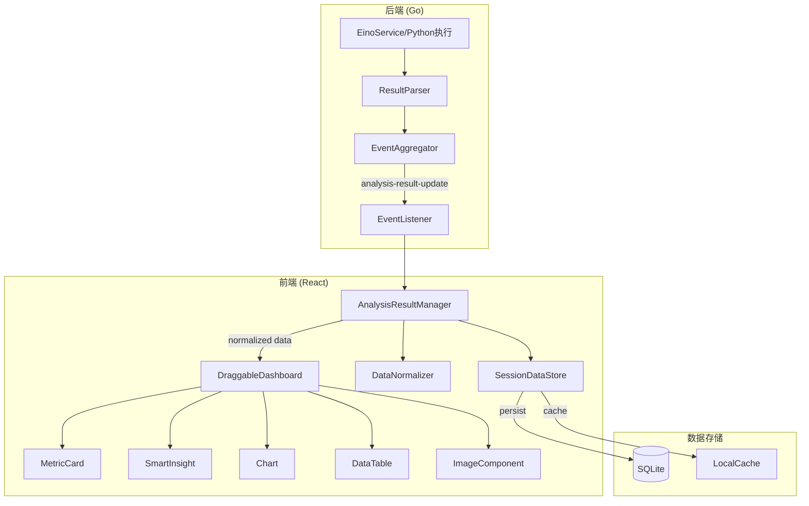
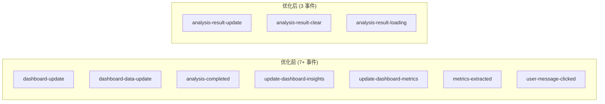

# Design Document: Analysis Result Display Optimization

## Overview

本设计文档描述了优化分析结果数据展示逻辑的技术方案。核心思路是引入统一的数据模型和集中的状态管理器，简化事件流，规范化数据格式，从而解决当前系统中数据流复杂、状态管理混乱、渲染逻辑重复等问题。

### 设计目标

1. **统一数据模型**: 定义 `AnalysisResultItem` 作为所有分析结果的标准包装格式
2. **简化事件流**: 将7+个事件合并为3个核心事件
3. **集中状态管理**: 引入 `AnalysisResultManager` 作为单一数据源
4. **规范化数据格式**: 所有数据在存储前经过规范化处理
5. **优化渲染逻辑**: 组件直接从管理器获取预处理好的数据

## Architecture

### 整体架构图



### 数据流简化对比



## Components and Interfaces

### 1. AnalysisResultItem (统一数据模型)

```typescript
// 统一的分析结果数据项
interface AnalysisResultItem {
  id: string;                    // 唯一标识符
  type: AnalysisResultType;      // 数据类型
  data: any;                     // 规范化后的数据
  metadata: ResultMetadata;      // 元数据
  source: ResultSource;          // 数据来源
}

type AnalysisResultType = 
  | 'echarts'    // ECharts 图表配置对象
  | 'image'      // Base64 图片数据
  | 'table'      // 表格数据数组
  | 'csv'        // CSV 数据（转换为表格格式）
  | 'metric'     // 关键指标
  | 'insight';   // 智能洞察

interface ResultMetadata {
  sessionId: string;             // 会话ID
  messageId: string;             // 消息ID
  timestamp: number;             // 时间戳
  requestId?: string;            // 请求ID（用于匹配）
  fileName?: string;             // 文件名（如适用）
}

type ResultSource = 
  | 'realtime'      // 实时流式更新
  | 'completed'     // 分析完成后的完整数据
  | 'cached'        // 从缓存加载
  | 'restored';     // 从持久化存储恢复
```

### 2. AnalysisResultBatch (批量数据)

```typescript
// 批量分析结果（单次事件传递）
interface AnalysisResultBatch {
  sessionId: string;
  messageId: string;
  requestId: string;
  items: AnalysisResultItem[];
  isComplete: boolean;           // 是否为完整结果
  timestamp: number;
}
```

### 3. AnalysisResultManager (状态管理器)

```typescript
// 分析结果管理器接口
interface IAnalysisResultManager {
  // 数据更新
  updateResults(batch: AnalysisResultBatch): void;
  clearResults(sessionId: string, messageId?: string): void;
  
  // 数据查询
  getResults(sessionId: string, messageId: string): AnalysisResultItem[];
  getResultsByType(sessionId: string, messageId: string, type: AnalysisResultType): AnalysisResultItem[];
  hasData(sessionId: string, messageId: string, type: AnalysisResultType): boolean;
  
  // 会话管理
  switchSession(sessionId: string): void;
  getCurrentSession(): string | null;
  
  // 状态订阅
  subscribe(callback: (state: AnalysisResultState) => void): () => void;
  
  // 加载状态
  setLoading(loading: boolean, requestId?: string): void;
  isLoading(): boolean;
}

// 管理器内部状态
interface AnalysisResultState {
  currentSessionId: string | null;
  currentMessageId: string | null;
  isLoading: boolean;
  pendingRequestId: string | null;
  // 按 sessionId -> messageId -> items 组织的数据
  data: Map<string, Map<string, AnalysisResultItem[]>>;
}
```

### 4. DataNormalizer (数据规范化器)

```typescript
// 数据规范化器接口
interface IDataNormalizer {
  normalize(type: AnalysisResultType, rawData: any): NormalizedResult;
  validate(type: AnalysisResultType, data: any): ValidationResult;
}

interface NormalizedResult {
  success: boolean;
  data?: any;
  error?: string;
}

interface ValidationResult {
  valid: boolean;
  errors: string[];
}

// 各类型数据的规范化规则
const normalizationRules = {
  echarts: {
    // 输入: JSON字符串或对象
    // 输出: 解析后的ECharts配置对象
    normalize: (data: string | object) => {
      if (typeof data === 'string') {
        return JSON.parse(data);
      }
      return data;
    }
  },
  image: {
    // 输入: base64字符串（可能带或不带data URL前缀）
    // 输出: 完整的data URL格式
    normalize: (data: string) => {
      if (data.startsWith('data:image')) {
        return data;
      }
      // 检测图片类型并添加前缀
      return `data:image/png;base64,${data}`;
    }
  },
  table: {
    // 输入: JSON字符串、数组或对象
    // 输出: { columns: string[], rows: object[] }
    normalize: (data: any) => {
      let parsed = typeof data === 'string' ? JSON.parse(data) : data;
      if (Array.isArray(parsed) && parsed.length > 0) {
        return {
          columns: Object.keys(parsed[0]),
          rows: parsed
        };
      }
      return { columns: [], rows: [] };
    }
  },
  csv: {
    // 输入: CSV字符串或base64 data URL
    // 输出: 与table相同的格式
    normalize: (data: string) => {
      // 解析CSV并转换为表格格式
      // ...
    }
  },
  metric: {
    // 输入: { name, value, unit?, change? }
    // 输出: { title, value, change }
    normalize: (data: any) => ({
      title: data.name || data.title,
      value: data.unit ? `${data.value}${data.unit}` : String(data.value),
      change: data.change || ''
    })
  },
  insight: {
    // 输入: string 或 { text, icon?, data_source_id? }
    // 输出: { text, icon, dataSourceId? }
    normalize: (data: any) => {
      if (typeof data === 'string') {
        return { text: data, icon: 'lightbulb' };
      }
      return {
        text: data.text,
        icon: data.icon || 'lightbulb',
        dataSourceId: data.data_source_id
      };
    }
  }
};
```

### 5. EventAggregator (后端事件聚合器)

```go
// Go 后端事件聚合器
type EventAggregator struct {
    pendingItems map[string][]AnalysisResultItem // sessionId -> items
    mutex        sync.Mutex
    flushTimer   *time.Timer
}

// 聚合后的事件结构
type AnalysisResultUpdateEvent struct {
    SessionID   string               `json:"sessionId"`
    MessageID   string               `json:"messageId"`
    RequestID   string               `json:"requestId"`
    Items       []AnalysisResultItem `json:"items"`
    IsComplete  bool                 `json:"isComplete"`
    Timestamp   int64                `json:"timestamp"`
}

// 添加结果项（自动聚合）
func (ea *EventAggregator) AddItem(sessionId string, item AnalysisResultItem) {
    ea.mutex.Lock()
    defer ea.mutex.Unlock()
    
    ea.pendingItems[sessionId] = append(ea.pendingItems[sessionId], item)
    
    // 重置刷新定时器（50ms内的更新会被聚合）
    if ea.flushTimer != nil {
        ea.flushTimer.Stop()
    }
    ea.flushTimer = time.AfterFunc(50*time.Millisecond, func() {
        ea.flush(sessionId)
    })
}

// 立即刷新（分析完成时调用）
func (ea *EventAggregator) FlushNow(sessionId string, isComplete bool) {
    ea.mutex.Lock()
    defer ea.mutex.Unlock()
    
    if ea.flushTimer != nil {
        ea.flushTimer.Stop()
    }
    ea.flushWithComplete(sessionId, isComplete)
}
```

## Data Models

### 前端状态结构

```typescript
// App.tsx 中的简化状态
interface AppState {
  // 替代原有的多个状态
  analysisResultManager: IAnalysisResultManager;
  
  // 保留的必要状态
  activeSessionId: string | null;
  selectedMessageId: string | null;
  isChatOpen: boolean;
  
  // 移除的状态（由 AnalysisResultManager 管理）
  // - activeChart
  // - sessionCharts
  // - sessionInsights
  // - sessionMetrics
  // - sessionFiles
  // - dashboardData
  // - isAnalysisLoading
  // - pendingRequestId
}
```

### 后端数据结构

```go
// 统一的分析结果项
type AnalysisResultItem struct {
    ID       string                 `json:"id"`
    Type     string                 `json:"type"`
    Data     interface{}            `json:"data"`
    Metadata map[string]interface{} `json:"metadata"`
    Source   string                 `json:"source"`
}

// 会话文件关联
type SessionFileAssociation struct {
    SessionID string `json:"session_id"`
    MessageID string `json:"message_id"`
    FilePath  string `json:"file_path"`
    FileType  string `json:"file_type"`
    FileName  string `json:"file_name"`
}
```

