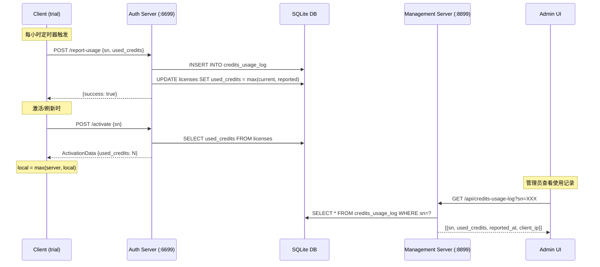

# 设计文档：Credits 使用量上报与追踪

## 概述

本设计实现试用版客户端每小时上报 Credits 使用量到授权服务器的完整链路。涉及三个层面的改动：

1. **客户端**（`src/agent/license_client.go` + `src/app.go`）：新增定时上报 goroutine、启动时补报逻辑、合并逻辑修正
2. **授权服务器**（`tools/license_server/main.go`）：新增 `/report-usage` 端点、数据库 schema 变更、ActivationData 增加 `used_credits` 字段
3. **管理后台**（`tools/license_server/templates/email_records.go` + `main.go`）：新增使用记录查看按钮和 API 端点

### 当前代码状态

- 客户端 `ActivationData` 已有 `UsedCredits float64` 字段（`json:"used_credits"`）
- 服务器端 `ActivationData` 尚无 `UsedCredits` 字段，需新增
- 客户端 `Activate()` 中合并逻辑为 `if c.data != nil && c.data.UsedCredits > 0`，需改为 `math.Max`
- `handleActivate` 的 SELECT 查询未读取 `used_credits` 列，需扩展
- `licenses` 表已有 `total_credits` 和 `credits_mode` 列，但无 `used_credits` 列
- `credits_usage_log` 表尚未创建
- 无 `/report-usage` 端点
- `SaveActivationData` / `LoadActivationData` 无 `lastReportAt` 字段

## 架构



## 组件与接口

### 1. 客户端上报组件（LicenseClient 扩展）

**文件**: `src/agent/license_client.go`

新增字段：

```go
type LicenseClient struct {
    // ... 现有字段 ...
    lastReportAt   time.Time    // 上次上报时间
    reportTicker   *time.Ticker // 定时上报 ticker
    reportStopCh   chan struct{}// 停止上报信号
}
```

新增方法：

```go
// ReportUsage 向服务器上报当前 used_credits
func (c *LicenseClient) ReportUsage() error

// StartUsageReporting 启动定时上报 goroutine（仅 trial + credits mode）
func (c *LicenseClient) StartUsageReporting()

// StopUsageReporting 停止定时上报
func (c *LicenseClient) StopUsageReporting()

// ShouldReportOnStartup 检查启动时是否需要补报
func (c *LicenseClient) ShouldReportOnStartup() bool
```

**上报请求格式**:
```json
POST /report-usage
Content-Type: application/json

{
    "sn": "XXXX-XXXX-XXXX",
    "used_credits": 15.0
}
```

**上报响应格式**:
```json
{
    "success": true
}
```

**定时上报逻辑**:
- `StartUsageReporting()` 中创建 1 小时 ticker
- 每次 tick 检查：`IsCreditsMode() == true` 且 `GetTrustLevel() == "low"`
- 满足条件则调用 `ReportUsage()`
- 上报成功后更新 `lastReportAt` 并调用 `SaveActivationData()` 持久化
- 上报失败时记录日志，不更新 `lastReportAt`，下个周期自动重试

**启动补报逻辑**:
- `ShouldReportOnStartup()` 检查 `time.Since(lastReportAt) >= 1 hour`
- 在 `app.go` 的 `startup()` 中，license 加载成功后调用此方法
- 若需要补报且满足上报条件（trial + credits mode），调用 `ReportUsage()`

### 2. SaveActivationData / LoadActivationData 扩展

**文件**: `src/agent/license_client.go`

在 `saveData` 结构体中新增 `LastReportAt` 字段：

```go
saveData := struct {
    // ... 现有字段（SN, Data, SavedAt, ServerURL, LastRefreshAt, AnalysisCount, AnalysisDate, UsedCredits）...
    LastReportAt string `json:"last_report_at"` // 上次上报时间
}{
    // ...
    LastReportAt: c.lastReportAt.Format(time.RFC3339),
}
```

`LoadActivationData` 中恢复 `lastReportAt`：

```go
if saveData.LastReportAt != "" {
    if t, err := time.Parse(time.RFC3339, saveData.LastReportAt); err == nil {
        c.lastReportAt = t
    }
}
```

### 3. 客户端合并逻辑修改

**文件**: `src/agent/license_client.go` → `Activate()` 方法

当前逻辑（第 ~210 行）：
```go
// Preserve local UsedCredits when refreshing (server doesn't track usage)
if c.data != nil && c.data.UsedCredits > 0 {
    data.UsedCredits = c.data.UsedCredits
}
```

改为：
```go
// Merge: take max of server and local used_credits
if c.data != nil {
    data.UsedCredits = math.Max(data.UsedCredits, c.data.UsedCredits)
}
```

需添加 `"math"` 包导入。首次激活时 `c.data` 为 nil，直接使用服务器下发值。

### 4. 服务器端 `/report-usage` 端点

**文件**: `tools/license_server/main.go`

注册在 auth server（端口 6699），无需管理员认证：

```go
// startAuthServer 中新增
mux.HandleFunc("/report-usage", handleReportUsage)
```

**handleReportUsage 逻辑**:
1. 设置 CORS 头（与 `handleActivate` 一致）
2. 仅接受 POST 请求，OPTIONS 返回 200
3. 解析请求体 `{sn, used_credits}`
4. 验证 SN 存在于 licenses 表，不存在返回 `{success: false, code: "INVALID_SN"}`
5. 验证 used_credits >= 0，否则返回 `{success: false, code: "INVALID_VALUE"}`
6. `INSERT INTO credits_usage_log (sn, used_credits, reported_at, client_ip) VALUES (?, ?, ?, ?)`
7. `UPDATE licenses SET used_credits = MAX(used_credits, ?) WHERE sn = ?`
8. 返回 `{success: true}`

### 5. 服务器端 ActivationData 扩展

**文件**: `tools/license_server/main.go`

服务器端 `ActivationData` 结构体新增字段（当前无此字段）：
```go
type ActivationData struct {
    // ... 现有字段 ...
    UsedCredits float64 `json:"used_credits"` // 服务器记录的已用量
}
```

`handleActivate` 中修改：
- SELECT 查询增加 `COALESCE(used_credits, 0)` 列
- 将读取的值填入 `activationData.UsedCredits`

### 6. 管理后台使用记录查看

**文件**: `tools/license_server/main.go` + `tools/license_server/templates/email_records.go`

**新增 API 端点**（管理端口 8899，需认证）：
```go
// startManageServer 中新增
mux.HandleFunc("/api/credits-usage-log", authMiddleware(handleCreditsUsageLog))
```

**handleCreditsUsageLog 逻辑**:
- GET 请求，查询参数 `sn`
- 查询 `credits_usage_log` 表，按 `reported_at DESC` 排序
- 返回 JSON 数组

**前端按钮**（email_records.go）：
- 在操作按钮区新增"使用记录"按钮
- 点击后调用 `showUsageLog(sn)` 函数
- 弹窗中以表格形式展示使用日志（上报时间、已用量、客户端 IP）

### 7. app.go 集成

**文件**: `src/app.go`

在 `startup()` 中，license 加载/激活成功后：
```go
// 检查是否需要启动时补报
if a.licenseClient.ShouldReportOnStartup() {
    go a.licenseClient.ReportUsage()
}
// 启动定时上报
a.licenseClient.StartUsageReporting()
```

在 `shutdown()` 中：
```go
a.licenseClient.StopUsageReporting()
```

## 数据模型

### 新增表：credits_usage_log

```sql
CREATE TABLE IF NOT EXISTS credits_usage_log (
    id INTEGER PRIMARY KEY AUTOINCREMENT,
    sn TEXT NOT NULL,
    used_credits FLOAT NOT NULL,
    reported_at DATETIME NOT NULL,
    client_ip TEXT
);
```

### licenses 表新增列

```sql
ALTER TABLE licenses ADD COLUMN used_credits FLOAT DEFAULT 0;
```

### 服务器端 ActivationData 结构体变更

```go
type ActivationData struct {
    // 现有字段不变
    UsedCredits float64 `json:"used_credits"` // 新增
}
```

### 客户端 SaveData 结构体变更

```go
// SaveActivationData 中的 saveData 新增字段
LastReportAt string `json:"last_report_at"`
```

## 正确性属性

*属性是系统在所有有效执行中应保持为真的特征或行为——本质上是关于系统应该做什么的形式化陈述。属性是人类可读规范与机器可验证正确性保证之间的桥梁。*

### Property 1: 上报条件判断

*For any* (credits_mode, trust_level) 组合，上报功能启用当且仅当 credits_mode == true 且 trust_level == "low"。其他任何组合（包括 trust_level == "high"）都不应触发上报。

**Validates: Requirements 1.1, 1.5**

### Property 2: 启动补报时间判断

*For any* lastReportAt 时间值，`ShouldReportOnStartup()` 返回 true 当且仅当 `time.Since(lastReportAt) >= 1 hour`。

**Validates: Requirements 1.2**

### Property 3: 上报结果与持久化一致性

*For any* 上报尝试，`lastReportAt` 被更新当且仅当上报成功（服务器返回 success: true）。上报失败时 `lastReportAt` 保持不变，确保下个周期自动重试。

**Validates: Requirements 1.4, 1.6**

### Property 4: 服务器 max-update 语义

*For any* 非负 (current_used_credits, reported_used_credits) 值对，上报处理后 licenses 表中的 used_credits = max(current_used_credits, reported_used_credits)。

**Validates: Requirements 2.3**

### Property 5: 服务器日志插入完整性

*For any* 有效上报请求（SN 存在且 used_credits >= 0），处理后 credits_usage_log 表恰好新增一条记录，且该记录的 sn、used_credits 与请求一致。

**Validates: Requirements 2.2**

### Property 6: ActivationData 下发已用量一致性

*For any* licenses 表中的记录，`handleActivate` 构建的 ActivationData 中的 `used_credits` 值等于该 license 在 licenses 表中的 `used_credits` 值。

**Validates: Requirements 3.1**

### Property 7: 客户端合并取最大值

*For any* 非负 (server_used_credits, local_used_credits) 值对，合并后的 UsedCredits = max(server_used_credits, local_used_credits)。当本地数据为 nil（首次激活）时，直接使用服务器值。

**Validates: Requirements 4.1, 4.2**

### Property 8: 使用日志降序排列

*For any* 给定 SN 的使用日志记录集合，`/api/credits-usage-log` 返回的列表按 reported_at 降序排列（最新记录在前）。

**Validates: Requirements 5.3**

## 错误处理

| 场景 | 处理方式 |
|------|---------|
| 客户端上报网络失败 | 记录日志，不更新 lastReportAt，下个周期自动重试 |
| 服务器返回 INVALID_SN | 记录日志，不重试（SN 可能已被删除） |
| 服务器返回 INVALID_VALUE | 记录日志，这是客户端 bug，不应发生 |
| 上报端点收到非 POST 请求 | 返回 405 Method Not Allowed |
| 上报端点 JSON 解析失败 | 返回 `{success: false, code: "INVALID_REQUEST"}` |
| 数据库写入失败 | 返回 500，记录服务器日志 |
| 管理端点查询无记录 | 返回空数组 `[]` |
| 管理端点未认证访问 | 由 authMiddleware 返回 401 |

## 测试策略

### 属性测试（Property-Based Testing）

使用 Go 的 `testing/quick` 包进行属性测试，每个属性至少运行 100 次迭代。

需要测试的属性：
- **Property 1**: 生成随机 (credits_mode, trust_level) 组合，验证上报条件判断
  - Tag: `// Feature: credits-usage-reporting, Property 1: 上报条件判断`
- **Property 2**: 生成随机时间戳，验证 ShouldReportOnStartup 逻辑
  - Tag: `// Feature: credits-usage-reporting, Property 2: 启动补报时间判断`
- **Property 4**: 生成随机非负 (current, reported) 值对，验证 max-update 语义
  - Tag: `// Feature: credits-usage-reporting, Property 4: 服务器 max-update 语义`
- **Property 7**: 生成随机非负 (server, local) 值对，验证合并取最大值
  - Tag: `// Feature: credits-usage-reporting, Property 7: 客户端合并取最大值`

### 单元测试

- 客户端 `ReportUsage()` 方法：mock HTTP server 测试成功/失败场景
- 服务器 `handleReportUsage`：测试有效请求、无效 SN、负数 credits、JSON 解析失败等边界情况
- 服务器 `handleActivate` 中 used_credits 字段的正确填充
- 管理端点 `handleCreditsUsageLog` 的排序和过滤
- `SaveActivationData` / `LoadActivationData` 中 lastReportAt 的持久化往返

### 测试配置

- 属性测试库：Go 标准库 `testing/quick`
- 每个属性测试最少 100 次迭代
- 单元测试使用 `httptest.NewServer` mock HTTP 交互
- 数据库测试使用内存 SQLite（`":memory:"` DSN）
