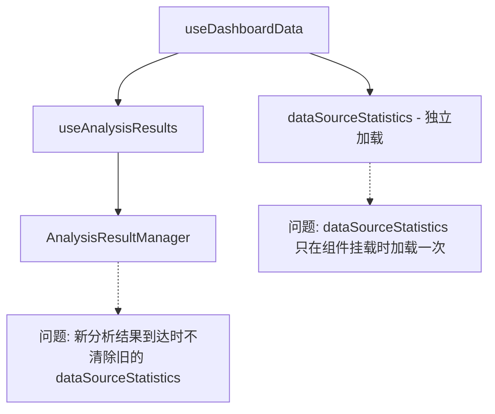
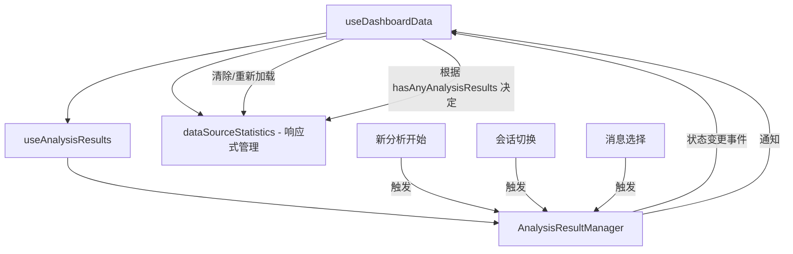

# 设计文档

## 概述

本设计文档描述了仪表盘数据隔离功能的技术实现方案。该功能解决了当显示分析结果时，仪表盘中旧数据（特别是数据源统计信息）没有被正确清除，导致新旧数据混合显示的问题。

核心解决方案是在 `useDashboardData` Hook 中引入对 `AnalysisResultManager` 状态变更的监听，并在适当的时机清除或重新加载 `dataSourceStatistics` 状态。

## 架构

### 当前架构问题



### 改进后架构



## 组件和接口

### 1. useDashboardData Hook 改进

**文件**: `src/frontend/src/hooks/useDashboardData.ts`

**改进点**:
- 订阅 `AnalysisResultManager` 的状态变更
- 在分析开始时清除 `dataSourceStatistics`
- 在会话/消息切换时重新评估是否显示数据源统计

```typescript
interface DashboardDataSource {
  // 现有字段...
  
  // 新增：数据源统计加载状态
  isDataSourceStatsLoading: boolean;
  
  // 新增：强制刷新数据源统计的方法
  refreshDataSourceStats: () => void;
  
  // 新增：清除所有数据的方法
  clearAllData: () => void;
}
```

### 2. AnalysisResultManager 事件扩展

**文件**: `src/frontend/src/managers/AnalysisResultManager.ts`

**新增事件类型**:
- `analysis-started`: 新分析开始时触发
- `session-switched`: 会话切换时触发
- `message-selected`: 消息选择时触发

```typescript
interface AnalysisResultEvents {
  'analysis-started': { sessionId: string; messageId: string; requestId: string };
  'session-switched': { fromSessionId: string | null; toSessionId: string };
  'message-selected': { sessionId: string; fromMessageId: string | null; toMessageId: string };
}
```

### 3. 数据清除策略接口

```typescript
interface DataClearStrategy {
  // 清除分析结果数据
  clearAnalysisResults: (sessionId: string, messageId?: string) => void;
  
  // 清除数据源统计
  clearDataSourceStats: () => void;
  
  // 清除所有仪表盘数据
  clearAll: () => void;
}
```

## 数据模型

### 状态管理模型

```typescript
interface DashboardState {
  // 分析结果数据（来自 AnalysisResultManager）
  analysisResults: {
    charts: AnalysisResultItem[];
    images: AnalysisResultItem[];
    tables: AnalysisResultItem[];
    metrics: NormalizedMetricData[];
    insights: NormalizedInsightData[];
    files: AnalysisResultItem[];
  };
  
  // 数据源统计（独立管理）
  dataSourceStatistics: {
    data: DataSourceStatistics | null;
    isLoading: boolean;
    lastLoadedAt: number | null;
    shouldShow: boolean;  // 基于 hasAnyAnalysisResults 计算
  };
  
  // 当前上下文
  context: {
    sessionId: string | null;
    messageId: string | null;
    isAnalysisInProgress: boolean;
  };
}
```

### 状态转换规则

| 触发事件 | 分析结果 | 数据源统计 | shouldShow |
|---------|---------|-----------|------------|
| 新分析开始 | 清除 | 清除 | false |
| 分析结果到达 | 更新 | 保持清除 | false |
| 分析完成（有结果） | 保持 | 保持清除 | false |
| 分析完成（无结果） | 空 | 重新加载 | true |
| 切换会话 | 清除 | 清除后重新评估 | 取决于新会话 |
| 切换消息 | 清除当前消息数据 | 保持 | 取决于新消息 |
| 点击历史请求 | 加载历史数据 | 清除 | false |


## 正确性属性

*正确性属性是在系统所有有效执行中都应保持为真的特征或行为——本质上是关于系统应该做什么的形式化陈述。属性作为人类可读规范和机器可验证正确性保证之间的桥梁。*

### Property 1: 数据清除一致性

*For any* 触发清除的事件（新分析开始、历史请求选择、会话切换、消息切换），当该事件触发时，当前显示的分析结果数据应被完全清除，不保留任何旧数据。

**Validates: Requirements 1.1, 2.1, 4.1, 4.3**

### Property 2: 数据源统计清除同步

*For any* 需要清除数据源统计的事件（新分析开始、会话切换、Manager 清除数据），当该事件触发时，`dataSourceStatistics` 状态应被设置为 `null`。

**Validates: Requirements 1.2, 4.2, 5.1**

### Property 3: 数据隔离性

*For any* 数据加载操作（新分析结果到达、历史数据恢复、消息切换），加载完成后显示的数据应仅包含目标 `sessionId` 和 `messageId` 对应的数据，不包含其他会话或消息的数据。

**Validates: Requirements 1.4, 2.2, 4.4**

### Property 4: 数据源统计显示互斥性

*For any* 仪表盘状态，当 `hasAnyAnalysisResults` 为 `true` 时，数据源统计相关的指标和洞察不应出现在显示数据中；当 `hasAnyAnalysisResults` 为 `false` 且有数据源时，数据源统计应显示。

**Validates: Requirements 2.3, 3.1, 3.2, 3.3**

### Property 5: hasAnyAnalysisResults 边界正确性

*For any* 分析结果状态组合（空数组、null 值、只有某些类型数据），`hasAnyAnalysisResults` 的计算结果应正确反映是否存在任何有效的分析结果数据。

**Validates: Requirements 3.4**

### Property 6: 状态同步响应性

*For any* `AnalysisResultManager` 状态变更（会话切换、消息选择、数据更新），`useDashboardData` Hook 应在下一个渲染周期内同步更新其状态，包括重新评估 `hasAnyAnalysisResults` 条件。

**Validates: Requirements 5.2, 5.3, 5.5**

### Property 7: 加载状态一致性

*For any* 分析请求，从请求开始到数据到达（或错误发生）期间，`isLoading` 状态应为 `true`；数据到达或错误发生后，`isLoading` 应为 `false`。

**Validates: Requirements 1.3**

## 错误处理

### 错误场景

| 错误场景 | 处理策略 | 用户反馈 |
|---------|---------|---------|
| 数据源统计加载失败 | 设置 dataSourceStatistics 为 null，不影响分析结果显示 | 静默处理，不显示数据源统计 |
| 分析结果加载失败 | 设置 error 状态，清除 isLoading | 显示错误提示 |
| 会话切换时数据清除失败 | 强制重置所有状态 | 静默处理 |
| 状态同步超时 | 重试一次，失败则强制刷新 | 静默处理 |

### 错误恢复

```typescript
// 错误恢复策略
const errorRecoveryStrategy = {
  // 数据源统计加载失败
  onDataSourceStatsError: () => {
    setDataSourceStatistics(null);
    // 不影响其他功能
  },
  
  // 分析结果加载失败
  onAnalysisResultError: (error: string) => {
    manager.setError(error);
    manager.setLoading(false);
  },
  
  // 状态同步失败
  onSyncError: () => {
    // 强制重新获取状态
    const freshState = manager.getState();
    setState(freshState);
  }
};
```

## 测试策略

### 双重测试方法

本功能采用单元测试和属性测试相结合的方式：

- **单元测试**: 验证特定示例、边界情况和错误条件
- **属性测试**: 验证跨所有输入的通用属性

### 属性测试配置

- 使用 `fast-check` 库进行属性测试
- 每个属性测试最少运行 100 次迭代
- 每个属性测试必须引用设计文档中的属性
- 标签格式: **Feature: dashboard-data-isolation, Property {number}: {property_text}**

### 测试用例分类

#### 属性测试

1. **Property 1 测试**: 数据清除一致性
   - 生成随机初始状态和触发事件
   - 验证清除后数据为空

2. **Property 2 测试**: 数据源统计清除同步
   - 生成随机 dataSourceStatistics
   - 触发清除事件
   - 验证 dataSourceStatistics 为 null

3. **Property 3 测试**: 数据隔离性
   - 生成多个 sessionId/messageId 的数据
   - 执行加载操作
   - 验证只有目标数据被显示

4. **Property 4 测试**: 数据源统计显示互斥性
   - 生成随机分析结果状态
   - 验证 hasAnyAnalysisResults 与数据源统计显示的互斥关系

5. **Property 5 测试**: hasAnyAnalysisResults 边界正确性
   - 生成各种边界状态组合
   - 验证 hasAnyAnalysisResults 计算正确

6. **Property 6 测试**: 状态同步响应性
   - 触发 Manager 状态变更
   - 验证 Hook 状态同步更新

7. **Property 7 测试**: 加载状态一致性
   - 模拟分析请求生命周期
   - 验证 isLoading 状态转换正确

#### 单元测试

1. **边界情况测试**
   - 空会话切换
   - 无数据源统计时的显示
   - 历史请求无结果时的处理

2. **集成测试**
   - useDashboardData 与 AnalysisResultManager 的集成
   - 事件监听和响应

### 测试数据生成器

```typescript
// 使用 fast-check 生成测试数据
import * as fc from 'fast-check';

// 生成随机 sessionId
const sessionIdArb = fc.uuid();

// 生成随机 messageId
const messageIdArb = fc.uuid();

// 生成随机分析结果项
const analysisResultItemArb = fc.record({
  id: fc.uuid(),
  type: fc.constantFrom('echarts', 'image', 'table', 'metric', 'insight', 'file'),
  data: fc.anything(),
  metadata: fc.record({
    sessionId: sessionIdArb,
    messageId: messageIdArb,
    timestamp: fc.nat()
  })
});

// 生成随机数据源统计
const dataSourceStatisticsArb = fc.option(fc.record({
  total_count: fc.nat(),
  breakdown_by_type: fc.dictionary(fc.string(), fc.nat()),
  data_sources: fc.array(fc.record({
    id: fc.uuid(),
    name: fc.string(),
    type: fc.string()
  }))
}));
```
