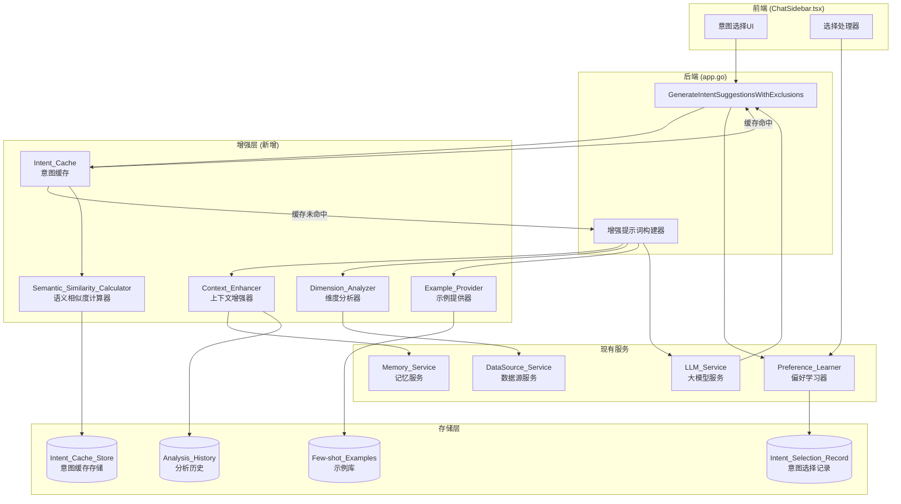

# 设计文档

## 概述

本设计文档描述了意图理解增强功能的技术架构和实现方案。该功能通过五个核心组件（上下文增强器、偏好学习器、维度分析器、示例提供器、意图缓存）来提升意图建议的准确性和响应速度。

设计遵循以下原则：
- **渐进增强**: 每个组件独立工作，可单独启用/禁用
- **向后兼容**: 保持现有API不变，新功能通过内部增强实现
- **性能优先**: 通过缓存和预计算减少延迟
- **可扩展性**: 组件化设计便于未来扩展

## 架构



## 组件和接口

### 1. IntentEnhancementService (意图增强服务)

主服务，协调所有增强组件。

```go
// IntentEnhancementService 意图增强服务
type IntentEnhancementService struct {
    contextEnhancer    *ContextEnhancer
    dimensionAnalyzer  *DimensionAnalyzer
    exampleProvider    *ExampleProvider
    intentCache        *IntentCache
    preferenceLearner  *PreferenceLearner
    config             *IntentEnhancementConfig
    logger             func(string)
}

// IntentEnhancementConfig 增强功能配置
type IntentEnhancementConfig struct {
    EnableContextEnhancement  bool    `json:"enable_context_enhancement"`
    EnablePreferenceLearning  bool    `json:"enable_preference_learning"`
    EnableDynamicDimensions   bool    `json:"enable_dynamic_dimensions"`
    EnableFewShotExamples     bool    `json:"enable_few_shot_examples"`
    EnableCaching             bool    `json:"enable_caching"`
    CacheSimilarityThreshold  float64 `json:"cache_similarity_threshold"`  // 默认 0.85
    CacheExpirationHours      int     `json:"cache_expiration_hours"`      // 默认 24
    MaxCacheEntries           int     `json:"max_cache_entries"`           // 默认 1000
    MaxHistoryRecords         int     `json:"max_history_records"`         // 默认 10
}

// NewIntentEnhancementService 创建意图增强服务
func NewIntentEnhancementService(
    dataDir string,
    preferenceLearner *PreferenceLearner,
    memoryService *MemoryService,
    logger func(string),
) *IntentEnhancementService

// EnhancePrompt 增强意图理解提示词
func (s *IntentEnhancementService) EnhancePrompt(
    ctx context.Context,
    basePrompt string,
    dataSourceID string,
    userMessage string,
    language string,
) (string, error)

// GetCachedSuggestions 获取缓存的建议
func (s *IntentEnhancementService) GetCachedSuggestions(
    dataSourceID string,
    userMessage string,
) ([]IntentSuggestion, bool)

// CacheSuggestions 缓存建议
func (s *IntentEnhancementService) CacheSuggestions(
    dataSourceID string,
    userMessage string,
    suggestions []IntentSuggestion,
)

// RankSuggestions 根据用户偏好重新排序建议
func (s *IntentEnhancementService) RankSuggestions(
    dataSourceID string,
    suggestions []IntentSuggestion,
) []IntentSuggestion

// RecordSelection 记录用户的意图选择
func (s *IntentEnhancementService) RecordSelection(
    dataSourceID string,
    selectedIntent IntentSuggestion,
)
```

### 2. ContextEnhancer (上下文增强器)

负责收集和整合历史分析记录。

```go
// ContextEnhancer 上下文增强器
type ContextEnhancer struct {
    memoryService *MemoryService
    dataDir       string
    mu            sync.RWMutex
}

// AnalysisRecord 分析记录
type AnalysisRecord struct {
    ID            string    `json:"id"`
    DataSourceID  string    `json:"data_source_id"`
    AnalysisType  string    `json:"analysis_type"`   // trend, comparison, distribution, etc.
    TargetColumns []string  `json:"target_columns"`
    KeyFindings   string    `json:"key_findings"`
    Timestamp     time.Time `json:"timestamp"`
}

// NewContextEnhancer 创建上下文增强器
func NewContextEnhancer(dataDir string, memoryService *MemoryService) *ContextEnhancer

// GetHistoryContext 获取历史分析上下文
func (c *ContextEnhancer) GetHistoryContext(dataSourceID string, maxRecords int) []AnalysisRecord

// AddAnalysisRecord 添加分析记录
func (c *ContextEnhancer) AddAnalysisRecord(record AnalysisRecord) error

// BuildContextSection 构建上下文提示词片段
func (c *ContextEnhancer) BuildContextSection(records []AnalysisRecord, language string) string
```

### 3. DimensionAnalyzer (维度分析器)

根据数据特征动态调整分析维度。

```go
// DimensionAnalyzer 维度分析器
type DimensionAnalyzer struct {
    dataSourceService *DataSourceService
}

// ColumnCharacteristics 列特征
type ColumnCharacteristics struct {
    Name          string   `json:"name"`
    DataType      string   `json:"data_type"`      // date, numeric, categorical, geographic, text
    SemanticType  string   `json:"semantic_type"`  // time, location, amount, count, category, etc.
    UniqueRatio   float64  `json:"unique_ratio"`   // 唯一值比例
    SampleValues  []string `json:"sample_values"`
}

// DimensionRecommendation 维度推荐
type DimensionRecommendation struct {
    DimensionType string  `json:"dimension_type"` // temporal, geographic, statistical, categorical
    Priority      int     `json:"priority"`       // 1-10, 越高越重要
    Columns       []string `json:"columns"`
    Rationale     string  `json:"rationale"`
}

// NewDimensionAnalyzer 创建维度分析器
func NewDimensionAnalyzer(dataSourceService *DataSourceService) *DimensionAnalyzer

// AnalyzeDataSource 分析数据源特征
func (d *DimensionAnalyzer) AnalyzeDataSource(dataSourceID string) ([]ColumnCharacteristics, error)

// GetDimensionRecommendations 获取维度推荐
func (d *DimensionAnalyzer) GetDimensionRecommendations(
    characteristics []ColumnCharacteristics,
) []DimensionRecommendation

// BuildDimensionSection 构建维度提示词片段
func (d *DimensionAnalyzer) BuildDimensionSection(
    recommendations []DimensionRecommendation,
    language string,
) string
```

### 4. ExampleProvider (示例提供器)

提供领域特定的Few-shot示例。

```go
// ExampleProvider 示例提供器
type ExampleProvider struct {
    examples map[string][]FewShotExample // domain -> examples
}

// FewShotExample Few-shot示例
type FewShotExample struct {
    Domain      string `json:"domain"`      // sales, finance, user_behavior, general
    UserMessage string `json:"user_message"`
    Intent      IntentSuggestion `json:"intent"`
    Language    string `json:"language"`    // en, zh
}

// NewExampleProvider 创建示例提供器
func NewExampleProvider() *ExampleProvider

// GetExamples 获取示例
func (e *ExampleProvider) GetExamples(domain string, language string, count int) []FewShotExample

// DetectDomain 检测数据领域
func (e *ExampleProvider) DetectDomain(columns []string, tableName string) string

// BuildExampleSection 构建示例提示词片段
func (e *ExampleProvider) BuildExampleSection(examples []FewShotExample, language string) string
```

### 5. IntentCache (意图缓存)

缓存相似请求的意图建议。

```go
// IntentCache 意图缓存
type IntentCache struct {
    cache      map[string]*CacheEntry
    lruList    *list.List
    lruMap     map[string]*list.Element
    maxEntries int
    expiration time.Duration
    similarity *SemanticSimilarityCalculator
    mu         sync.RWMutex
}

// CacheEntry 缓存条目
type CacheEntry struct {
    Key         string             `json:"key"`
    DataSourceID string            `json:"data_source_id"`
    UserMessage string             `json:"user_message"`
    Embedding   []float64          `json:"embedding"`
    Suggestions []IntentSuggestion `json:"suggestions"`
    CreatedAt   time.Time          `json:"created_at"`
    AccessCount int                `json:"access_count"`
}

// NewIntentCache 创建意图缓存
func NewIntentCache(
    maxEntries int,
    expirationHours int,
    similarityThreshold float64,
) *IntentCache

// Get 获取缓存
func (c *IntentCache) Get(dataSourceID, userMessage string) ([]IntentSuggestion, bool)

// Set 设置缓存
func (c *IntentCache) Set(dataSourceID, userMessage string, suggestions []IntentSuggestion)

// Clear 清除缓存
func (c *IntentCache) Clear()

// GetStats 获取缓存统计
func (c *IntentCache) GetStats() CacheStats
```

### 6. SemanticSimilarityCalculator (语义相似度计算器)

计算请求之间的语义相似度。

```go
// SemanticSimilarityCalculator 语义相似度计算器
type SemanticSimilarityCalculator struct {
    threshold float64
}

// NewSemanticSimilarityCalculator 创建语义相似度计算器
func NewSemanticSimilarityCalculator(threshold float64) *SemanticSimilarityCalculator

// CalculateSimilarity 计算两个文本的语义相似度
func (s *SemanticSimilarityCalculator) CalculateSimilarity(text1, text2 string) float64

// GetEmbedding 获取文本嵌入向量
func (s *SemanticSimilarityCalculator) GetEmbedding(text string) []float64

// IsSimilar 判断两个文本是否相似
func (s *SemanticSimilarityCalculator) IsSimilar(text1, text2 string) bool
```

### 7. 扩展 PreferenceLearner (偏好学习器)

扩展现有的偏好学习器以支持意图选择记录。

```go
// 新增到现有 PreferenceLearner

// IntentSelectionRecord 意图选择记录
type IntentSelectionRecord struct {
    DataSourceID string    `json:"data_source_id"`
    IntentType   string    `json:"intent_type"`   // trend, comparison, distribution, etc.
    IntentTitle  string    `json:"intent_title"`
    SelectCount  int       `json:"select_count"`
    LastSelected time.Time `json:"last_selected"`
}

// TrackIntentSelection 记录意图选择
func (p *PreferenceLearner) TrackIntentSelection(dataSourceID string, intent IntentSuggestion) error

// GetIntentPreferences 获取意图偏好
func (p *PreferenceLearner) GetIntentPreferences(dataSourceID string) []IntentSelectionRecord

// GetIntentRankingBoost 获取意图排序提升值
func (p *PreferenceLearner) GetIntentRankingBoost(dataSourceID string, intentType string) float64
```

## 数据模型

### 分析历史存储 (analysis_history.json)

```json
{
  "records": [
    {
      "id": "ah_1234567890",
      "data_source_id": "ds_abc123",
      "analysis_type": "trend",
      "target_columns": ["date", "sales_amount"],
      "key_findings": "销售额在Q4呈现上升趋势",
      "timestamp": "2024-01-15T10:30:00Z"
    }
  ]
}
```

### 意图选择记录存储 (intent_selections.json)

```json
{
  "selections": {
    "ds_abc123": [
      {
        "intent_type": "trend",
        "intent_title": "趋势分析",
        "select_count": 15,
        "last_selected": "2024-01-15T10:30:00Z"
      },
      {
        "intent_type": "comparison",
        "intent_title": "对比分析",
        "select_count": 8,
        "last_selected": "2024-01-14T15:20:00Z"
      }
    ]
  }
}
```

### 意图缓存存储 (intent_cache.json)

```json
{
  "entries": [
    {
      "key": "ds_abc123_分析销售趋势",
      "data_source_id": "ds_abc123",
      "user_message": "分析销售趋势",
      "embedding": [0.1, 0.2, ...],
      "suggestions": [...],
      "created_at": "2024-01-15T10:30:00Z",
      "access_count": 5
    }
  ],
  "stats": {
    "total_entries": 150,
    "hit_count": 1200,
    "miss_count": 300
  }
}
```

### Few-shot 示例库

```go
// 内置示例库 (硬编码)
var builtInExamples = map[string][]FewShotExample{
    "sales": {
        {
            Domain:      "sales",
            Language:    "zh",
            UserMessage: "分析销售情况",
            Intent: IntentSuggestion{
                Title:       "月度销售趋势",
                Description: "按月份分析销售额变化趋势，识别增长或下降模式",
                Icon:        "📈",
                Query:       "请按月份汇总销售额，绘制趋势图，并标注同比增长率",
            },
        },
        // ... 更多示例
    },
    "finance": { /* ... */ },
    "user_behavior": { /* ... */ },
    "general": { /* ... */ },
}
```


## 正确性属性

*正确性属性是一种在系统所有有效执行中都应该保持为真的特征或行为——本质上是关于系统应该做什么的形式化陈述。属性作为人类可读规范和机器可验证正确性保证之间的桥梁。*

### Property 1: 历史上下文构建正确性

*For any* 数据源ID和历史分析记录集合，Context_Enhancer 构建的上下文应满足：
- 包含的记录数量不超过配置的最大值（默认10条）
- 记录按时间戳降序排列（最新优先）
- 每条记录包含分析类型、目标列和关键发现

**Validates: Requirements 1.1, 1.2, 1.4, 1.5**

### Property 2: 偏好学习和排序正确性

*For any* 数据源和意图选择序列，Preference_Learner 应满足：
- 每次选择后，对应意图类型的计数递增1
- 不同数据源的偏好记录相互独立
- 排序后的建议列表中，选择频率高的意图排在前面
- 当选择次数少于阈值时，保持原始排序

**Validates: Requirements 2.1, 2.2, 2.3, 2.5**

### Property 3: 维度分析正确性

*For any* 数据源的列特征集合，Dimension_Analyzer 生成的维度推荐应满足：
- 包含日期列时，推荐中包含时间序列分析维度
- 包含地理列时，推荐中包含区域分析维度
- 包含数值列时，推荐中包含统计分析维度
- 包含分类列时，推荐中包含分组对比维度
- 多种维度同时存在时，按优先级排序

**Validates: Requirements 3.1, 3.2, 3.3, 3.4, 3.5, 3.6**

### Property 4: Few-shot 示例正确性

*For any* 数据领域和语言设置，Example_Provider 提供的示例应满足：
- 示例数量在2-3个范围内
- 每个示例包含完整的 title、description、icon、query 字段
- 示例与检测到的数据领域匹配
- 示例语言与用户语言设置一致

**Validates: Requirements 4.1, 4.2, 4.3, 4.4**

### Property 5: 缓存键唯一性

*For any* 两个不同的（数据源ID，用户消息）组合，Intent_Cache 应生成不同的缓存键，确保缓存隔离。

**Validates: Requirements 5.4**

### Property 6: 缓存语义相似度命中

*For any* 缓存的请求和新请求，当语义相似度超过阈值（0.85）时，Intent_Cache 应返回缓存的建议；当相似度低于阈值时，应返回缓存未命中。

**Validates: Requirements 5.1, 5.2**

### Property 7: 缓存LRU淘汰

*For any* 缓存状态，当条目数量超过最大限制时，最少使用的条目应被淘汰，且淘汰后条目数量不超过最大限制。

**Validates: Requirements 5.6**

### Property 8: 缓存过期清理

*For any* 缓存条目，当其创建时间超过过期时间（24小时）后，该条目应被视为无效并在下次访问时清理。

**Validates: Requirements 5.5**

### Property 9: 配置开关独立性

*For any* 增强功能配置组合，每个功能的启用/禁用应独立生效，不影响其他功能的行为。

**Validates: Requirements 6.3**

### Property 10: 向后兼容性

*For any* 输入，当所有增强功能禁用时，系统输出应与原始实现的输出在结构上一致（不考虑LLM的随机性）。

**Validates: Requirements 6.4**

### Property 11: 多语言输出一致性

*For any* 语言设置，系统生成的所有文本（包括示例、提示词片段、错误消息）应使用对应的语言。

**Validates: Requirements 8.1, 8.4**

### Property 12: 缓存命中响应时间

*For any* 缓存命中的请求，响应时间应在100毫秒以内。

**Validates: Requirements 7.1**

## 错误处理

### 组件初始化失败

当任何增强组件初始化失败时：
1. 记录错误日志
2. 将该组件标记为不可用
3. 继续使用其他可用组件
4. 如果所有组件都不可用，降级为原始行为

```go
func (s *IntentEnhancementService) Initialize() error {
    var initErrors []error
    
    if err := s.contextEnhancer.Initialize(); err != nil {
        s.logger(fmt.Sprintf("[INTENT-ENHANCEMENT] Context enhancer init failed: %v", err))
        s.config.EnableContextEnhancement = false
        initErrors = append(initErrors, err)
    }
    
    // ... 其他组件类似处理
    
    if len(initErrors) == 5 { // 所有组件都失败
        return fmt.Errorf("all enhancement components failed to initialize")
    }
    
    return nil
}
```

### 缓存服务不可用

当缓存服务不可用时：
1. 记录警告日志
2. 跳过缓存检查
3. 直接调用LLM生成建议
4. 不尝试缓存结果

### 历史记录加载失败

当历史记录加载失败时：
1. 记录错误日志
2. 使用空历史记录继续
3. 不影响其他增强功能

### LLM调用失败

当LLM调用失败时：
1. 返回错误给调用方
2. 不缓存失败结果
3. 保持现有行为不变

## 测试策略

### 单元测试

单元测试用于验证各组件的独立功能：

1. **ContextEnhancer 测试**
   - 测试历史记录加载和排序
   - 测试提示词片段构建
   - 测试空历史记录处理

2. **DimensionAnalyzer 测试**
   - 测试列类型识别
   - 测试维度推荐生成
   - 测试多维度排序

3. **ExampleProvider 测试**
   - 测试领域检测
   - 测试示例选择
   - 测试语言匹配

4. **IntentCache 测试**
   - 测试缓存存取
   - 测试LRU淘汰
   - 测试过期清理

5. **SemanticSimilarityCalculator 测试**
   - 测试相似度计算
   - 测试阈值判断

6. **PreferenceLearner 扩展测试**
   - 测试意图选择记录
   - 测试偏好排序

### 属性测试

属性测试用于验证系统的通用正确性属性。每个属性测试应运行至少100次迭代。

**测试框架**: Go 的 `testing/quick` 包或 `gopter` 库

```go
// Property 1: 历史上下文构建正确性
// Feature: intent-understanding-enhancement, Property 1: 历史上下文构建正确性
func TestProperty_HistoryContextConstruction(t *testing.T) {
    // 生成随机历史记录
    // 验证构建的上下文满足所有约束
}

// Property 2: 偏好学习和排序正确性
// Feature: intent-understanding-enhancement, Property 2: 偏好学习和排序正确性
func TestProperty_PreferenceLearningAndRanking(t *testing.T) {
    // 生成随机选择序列
    // 验证排序结果符合频率顺序
}

// Property 5: 缓存键唯一性
// Feature: intent-understanding-enhancement, Property 5: 缓存键唯一性
func TestProperty_CacheKeyUniqueness(t *testing.T) {
    // 生成随机（数据源ID，消息）组合
    // 验证不同组合生成不同的键
}

// Property 6: 缓存语义相似度命中
// Feature: intent-understanding-enhancement, Property 6: 缓存语义相似度命中
func TestProperty_CacheSemanticSimilarityHit(t *testing.T) {
    // 生成随机请求对
    // 验证相似度判断正确
}

// Property 7: 缓存LRU淘汰
// Feature: intent-understanding-enhancement, Property 7: 缓存LRU淘汰
func TestProperty_CacheLRUEviction(t *testing.T) {
    // 生成超过限制的缓存条目
    // 验证LRU淘汰正确
}
```

### 集成测试

集成测试验证组件之间的协作：

1. **端到端意图生成测试**
   - 测试完整的意图生成流程
   - 验证所有增强功能协同工作

2. **缓存集成测试**
   - 测试缓存命中和未命中场景
   - 验证缓存与LLM调用的协调

3. **配置切换测试**
   - 测试不同配置组合
   - 验证功能独立启用/禁用

### 性能测试

1. **缓存命中响应时间测试**
   - 验证缓存命中时响应时间 < 100ms

2. **缓存未命中额外延迟测试**
   - 验证增强功能增加的延迟 < 200ms

3. **大规模缓存性能测试**
   - 测试1000条缓存时的性能
   - 验证LRU淘汰不影响性能

### 测试配置

```go
// 属性测试配置
const (
    PropertyTestIterations = 100  // 每个属性测试的迭代次数
    CacheTestMaxEntries    = 1000 // 缓存测试的最大条目数
    PerformanceTestTimeout = 5 * time.Second // 性能测试超时
)
```
