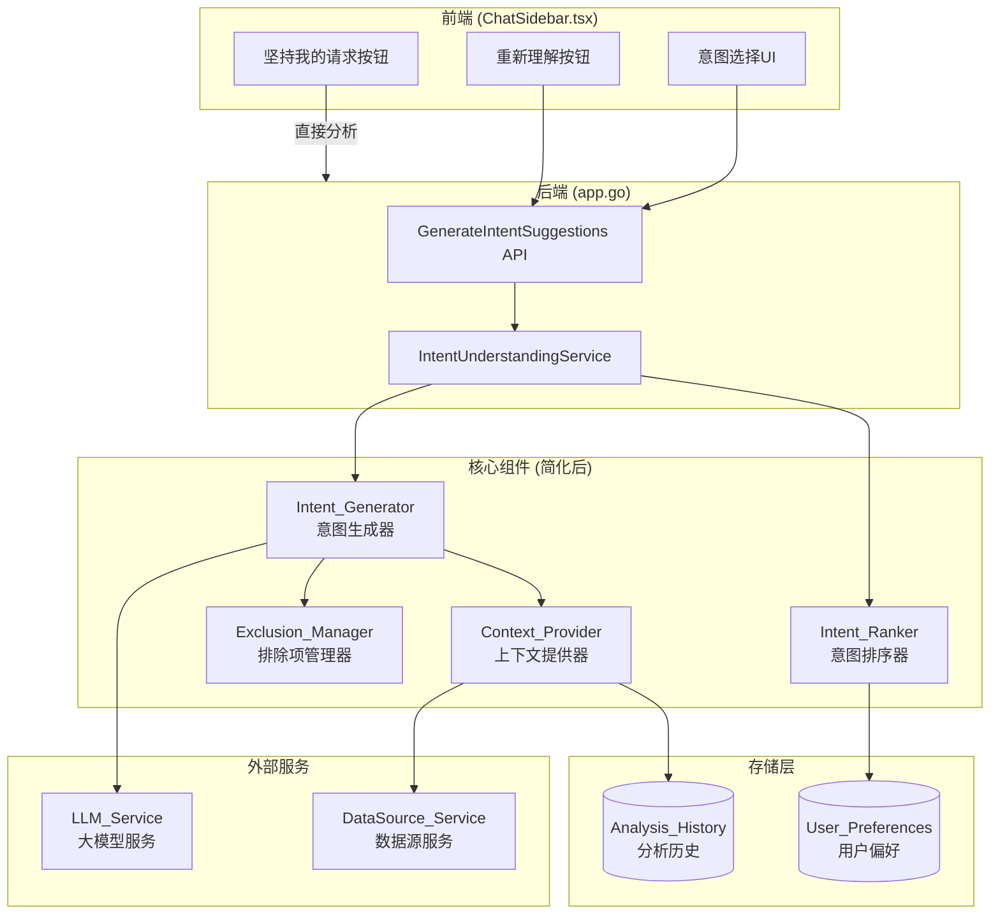

# 设计文档

## 概述

本设计文档描述意图理解系统重新设计的技术架构和实现方案。新设计遵循以下原则：

- **简化优先**：将8个组件简化为4个核心组件，降低系统复杂度
- **准确性提升**：通过更好的上下文整合提高LLM生成质量
- **用户体验优化**：简化交互流程，提供清晰的反馈
- **向后兼容**：保持现有API和数据结构不变

## 架构



## 组件和接口

### 1. IntentUnderstandingService (意图理解服务)

主服务，协调所有核心组件，提供统一的API接口。

```go
// IntentUnderstandingService 意图理解服务
// 简化后的主服务，协调4个核心组件
type IntentUnderstandingService struct {
    generator       *IntentGenerator
    contextProvider *ContextProvider
    exclusionMgr    *ExclusionManager
    ranker          *IntentRanker
    config          *IntentUnderstandingConfig
    logger          func(string)
    mu              sync.RWMutex
}

// IntentUnderstandingConfig 配置
// 简化为5个核心配置项
type IntentUnderstandingConfig struct {
    Enabled              bool `json:"enabled"`                // 是否启用意图理解
    MaxSuggestions       int  `json:"max_suggestions"`        // 最大建议数量，默认5
    MaxHistoryRecords    int  `json:"max_history_records"`    // 最大历史记录数，默认5
    PreferenceThreshold  int  `json:"preference_threshold"`   // 偏好学习阈值，默认3
    MaxExclusionSummary  int  `json:"max_exclusion_summary"`  // 排除摘要最大长度，默认300
}

// NewIntentUnderstandingService 创建意图理解服务
func NewIntentUnderstandingService(
    dataDir string,
    dataSourceService *DataSourceService,
    logger func(string),
) *IntentUnderstandingService

// GenerateSuggestions 生成意图建议
// 主入口方法，整合所有组件功能
func (s *IntentUnderstandingService) GenerateSuggestions(
    ctx context.Context,
    threadID string,
    userMessage string,
    dataSourceID string,
    language string,
    exclusions []IntentSuggestion,
) ([]IntentSuggestion, error)

// RecordSelection 记录用户选择
func (s *IntentUnderstandingService) RecordSelection(
    dataSourceID string,
    selectedIntent IntentSuggestion,
) error

// GetConfig 获取配置
func (s *IntentUnderstandingService) GetConfig() *IntentUnderstandingConfig

// SetConfig 设置配置
func (s *IntentUnderstandingService) SetConfig(config *IntentUnderstandingConfig)
```

### 2. IntentGenerator (意图生成器)

负责调用LLM生成意图建议。

```go
// IntentGenerator 意图生成器
// 负责构建提示词并调用LLM生成意图建议
type IntentGenerator struct {
    contextProvider *ContextProvider
    exclusionMgr    *ExclusionManager
    logger          func(string)
}

// NewIntentGenerator 创建意图生成器
func NewIntentGenerator(
    contextProvider *ContextProvider,
    exclusionMgr *ExclusionManager,
    logger func(string),
) *IntentGenerator

// Generate 生成意图建议
// 构建提示词，调用LLM，解析响应
func (g *IntentGenerator) Generate(
    ctx context.Context,
    userMessage string,
    dataSourceContext *DataSourceContext,
    exclusionSummary string,
    language string,
    maxSuggestions int,
) ([]IntentSuggestion, error)

// BuildPrompt 构建提示词
// 整合用户消息、数据源上下文、排除项摘要
func (g *IntentGenerator) BuildPrompt(
    userMessage string,
    dataSourceContext *DataSourceContext,
    exclusionSummary string,
    language string,
    maxSuggestions int,
) string
```

### 3. ContextProvider (上下文提供器)

负责收集和整合数据源信息和历史记录。

```go
// ContextProvider 上下文提供器
// 整合数据源特征和历史分析记录
type ContextProvider struct {
    dataSourceService *DataSourceService
    historyStore      *AnalysisHistoryStore
    dataDir           string
    mu                sync.RWMutex
}

// DataSourceContext 数据源上下文
// 包含数据源的所有相关信息
type DataSourceContext struct {
    TableName       string              `json:"table_name"`
    Columns         []ColumnInfo        `json:"columns"`
    AnalysisHints   []string            `json:"analysis_hints"`   // 分析提示
    RecentAnalyses  []AnalysisRecord    `json:"recent_analyses"`  // 最近分析记录
}

// ColumnInfo 列信息
type ColumnInfo struct {
    Name         string `json:"name"`
    Type         string `json:"type"`
    SemanticType string `json:"semantic_type"` // date, geographic, numeric, categorical, text
}

// NewContextProvider 创建上下文提供器
func NewContextProvider(
    dataDir string,
    dataSourceService *DataSourceService,
) *ContextProvider

// GetContext 获取数据源上下文
// 收集表信息、列特征、历史记录
func (c *ContextProvider) GetContext(
    dataSourceID string,
    maxHistoryRecords int,
) (*DataSourceContext, error)

// AddAnalysisRecord 添加分析记录
func (c *ContextProvider) AddAnalysisRecord(record AnalysisRecord) error

// BuildContextSection 构建上下文提示词片段
func (c *ContextProvider) BuildContextSection(
    context *DataSourceContext,
    language string,
) string
```

### 4. ExclusionManager (排除项管理器)

负责管理排除项并生成摘要。

```go
// ExclusionManager 排除项管理器
// 管理用户拒绝的意图并生成排除摘要
type ExclusionManager struct {
    maxSummaryLength int
}

// NewExclusionManager 创建排除项管理器
func NewExclusionManager(maxSummaryLength int) *ExclusionManager

// GenerateSummary 生成排除项摘要
// 将排除项列表转换为简洁的摘要文本
func (m *ExclusionManager) GenerateSummary(
    exclusions []IntentSuggestion,
    language string,
) string

// CategorizeExclusions 分类排除项
// 将排除项按分析类型分组
func (m *ExclusionManager) CategorizeExclusions(
    exclusions []IntentSuggestion,
) map[string][]string
```

### 5. IntentRanker (意图排序器)

负责根据用户偏好对意图建议进行排序。

```go
// IntentRanker 意图排序器
// 根据用户历史选择对意图建议进行排序
type IntentRanker struct {
    preferencesStore *PreferencesStore
    threshold        int // 最小选择次数阈值
    dataDir          string
    mu               sync.RWMutex
}

// PreferencesStore 偏好存储
type PreferencesStore struct {
    Selections map[string][]SelectionRecord `json:"selections"` // dataSourceID -> records
}

// SelectionRecord 选择记录
type SelectionRecord struct {
    IntentType   string    `json:"intent_type"`
    SelectCount  int       `json:"select_count"`
    LastSelected time.Time `json:"last_selected"`
}

// NewIntentRanker 创建意图排序器
func NewIntentRanker(dataDir string, threshold int) *IntentRanker

// RankSuggestions 排序意图建议
// 根据用户偏好重新排序
func (r *IntentRanker) RankSuggestions(
    dataSourceID string,
    suggestions []IntentSuggestion,
) []IntentSuggestion

// RecordSelection 记录用户选择
func (r *IntentRanker) RecordSelection(
    dataSourceID string,
    intent IntentSuggestion,
) error

// GetSelectionCount 获取总选择次数
func (r *IntentRanker) GetSelectionCount(dataSourceID string) int
```

## 数据模型

### IntentSuggestion (保持不变)

```go
// IntentSuggestion 意图建议
// 保持与现有结构完全一致，确保向后兼容
type IntentSuggestion struct {
    ID          string `json:"id"`          // 唯一标识符
    Title       string `json:"title"`       // 简短标题（最多10字）
    Description string `json:"description"` // 详细描述（最多30字）
    Icon        string `json:"icon"`        // 图标（emoji）
    Query       string `json:"query"`       // 具体的分析查询
}
```

### DataSourceContext

```json
{
  "table_name": "sales_data",
  "columns": [
    {"name": "date", "type": "DATE", "semantic_type": "date"},
    {"name": "region", "type": "TEXT", "semantic_type": "geographic"},
    {"name": "amount", "type": "REAL", "semantic_type": "numeric"},
    {"name": "category", "type": "TEXT", "semantic_type": "categorical"}
  ],
  "analysis_hints": [
    "适合时间序列分析（包含日期列）",
    "适合区域分析（包含地理位置列）",
    "适合统计分析（包含数值列）",
    "适合分组对比分析（包含分类列）"
  ],
  "recent_analyses": [
    {
      "analysis_type": "trend",
      "target_columns": ["date", "amount"],
      "key_findings": "销售额呈上升趋势"
    }
  ]
}
```

### 配置文件 (intent_understanding_config.json)

```json
{
  "enabled": true,
  "max_suggestions": 5,
  "max_history_records": 5,
  "preference_threshold": 3,
  "max_exclusion_summary": 300
}
```

### 用户偏好存储 (intent_preferences.json)

```json
{
  "selections": {
    "ds_abc123": [
      {
        "intent_type": "趋势分析",
        "select_count": 5,
        "last_selected": "2024-01-15T10:30:00Z"
      },
      {
        "intent_type": "对比分析",
        "select_count": 3,
        "last_selected": "2024-01-14T15:20:00Z"
      }
    ]
  }
}
```


## 正确性属性

*正确性属性是一种在系统所有有效执行中都应该保持为真的特征或行为——本质上是关于系统应该做什么的形式化陈述。属性作为人类可读规范和机器可验证正确性保证之间的桥梁。*

### Property 1: 意图建议数量正确性

*For any* 有效的用户请求和数据源，Intent_Generator生成的意图建议数量应在3-5个之间（除非LLM无法生成足够的建议）。

**Validates: Requirements 1.1**

### Property 2: 意图建议结构完整性

*For any* 生成的意图建议，应包含非空的id、title、description、icon和query字段。

**Validates: Requirements 1.2**

### Property 3: 上下文包含数据源信息

*For any* 数据源ID，Context_Provider返回的上下文应包含：
- 表名（非空）
- 列信息列表（包含name、type、semantic_type）
- 分析提示列表

**Validates: Requirements 1.3, 2.1, 2.7**

### Property 4: 列类型识别与分析提示

*For any* 数据源的列集合：
- 包含日期类型列时，分析提示应包含"时间序列分析"相关提示
- 包含地理位置列时，分析提示应包含"区域分析"相关提示
- 包含数值类型列时，分析提示应包含"统计分析"相关提示
- 包含分类列时，分析提示应包含"分组对比分析"相关提示

**Validates: Requirements 2.2, 2.3, 2.4, 2.5**

### Property 5: 历史记录数量限制

*For any* 数据源和任意数量的历史分析记录，Context_Provider返回的上下文中最多包含配置的最大历史记录数（默认5条），且按时间倒序排列。

**Validates: Requirements 2.6**

### Property 6: 排除摘要长度限制

*For any* 排除项列表（无论数量多少），Exclusion_Manager生成的摘要长度应不超过配置的最大长度（默认300字符）。

**Validates: Requirements 3.3**

### Property 7: 排除项分类合并

*For any* 超过10个的排除项列表，Exclusion_Manager应将排除项按分析类型分类，生成的摘要中应包含分类信息而非逐个列出。

**Validates: Requirements 3.4**

### Property 8: 选择记录与数据源隔离

*For any* 两个不同的数据源ID，在一个数据源上记录的意图选择不应影响另一个数据源的偏好统计。

**Validates: Requirements 5.1, 5.2**

### Property 9: 偏好排序正确性

*For any* 数据源和意图建议列表：
- 当总选择次数少于阈值（默认3次）时，排序后的列表应与原始列表顺序一致
- 当总选择次数达到阈值时，选择频率高的意图类型应排在前面

**Validates: Requirements 5.3, 5.4**

### Property 10: 文本截断正确性

*For any* 长度超过30字符的文本，截断后的文本长度应等于30字符。

**Validates: Requirements 4.4**

## 错误处理

### LLM调用失败

```go
func (g *IntentGenerator) Generate(...) ([]IntentSuggestion, error) {
    // 调用LLM
    response, err := g.callLLM(ctx, prompt)
    if err != nil {
        g.logger(fmt.Sprintf("[INTENT-GENERATOR] LLM call failed: %v", err))
        return nil, fmt.Errorf("意图生成失败: %w", err)
    }
    
    // 解析响应
    suggestions, err := g.parseResponse(response)
    if err != nil {
        g.logger(fmt.Sprintf("[INTENT-GENERATOR] Response parse failed: %v", err))
        return nil, fmt.Errorf("响应解析失败: %w", err)
    }
    
    // 验证建议数量
    if len(suggestions) == 0 {
        g.logger("[INTENT-GENERATOR] No suggestions generated")
        return nil, fmt.Errorf("未能生成意图建议")
    }
    
    return suggestions, nil
}
```

### 数据源信息获取失败

```go
func (c *ContextProvider) GetContext(dataSourceID string, maxHistoryRecords int) (*DataSourceContext, error) {
    context := &DataSourceContext{
        AnalysisHints:  []string{},
        RecentAnalyses: []AnalysisRecord{},
    }
    
    // 获取表信息（失败时使用空值继续）
    tableInfo, err := c.dataSourceService.GetTableInfo(dataSourceID)
    if err != nil {
        c.logger(fmt.Sprintf("[CONTEXT-PROVIDER] Failed to get table info: %v", err))
        // 继续使用空上下文
    } else {
        context.TableName = tableInfo.Name
        context.Columns = c.analyzeColumns(tableInfo.Columns)
        context.AnalysisHints = c.generateHints(context.Columns)
    }
    
    // 获取历史记录（失败时使用空列表继续）
    history, err := c.historyStore.GetRecordsByDataSource(dataSourceID, maxHistoryRecords)
    if err != nil {
        c.logger(fmt.Sprintf("[CONTEXT-PROVIDER] Failed to get history: %v", err))
    } else {
        context.RecentAnalyses = history
    }
    
    return context, nil
}
```

### 组件初始化失败

```go
func (s *IntentUnderstandingService) Initialize() error {
    var initErrors []error
    
    // 初始化上下文提供器
    if err := s.contextProvider.Initialize(); err != nil {
        s.logger(fmt.Sprintf("[INTENT-SERVICE] Context provider init failed: %v", err))
        initErrors = append(initErrors, err)
    }
    
    // 初始化排序器
    if err := s.ranker.Initialize(); err != nil {
        s.logger(fmt.Sprintf("[INTENT-SERVICE] Ranker init failed: %v", err))
        initErrors = append(initErrors, err)
    }
    
    // 如果所有组件都失败，返回错误
    if len(initErrors) == 2 {
        return fmt.Errorf("所有组件初始化失败")
    }
    
    // 部分组件失败时，记录警告但继续运行
    if len(initErrors) > 0 {
        s.logger("[INTENT-SERVICE] Some components failed to initialize, running in degraded mode")
    }
    
    return nil
}
```

## 测试策略

### 单元测试

单元测试用于验证各组件的独立功能：

1. **IntentGenerator 测试**
   - 测试提示词构建
   - 测试响应解析
   - 测试错误处理

2. **ContextProvider 测试**
   - 测试列类型识别
   - 测试分析提示生成
   - 测试历史记录获取

3. **ExclusionManager 测试**
   - 测试摘要生成
   - 测试长度限制
   - 测试分类合并

4. **IntentRanker 测试**
   - 测试选择记录
   - 测试排序逻辑
   - 测试阈值判断

### 属性测试

属性测试用于验证系统的通用正确性属性。每个属性测试应运行至少100次迭代。

**测试框架**: Go 的 `testing/quick` 包或 `gopter` 库

```go
// Property 2: 意图建议结构完整性
// Feature: intent-understanding-redesign, Property 2: 意图建议结构完整性
func TestProperty_IntentSuggestionStructure(t *testing.T) {
    // 生成随机意图建议
    // 验证所有必需字段都存在且非空
}

// Property 4: 列类型识别与分析提示
// Feature: intent-understanding-redesign, Property 4: 列类型识别与分析提示
func TestProperty_ColumnTypeRecognition(t *testing.T) {
    // 生成随机列信息
    // 验证分析提示与列类型匹配
}

// Property 5: 历史记录数量限制
// Feature: intent-understanding-redesign, Property 5: 历史记录数量限制
func TestProperty_HistoryRecordLimit(t *testing.T) {
    // 生成随机数量的历史记录
    // 验证返回的记录数量不超过限制
}

// Property 6: 排除摘要长度限制
// Feature: intent-understanding-redesign, Property 6: 排除摘要长度限制
func TestProperty_ExclusionSummaryLength(t *testing.T) {
    // 生成随机数量的排除项
    // 验证摘要长度不超过限制
}

// Property 8: 选择记录与数据源隔离
// Feature: intent-understanding-redesign, Property 8: 选择记录与数据源隔离
func TestProperty_SelectionIsolation(t *testing.T) {
    // 在不同数据源记录选择
    // 验证选择记录相互独立
}

// Property 9: 偏好排序正确性
// Feature: intent-understanding-redesign, Property 9: 偏好排序正确性
func TestProperty_PreferenceRanking(t *testing.T) {
    // 生成随机选择历史
    // 验证排序结果符合频率顺序
}
```

### 集成测试

集成测试验证组件之间的协作：

1. **端到端意图生成测试**
   - 测试完整的意图生成流程
   - 验证所有组件协同工作

2. **重新理解流程测试**
   - 测试多次重新理解循环
   - 验证排除项正确累积

3. **配置切换测试**
   - 测试启用/禁用意图理解
   - 验证配置变更生效

### 测试配置

```go
// 属性测试配置
const (
    PropertyTestIterations = 100  // 每个属性测试的迭代次数
    MaxTestHistoryRecords  = 20   // 测试用最大历史记录数
    MaxTestExclusions      = 30   // 测试用最大排除项数
)
```

## 迁移策略

### 从现有系统迁移

1. **保留的组件**
   - `IntentSuggestion` 数据结构（完全保留）
   - `AnalysisRecord` 数据结构（完全保留）
   - `AnalysisHistoryStore`（简化后保留）
   - 排除项摘要逻辑（简化后保留）
   - 偏好学习逻辑（简化后保留）

2. **移除的组件**
   - `IntentCache`（移除缓存机制）
   - `SemanticSimilarityCalculator`（移除语义相似度计算）
   - `ExampleProvider`（移除Few-shot示例）
   - `DimensionAnalyzer`（功能合并到ContextProvider）

3. **简化的组件**
   - `IntentEnhancementService` → `IntentUnderstandingService`
   - `ContextEnhancer` → `ContextProvider`
   - `ExclusionSummarizer` → `ExclusionManager`
   - `PreferenceLearner` → `IntentRanker`

### 配置迁移

```go
// 旧配置 -> 新配置映射
// EnableContextEnhancement -> (移除，默认启用)
// EnablePreferenceLearning -> (移除，默认启用)
// EnableDynamicDimensions -> (移除，功能合并)
// EnableFewShotExamples -> (移除)
// EnableCaching -> (移除)
// CacheSimilarityThreshold -> (移除)
// CacheExpirationHours -> (移除)
// MaxCacheEntries -> (移除)
// MaxHistoryRecords -> max_history_records (保留)
// MinSelectionsForPreference -> preference_threshold (保留，默认值从5改为3)
```

### 数据迁移

1. **分析历史数据**：完全兼容，无需迁移
2. **意图选择记录**：完全兼容，无需迁移
3. **缓存数据**：可安全删除（移除缓存机制）
