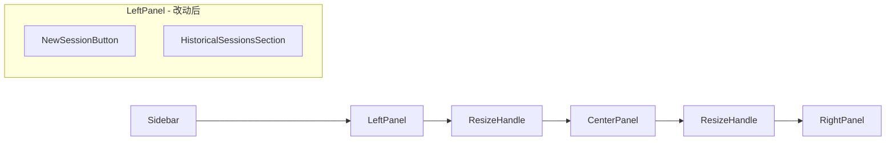

# 设计文档

## 概述

本设计涵盖两个独立的改动：

1. **移除数据源区域**：从 LeftPanel 中移除 DataSourcesSection 组件及其相关代码，简化左侧面板为仅包含 NewSessionButton 和 HistoricalSessionsSection。
2. **修复拖拽调整大小**：修复 ResizeHandle 组件中的 React 闭包陈旧（stale closure）问题，使面板间拖拽调整大小功能正常工作。

## 架构

当前三面板布局结构（Sidebar | LeftPanel | ResizeHandle | CenterPanel | ResizeHandle | RightPanel）保持不变。改动仅涉及：

- LeftPanel 内部组件组合的简化
- ResizeHandle 内部状态管理的修复



## 组件与接口

### 1. LeftPanel 组件改动

**移除的内容：**
- DataSourcesSection 组件的渲染
- `dataSources` 状态及 `fetchDataSources` 函数
- 数据源相关事件监听（data-source-added、data-source-deleted、data-source-renamed）
- `handleDataSourceContextMenu` 函数
- Props 中的 `onDataSourceSelect`、`onBrowseData`、`selectedDataSourceId`

**简化后的 Props 接口：**

```typescript
interface LeftPanelProps {
    width: number;
    onSessionSelect: (sessionId: string) => void;
    onNewSession: () => void;
    selectedSessionId: string | null;
}
```

**布局调整：**
- NewSessionButton 位于面板顶部，不再依赖 `selectedDataSourceId`，始终可点击
- HistoricalSessionsSection 占据剩余全部空间

### 2. ResizeHandle 组件修复

**问题根因分析：**

当前 ResizeHandle 存在 React 闭包陈旧（stale closure）问题：

1. `handleMouseMove` 和 `handleMouseUp` 通过 `useCallback` 创建，依赖 `isDragging` 状态
2. 当 `handleMouseDown` 调用 `setIsDragging(true)` 时，React 重新渲染组件
3. `useEffect` 检测到 `isDragging` 变为 `true`，注册全局事件监听器
4. 但此时 `handleMouseMove` 和 `handleMouseUp` 可能仍持有旧的 `isDragging=false` 闭包值
5. 导致 `handleMouseMove` 中的 `if (!isDragging) return;` 始终为 true，拖拽无效

**修复方案：使用 useRef 替代 useState 跟踪拖拽状态**

```typescript
const isDraggingRef = useRef(false);
const [isDragging, setIsDragging] = useState(false); // 仅用于视觉渲染

// 同时使用 ref 存储回调，避免闭包问题
const onDragRef = useRef(onDrag);
const onDragEndRef = useRef(onDragEnd);

useEffect(() => {
    onDragRef.current = onDrag;
    onDragEndRef.current = onDragEnd;
}, [onDrag, onDragEnd]);
```

在 `handleMouseDown` 中同时设置 ref 和 state：
```typescript
isDraggingRef.current = true;
setIsDragging(true);
```

在 `handleMouseMove` 和 `handleMouseUp` 中使用 ref：
```typescript
if (!isDraggingRef.current) return;
onDragRef.current(deltaX);
```

事件监听器在 `handleMouseDown` 中直接注册，在 `handleMouseUp` 中移除，不依赖 `useEffect`：
```typescript
const handleMouseDown = useCallback((e: React.MouseEvent) => {
    e.preventDefault();
    isDraggingRef.current = true;
    setIsDragging(true);
    dragStartX.current = e.clientX;
    onDragStartRef.current();
    document.body.style.userSelect = 'none';
    document.body.style.cursor = 'col-resize';
    
    window.addEventListener('mousemove', handleMouseMoveRef.current);
    window.addEventListener('mouseup', handleMouseUpRef.current);
}, []);
```

### 3. App.tsx 改动

- 移除传递给 LeftPanel 的数据源相关 props
- 保留 `selectedDataSourceId` 状态（其他组件仍在使用）
- ResizeHandle 的使用方式不变

## 数据模型

无新增数据模型。仅涉及现有接口的简化：

- `LeftPanelProps`：移除 `onDataSourceSelect`、`onBrowseData`、`selectedDataSourceId`、`onWidthChange`
- `PanelWidths` 接口不变
- `PANEL_CONSTRAINTS` 不变


## 正确性属性

*属性（Property）是指在系统所有有效执行中都应成立的特征或行为——本质上是关于系统应该做什么的形式化陈述。属性是人类可读规范与机器可验证正确性保证之间的桥梁。*

### Property 1: 面板宽度约束不变量

*For any* 总宽度 totalWidth、左侧宽度 leftWidth 和右侧宽度 rightWidth 的组合，`calculatePanelWidths(totalWidth, leftWidth, rightWidth)` 的返回值应始终满足：
- `left >= PANEL_CONSTRAINTS.left.min` (180px)
- `center >= PANEL_CONSTRAINTS.center.min` (400px)
- `right >= PANEL_CONSTRAINTS.right.min` (280px)
- `left + center + right == totalWidth`

**Validates: Requirements 3.3**

### Property 2: 拖拽调整大小的正确性

*For any* 手柄位置（'left' 或 'right'）、任意拖拽增量 deltaX、任意合法的当前面板宽度和总宽度，`handleResizeDrag(handlePosition, deltaX, currentWidths, totalWidth)` 的返回值应满足：
- 所有面板宽度约束（同 Property 1）
- 三个面板宽度之和等于 totalWidth

**Validates: Requirements 3.1, 3.2**

### Property 3: 面板宽度持久化往返一致性

*For any* 合法的 PanelWidths 对象和 totalWidth，执行 `savePanelWidths(widths)` 后再执行 `loadPanelWidths(totalWidth)`，加载回的 left 和 right 值应与保存时一致（当 totalWidth 相同时）。

**Validates: Requirements 3.4**

## 错误处理

| 场景 | 处理方式 |
|------|---------|
| localStorage 不可用 | savePanelWidths/loadPanelWidths 已有 try-catch，返回 false/null，使用默认值 |
| 面板宽度计算溢出 | calculatePanelWidths 通过约束裁剪确保合法值 |
| ResizeHandle 拖拽中鼠标离开窗口 | 全局 mouseup 监听器确保拖拽正确结束 |
| LeftPanel 会话加载失败 | 现有 try-catch 处理，显示空列表 |

## 测试策略

### 属性测试（Property-Based Testing）

使用 `fast-check` 库进行属性测试，每个属性至少运行 100 次迭代。

- **Property 1**: 生成随机的 totalWidth（860-3000）、leftWidth（0-1000）、rightWidth（0-1000），验证 calculatePanelWidths 输出满足所有约束
  - Tag: **Feature: layout-simplification, Property 1: 面板宽度约束不变量**
- **Property 2**: 生成随机的 handlePosition、deltaX（-500 到 500）、合法的 currentWidths 和 totalWidth，验证 handleResizeDrag 输出满足约束
  - Tag: **Feature: layout-simplification, Property 2: 拖拽调整大小的正确性**
- **Property 3**: 生成随机的合法 PanelWidths，执行 save/load 往返，验证一致性
  - Tag: **Feature: layout-simplification, Property 3: 面板宽度持久化往返一致性**

### 单元测试

- LeftPanel 渲染测试：验证不包含 DataSourcesSection，包含 NewSessionButton 和 HistoricalSessionsSection
- LeftPanel 初始化测试：验证不调用 GetDataSources，不监听数据源事件
- NewSessionButton 测试：验证无 selectedDataSourceId 时仍可点击
- ResizeHandle 拖拽测试：模拟 mousedown → mousemove → mouseup 序列，验证 onDrag 回调被正确调用
