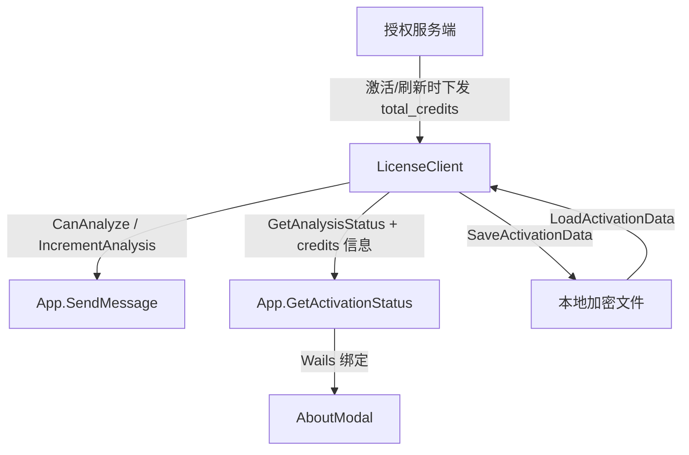

# 设计文档：License Credits 支持

## 概述

在现有授权系统的基础上，新增 credits（积分）授权模式。该模式与现有的每日限制模式互斥——一个授权要么使用每日限制，要么使用 credits。核心改动集中在 `LicenseClient` 的分析检查/扣减逻辑、`ActivationData` 数据结构、`GetActivationStatus` 返回值，以及前端 `AboutModal` 的条件渲染。

## 架构

整体架构不变，仍然是 Go 后端 + React/TypeScript 前端通过 Wails 绑定通信。改动范围：



改动点：
1. `ActivationData` 新增 `TotalCredits` 和 `UsedCredits` 字段
2. `LicenseClient` 新增 credits 模式判定、检查和扣减逻辑
3. `App.GetActivationStatus` 返回 credits 相关字段
4. `AboutModal` 根据模式条件渲染 credits 或每日限制用量

## 组件与接口

### 1. LicenseClient（后端 - `src/agent/license_client.go`）

新增常量：

```go
const CreditsPerAnalysis = 1.5
```

新增方法：

```go
// IsCreditsMode 判断当前是否为 credits 模式
func (c *LicenseClient) IsCreditsMode() bool

// GetCreditsStatus 返回 credits 状态
func (c *LicenseClient) GetCreditsStatus() (totalCredits float64, usedCredits float64, isCreditsMode bool)
```

修改方法：

- `CanAnalyze() (bool, string)` — 增加 credits 模式分支：检查剩余 credits >= 1.5
- `IncrementAnalysis()` — 增加 credits 模式分支：`used_credits += 1.5` 并持久化
- `GetAnalysisStatus()` — 保持不变，仅用于每日限制模式

### 2. ActivationData（后端 - `src/agent/license_client.go`）

新增字段：

```go
type ActivationData struct {
    // ... 现有字段 ...
    TotalCredits float64 `json:"total_credits"` // 总 credits，0 表示不使用 credits 模式
    UsedCredits  float64 `json:"used_credits"`  // 已使用的 credits
}
```

### 3. App.GetActivationStatus（后端 - `src/app.go`）

返回值新增字段：

```go
// 新增返回字段
"total_credits":  totalCredits,  // float64
"used_credits":   usedCredits,   // float64
"credits_mode":   isCreditsMode, // bool
```

### 4. AboutModal（前端 - `src/frontend/src/components/AboutModal.tsx`）

状态类型扩展：

```typescript
// activationStatus 新增字段
total_credits?: number;
used_credits?: number;
credits_mode?: boolean;
```

渲染逻辑：
- `credits_mode === true` 时：显示 credits 用量区域（已用/总量 + 进度条），隐藏每日分析用量
- `credits_mode === false` 或未设置时：保持现有每日分析用量展示

### 5. 持久化数据结构（`SaveActivationData` / `LoadActivationData`）

`saveData` 结构体新增字段：

```go
saveData := struct {
    // ... 现有字段 ...
    UsedCredits float64 `json:"used_credits"` // 已用 credits
}{
    // ...
    UsedCredits: c.data.UsedCredits,
}
```

`LoadActivationData` 恢复时读取 `used_credits` 并写入 `c.data.UsedCredits`。

## 数据模型

### ActivationData 完整结构（仅列出变更）

| 字段 | 类型 | 说明 | 来源 |
|------|------|------|------|
| `total_credits` | `float64` | 总 credits 数量，0 = 不使用 credits 模式 | 服务端下发 |
| `used_credits` | `float64` | 已使用的 credits 数量 | 本地累计 |

### 模式判定规则

| 条件 | 模式 |
|------|------|
| `total_credits > 0` | Credits_Mode |
| `total_credits == 0 && daily_analysis > 0` | Daily_Limit_Mode |
| `total_credits == 0 && daily_analysis == 0` | 无限制 |

### Credits 计算

- 剩余 credits = `total_credits - used_credits`
- 每次分析消耗 = `CreditsPerAnalysis`（常量 1.5）
- 可分析条件 = 剩余 credits >= `CreditsPerAnalysis`

### GetActivationStatus 返回值变更

新增字段：

| 字段 | 类型 | 说明 |
|------|------|------|
| `total_credits` | `float64` | 总 credits |
| `used_credits` | `float64` | 已用 credits |
| `credits_mode` | `bool` | 是否为 credits 模式 |


## 正确性属性

*属性是一种在系统所有有效执行中都应成立的特征或行为——本质上是关于系统应该做什么的形式化陈述。属性是人类可读规范与机器可验证正确性保证之间的桥梁。*

### Property 1: 模式判定一致性

*For any* ActivationData，`IsCreditsMode()` 返回 `true` 当且仅当 `total_credits > 0`；当 `total_credits == 0` 且 `daily_analysis > 0` 时为 Daily_Limit_Mode；当两者均为 0 时为无限制模式。

**Validates: Requirements 1.1, 1.2, 1.3**

### Property 2: Credits 持久化往返一致性

*For any* 处于 Credits_Mode 的 LicenseClient，执行若干次 `IncrementAnalysis()` 后调用 `SaveActivationData()`，再通过 `LoadActivationData()` 加载，恢复后的 `used_credits` 应与保存前的值相等。

**Validates: Requirements 2.2, 2.3**

### Property 3: CanAnalyze credits 阈值检查

*For any* 处于 Credits_Mode 的 ActivationData（`total_credits > 0`），`CanAnalyze()` 返回 `true` 当且仅当 `total_credits - used_credits >= 1.5`。

**Validates: Requirements 3.1, 3.2**

### Property 4: Credits 模式绕过每日限制

*For any* 处于 Credits_Mode 的 LicenseClient，即使 `daily_analysis > 0` 且当日分析次数已达到 `daily_analysis` 上限，只要剩余 credits 充足，`CanAnalyze()` 仍应返回 `true`。

**Validates: Requirements 3.3**

### Property 5: IncrementAnalysis credits 扣减精度

*For any* 处于 Credits_Mode 的 LicenseClient，调用 `IncrementAnalysis()` 后，`used_credits` 的增量应恰好等于 `CreditsPerAnalysis`（1.5）。

**Validates: Requirements 4.1**

### Property 6: GetActivationStatus credits 字段一致性

*For any* 已激活的 LicenseClient，`GetActivationStatus()` 返回的 `credits_mode` 字段应与 `IsCreditsMode()` 的返回值一致，且 `total_credits` 和 `used_credits` 应与 ActivationData 中的对应字段值一致。

**Validates: Requirements 5.1, 5.2, 5.3**

## 错误处理

| 场景 | 处理方式 |
|------|----------|
| Credits 不足时发起分析 | `CanAnalyze()` 返回 `false` 和中文提示消息，包含剩余 credits 数量 |
| `used_credits` 超过 `total_credits`（数据异常） | 视为 credits 用完，`CanAnalyze()` 返回 `false` |
| 服务端未返回 `total_credits` 字段 | 默认为 0，即不启用 credits 模式 |
| 持久化失败 | 记录日志，不阻塞分析流程（与现有行为一致） |
| `total_credits` 为负数 | 视为 0，不启用 credits 模式 |

## 测试策略

### 属性测试（Property-Based Testing）

使用 Go 的 `testing/quick` 包进行属性测试，每个属性至少运行 100 次迭代。

每个正确性属性对应一个独立的属性测试函数：

- **Property 1** → `TestPropertyModeDetection` — 生成随机 `total_credits` 和 `daily_analysis` 值，验证模式判定一致性
- **Property 2** → `TestPropertyCreditsPersistenceRoundTrip` — 生成随机 credits 值，执行保存/加载往返，验证 `used_credits` 一致
- **Property 3** → `TestPropertyCanAnalyzeCreditsThreshold` — 生成随机 `total_credits` 和 `used_credits`，验证 `CanAnalyze()` 的阈值判定
- **Property 4** → `TestPropertyCreditsModeBypasses DailyLimit` — 生成随机 credits 和 daily limit 配置，验证 credits 模式下不受每日限制影响
- **Property 5** → `TestPropertyIncrementAnalysisCreditsDeduction` — 生成随机初始 `used_credits`，验证扣减增量恰好为 1.5
- **Property 6** → `TestPropertyGetActivationStatusCreditsConsistency` — 生成随机 ActivationData，验证返回字段与内部状态一致

每个测试需添加注释标签：
```
// Feature: license-credits-support, Property N: <property_text>
```

### 单元测试

单元测试聚焦于具体示例和边界情况：

- Credits 恰好等于 1.5 时的分析检查（边界）
- Credits 为 0 时的分析检查
- `total_credits` 为负数时的处理
- 服务端数据不含 `total_credits` 字段时的默认值
- 前端 AboutModal 在 credits 模式下的渲染（显示 credits 区域、隐藏每日限制区域）
- 前端 AboutModal 在每日限制模式下的渲染（隐藏 credits 区域）
- Credits 用完时进度条显示红色

### 测试配置

- 属性测试：每个属性最少 100 次迭代
- 属性测试库：Go `testing/quick`
- 前端测试：React Testing Library
- 每个属性测试必须引用设计文档中的属性编号
