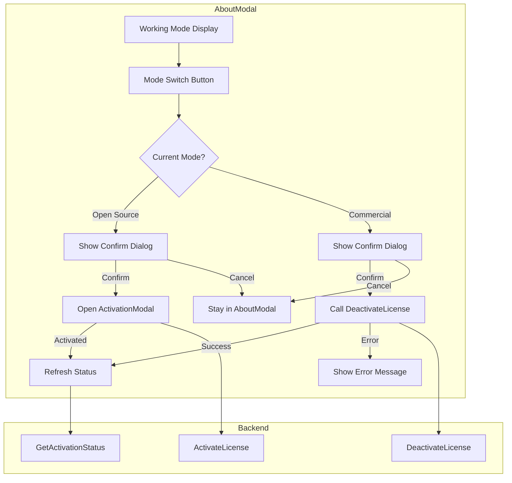

# Design Document: License Mode Switch

## Overview

本设计文档描述了在 AboutModal 组件中添加授权模式切换功能的技术实现方案。该功能允许用户在开源模式和商业模式之间切换，通过确认对话框防止误操作，并支持中英文国际化。

### 设计目标

1. 最小化对现有 AboutModal 组件的修改
2. 复用现有的 ActivationModal 组件
3. 使用现有的 i18n 国际化机制
4. 保持 UI 风格一致性

## Architecture



### 组件交互流程

1. **开源模式 → 商业模式**:
   - 用户点击"切换到商业模式"按钮
   - 显示确认对话框
   - 用户确认后关闭 AboutModal，打开 ActivationModal
   - 激活成功后，用户可重新打开 AboutModal 查看新状态

2. **商业模式 → 开源模式**:
   - 用户点击"切换到开源模式"按钮
   - 显示确认对话框（包含警告信息）
   - 用户确认后调用 DeactivateLicense()
   - 成功后刷新 AboutModal 中的状态显示

## Components and Interfaces

### 1. AboutModal 组件修改

```typescript
// 新增状态
const [showConfirmDialog, setShowConfirmDialog] = useState(false);
const [confirmAction, setConfirmAction] = useState<'toCommercial' | 'toOpenSource' | null>(null);
const [showActivationModal, setShowActivationModal] = useState(false);
const [isDeactivating, setIsDeactivating] = useState(false);
const [deactivateError, setDeactivateError] = useState<string | null>(null);

// 新增回调
interface AboutModalProps {
    isOpen: boolean;
    onClose: () => void;
    onOpenActivation?: () => void;  // 可选：用于外部控制 ActivationModal
}
```

### 2. 切换按钮组件

```typescript
// 内联在 AboutModal 中的切换按钮
const ModeSwitchButton: React.FC<{
    isCommercial: boolean;
    onClick: () => void;
    disabled?: boolean;
}> = ({ isCommercial, onClick, disabled }) => {
    const { t } = useLanguage();
    
    return (
        <button
            onClick={onClick}
            disabled={disabled}
            className="text-xs px-2 py-1 rounded bg-slate-100 hover:bg-slate-200 
                       text-slate-600 transition-colors disabled:opacity-50"
        >
            {isCommercial 
                ? t('switch_to_opensource') 
                : t('switch_to_commercial')}
        </button>
    );
};
```

### 3. 确认对话框组件

```typescript
interface ConfirmDialogProps {
    isOpen: boolean;
    title: string;
    message: string;
    confirmText: string;
    cancelText: string;
    onConfirm: () => void;
    onCancel: () => void;
    isLoading?: boolean;
    variant?: 'default' | 'warning';
}

const ConfirmDialog: React.FC<ConfirmDialogProps> = ({
    isOpen,
    title,
    message,
    confirmText,
    cancelText,
    onConfirm,
    onCancel,
    isLoading = false,
    variant = 'default'
}) => {
    if (!isOpen) return null;
    
    return (
        <div className="fixed inset-0 bg-black/50 flex items-center justify-center z-[60]">
            <div className="bg-white rounded-lg shadow-xl w-full max-w-sm p-4">
                <h3 className="text-lg font-semibold text-slate-800 mb-2">{title}</h3>
                <p className="text-sm text-slate-600 mb-4">{message}</p>
                <div className="flex justify-end gap-2">
                    <button
                        onClick={onCancel}
                        disabled={isLoading}
                        className="px-4 py-2 text-sm text-slate-600 hover:bg-slate-100 
                                   rounded-lg transition-colors"
                    >
                        {cancelText}
                    </button>
                    <button
                        onClick={onConfirm}
                        disabled={isLoading}
                        className={`px-4 py-2 text-sm text-white rounded-lg transition-colors
                            ${variant === 'warning' 
                                ? 'bg-orange-500 hover:bg-orange-600' 
                                : 'bg-blue-500 hover:bg-blue-600'}
                            disabled:opacity-50`}
                    >
                        {isLoading ? '...' : confirmText}
                    </button>
                </div>
            </div>
        </div>
    );
};
```

### 4. 事件处理函数

```typescript
// 处理切换按钮点击
const handleSwitchClick = () => {
    if (activationStatus.activated) {
        setConfirmAction('toOpenSource');
    } else {
        setConfirmAction('toCommercial');
    }
    setShowConfirmDialog(true);
};

// 处理确认
const handleConfirm = async () => {
    if (confirmAction === 'toCommercial') {
        setShowConfirmDialog(false);
        onClose();
        setShowActivationModal(true);
    } else if (confirmAction === 'toOpenSource') {
        setIsDeactivating(true);
        setDeactivateError(null);
        try {
            await DeactivateLicense();
            const status = await GetActivationStatus();
            setActivationStatus({
                activated: status.activated || false,
                sn: status.sn || '',
                expires_at: status.expires_at || '',
                daily_analysis_limit: status.daily_analysis_limit || 0,
                daily_analysis_count: status.daily_analysis_count || 0,
            });
            setShowConfirmDialog(false);
            setConfirmAction(null);
        } catch (error: any) {
            setDeactivateError(error.toString());
        } finally {
            setIsDeactivating(false);
        }
    }
};

// 处理取消
const handleCancel = () => {
    setShowConfirmDialog(false);
    setConfirmAction(null);
    setDeactivateError(null);
};
```

## Data Models

### 激活状态接口

```typescript
interface ActivationStatus {
    activated: boolean;           // 是否已激活（商业模式）
    sn?: string;                  // 序列号
    expires_at?: string;          // 过期时间
    daily_analysis_limit?: number; // 每日分析限制
    daily_analysis_count?: number; // 今日已分析次数
}
```

### 确认对话框状态

```typescript
type ConfirmAction = 'toCommercial' | 'toOpenSource' | null;

interface ConfirmDialogState {
    isOpen: boolean;
    action: ConfirmAction;
    isLoading: boolean;
    error: string | null;
}
```

### 国际化文本

```typescript
// 新增到 i18n.ts 的翻译键
interface LicenseModeTranslations {
    switch_to_commercial: string;      // "切换到商业模式" / "Switch to Commercial"
    switch_to_opensource: string;      // "切换到开源模式" / "Switch to Open Source"
    confirm_switch_to_commercial: string;      // 确认标题
    confirm_switch_to_commercial_desc: string; // 确认描述
    confirm_switch_to_opensource: string;      // 确认标题
    confirm_switch_to_opensource_desc: string; // 确认描述（包含警告）
    deactivate_failed: string;         // 取消激活失败
}
```


## Correctness Properties

*A property is a characteristic or behavior that should hold true across all valid executions of a system—essentially, a formal statement about what the system should do. Properties serve as the bridge between human-readable specifications and machine-verifiable correctness guarantees.*

Based on the prework analysis, the following properties have been identified:

### Property 1: Button Text Correctness

*For any* combination of activation state (activated: true/false) and language setting (Chinese/English), the switch button text SHALL correctly reflect both the current mode and the target mode in the appropriate language.

- When `activated: false` and language is Chinese → "切换到商业模式"
- When `activated: false` and language is English → "Switch to Commercial"
- When `activated: true` and language is Chinese → "切换到开源模式"
- When `activated: true` and language is English → "Switch to Open Source"

**Validates: Requirements 1.2, 1.3**

### Property 2: Cancel Action Preserves State (Idempotence)

*For any* initial activation state, when the user opens the confirmation dialog and clicks cancel, the activation state SHALL remain unchanged from its initial value.

- If `activated: false` before cancel → `activated: false` after cancel
- If `activated: true` before cancel → `activated: true` after cancel

**Validates: Requirements 2.3, 3.4**

### Property 3: Language Consistency

*For any* language setting, all text elements in the License_Mode_Switch feature (button text, dialog title, dialog message, confirm button, cancel button) SHALL be displayed in the selected language.

**Validates: Requirements 4.5, 5.3, 5.4**

## Error Handling

### 1. DeactivateLicense 调用失败

```typescript
try {
    await DeactivateLicense();
    // 成功处理
} catch (error: any) {
    setDeactivateError(t('deactivate_failed') + ': ' + error.toString());
    // 保持对话框打开，显示错误信息
}
```

### 2. GetActivationStatus 调用失败

```typescript
try {
    const status = await GetActivationStatus();
    setActivationStatus(status);
} catch (error) {
    console.error('Failed to get activation status:', error);
    // 使用默认状态（开源模式）
    setActivationStatus({ activated: false });
}
```

### 3. 用户体验考虑

- 在 DeactivateLicense 调用期间禁用确认按钮，显示加载状态
- 错误信息显示在确认对话框内，用户可以重试或取消
- 网络错误时提供友好的错误提示

## Testing Strategy

### 单元测试

使用 React Testing Library 进行组件测试：

1. **按钮渲染测试**
   - 测试开源模式下按钮显示正确文本
   - 测试商业模式下按钮显示正确文本

2. **确认对话框测试**
   - 测试点击按钮后对话框显示
   - 测试取消按钮关闭对话框
   - 测试确认按钮触发正确操作

3. **错误处理测试**
   - 测试 DeactivateLicense 失败时显示错误信息

4. **国际化测试**
   - 测试中文环境下所有文本正确
   - 测试英文环境下所有文本正确

### 属性测试

使用 fast-check 进行属性测试：

1. **Property 1: Button Text Correctness**
   - 生成随机的 `activated` 状态和语言设置
   - 验证按钮文本与预期值匹配
   - **Feature: license-mode-switch, Property 1: Button text matches activation state and language**

2. **Property 2: Cancel Action Preserves State**
   - 生成随机的初始激活状态
   - 模拟打开对话框并取消
   - 验证状态未改变
   - **Feature: license-mode-switch, Property 2: Cancel preserves activation state**

3. **Property 3: Language Consistency**
   - 生成随机语言设置
   - 验证所有文本元素使用正确语言
   - **Feature: license-mode-switch, Property 3: All text matches language setting**

### 测试配置

```typescript
// 属性测试配置
import fc from 'fast-check';

// 每个属性测试至少运行 100 次
const propertyTestConfig = { numRuns: 100 };

// 生成器
const activationStateArb = fc.boolean();
const languageArb = fc.constantFrom('English', '简体中文');
```

### 集成测试

1. 测试完整的切换到商业模式流程（需要 mock ActivationModal）
2. 测试完整的切换到开源模式流程（需要 mock DeactivateLicense）
3. 测试状态刷新后 UI 正确更新
