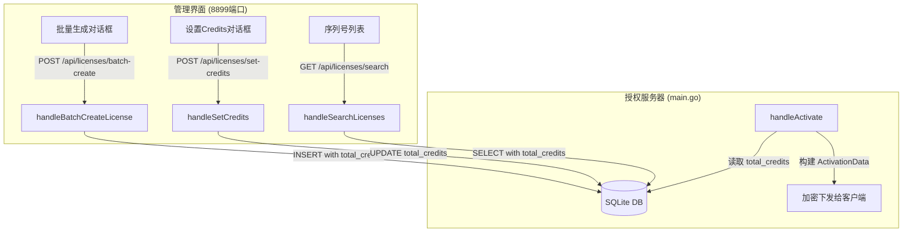

# 设计文档：授权服务器 Credits 支持

## 概述

在授权服务器（`tools/license_server/main.go`）中添加 credits 模式支持。改动范围包括：数据库 schema 迁移、License 和 ActivationData 结构体扩展、创建/查询/修改 API 的参数扩展，以及管理界面（`templates/licenses.go`）的交互改造。所有改动集中在单个 Go 文件和单个模板文件中，不涉及新文件创建。

## 架构

整体架构不变。改动路径如下：



改动点清单：
1. 数据库迁移：`licenses` 表添加 `total_credits` 列
2. `License` 结构体：添加 `TotalCredits` 字段
3. `ActivationData` 结构体：添加 `TotalCredits` 字段
4. `handleCreateLicense`：接受 `total_credits` 参数
5. `handleBatchCreateLicense`：接受 `total_credits` 参数
6. `handleActivate`：查询并填入 `total_credits`
7. `handleSearchLicenses`：查询并返回 `total_credits`
8. 新增 `handleSetCredits` API 端点
9. `templates/licenses.go`：批量生成对话框增加模式选择、列表展示 credits 信息、新增设置 Credits 对话框

## 组件与接口

### 1. 数据库迁移（`main.go` 初始化部分）

在现有迁移代码块（约 367 行附近）中追加：

```go
db.Exec("ALTER TABLE licenses ADD COLUMN total_credits FLOAT DEFAULT 0")
```

遵循现有迁移模式——SQLite 的 `ALTER TABLE ADD COLUMN` 在列已存在时会报错但不影响运行，与现有代码一致。

### 2. License 结构体（`main.go` 约 125 行）

新增字段：

```go
type License struct {
    // ... 现有字段 ...
    TotalCredits   float64   `json:"total_credits"`   // Credits 总量，0 = 不使用 credits 模式
}
```

### 3. ActivationData 结构体（`main.go` 约 180 行）

新增字段：

```go
type ActivationData struct {
    // ... 现有字段 ...
    TotalCredits float64 `json:"total_credits"` // Credits 总量，0 = 每日限制模式
}
```

### 4. handleCreateLicense（`main.go` 约 1270 行）

请求结构体新增 `TotalCredits float64` 字段。负值校验后写入数据库：

```go
if req.TotalCredits < 0 {
    req.TotalCredits = 0
}
```

INSERT 语句增加 `total_credits` 列。

### 5. handleBatchCreateLicense（`main.go` 约 1340 行）

请求结构体新增 `TotalCredits float64` 字段。同样的负值校验。INSERT 语句增加 `total_credits` 列。

### 6. handleActivate（`main.go` 约 3805 行）

- SELECT 查询增加 `COALESCE(total_credits, 0)` 列
- Scan 增加 `&license.TotalCredits`
- 构建 ActivationData 时设置 `TotalCredits: license.TotalCredits`

### 7. handleSearchLicenses（`main.go` 约 1748 行）

- SELECT 查询增加 `COALESCE(total_credits, 0)` 列
- Scan 增加 `&l.TotalCredits`

### 8. handleSetCredits（新增 API）

新增 API 端点 `POST /api/licenses/set-credits`，遵循 `handleSetDailyAnalysis` 的模式：

```go
func handleSetCredits(w http.ResponseWriter, r *http.Request) {
    var req struct {
        SN           string  `json:"sn"`
        TotalCredits float64 `json:"total_credits"`
    }
    // 解码、负值校验（< 0 则设为 0）
    // UPDATE licenses SET total_credits=? WHERE sn=?
    // 返回 {"success": true}
}
```

路由注册：`mux.HandleFunc("/api/licenses/set-credits", authMiddleware(handleSetCredits))`

### 9. Admin UI 模板改动（`templates/licenses.go`）

#### 9.1 批量生成对话框（`showBatchCreate` 函数）

在"每日分析次数"输入框之前，添加模式选择单选按钮：

```html
<div>
  <label class="text-sm text-slate-600">授权模式</label>
  <div class="flex gap-4 mt-1">
    <label class="flex items-center gap-1">
      <input type="radio" name="batch-mode" value="daily" checked onchange="toggleBatchMode()">
      <span class="text-sm">每日限制</span>
    </label>
    <label class="flex items-center gap-1">
      <input type="radio" name="batch-mode" value="credits" onchange="toggleBatchMode()">
      <span class="text-sm">Credits</span>
    </label>
  </div>
</div>
```

`toggleBatchMode()` 函数控制显示/隐藏：
- "每日限制"选中时：显示 `batch-daily` 输入框，隐藏 `batch-credits` 输入框
- "Credits"选中时：显示 `batch-credits` 输入框，隐藏 `batch-daily` 输入框

#### 9.2 `doBatchCreate` 函数

根据选中的模式设置参数：
- Credits 模式：`total_credits = 输入值`，`daily_analysis = 0`
- 每日限制模式：`total_credits = 0`，`daily_analysis = 输入值`

#### 9.3 序列号列表（`loadLicenses` 函数）

修改显示逻辑，在构建每个序列号的 HTML 时：

```javascript
// 替换原有的每日分析显示逻辑
var creditsInfo = '';
if (l.total_credits > 0) {
    creditsInfo = 'Credits: ' + l.total_credits;
} else {
    creditsInfo = '每日分析: ' + (l.daily_analysis === 0 ? '无限' : l.daily_analysis + '次');
}
```

#### 9.4 设置 Credits 对话框

新增 `setCredits(sn, current)` 和 `doSetCredits(sn)` 函数，遵循 `setDailyAnalysis` 的模式：

```javascript
function setCredits(sn, current) {
    showModal('...' +
        '<input type="number" id="credits-value" value="' + current + '" step="0.5">' +
        '...');
}

function doSetCredits(sn) {
    var credits = parseFloat(document.getElementById('credits-value').value) || 0;
    fetch('/api/licenses/set-credits', {
        method: 'POST',
        headers: {'Content-Type': 'application/json'},
        body: JSON.stringify({sn: sn, total_credits: credits})
    }).then(function() { hideModal(); loadLicenses(licenseCurrentPage, licenseSearchTerm); });
}
```

在序列号操作按钮区域添加"Credits"按钮。

## 数据模型

### licenses 表 Schema 变更

| 列名 | 类型 | 默认值 | 说明 |
|------|------|--------|------|
| `total_credits` | FLOAT | 0 | Credits 总量，0 表示不使用 credits 模式 |

### License 结构体变更

| 字段 | 类型 | JSON 标签 | 说明 |
|------|------|-----------|------|
| `TotalCredits` | `float64` | `total_credits` | Credits 总量 |

### ActivationData 结构体变更

| 字段 | 类型 | JSON 标签 | 说明 |
|------|------|-----------|------|
| `TotalCredits` | `float64` | `total_credits` | Credits 总量，客户端据此判定模式 |

### API 请求/响应变更

#### POST /api/licenses/batch-create（请求新增字段）

| 字段 | 类型 | 说明 |
|------|------|------|
| `total_credits` | `float64` | Credits 总量，可选，默认 0 |

#### POST /api/licenses/create（请求新增字段）

| 字段 | 类型 | 说明 |
|------|------|------|
| `total_credits` | `float64` | Credits 总量，可选，默认 0 |

#### POST /api/licenses/set-credits（新增端点）

请求：

| 字段 | 类型 | 说明 |
|------|------|------|
| `sn` | `string` | 序列号 |
| `total_credits` | `float64` | 新的 credits 值 |

响应：`{"success": true}` 或 `{"success": false, "error": "..."}`

#### GET /api/licenses/search（响应新增字段）

每个 license 对象新增：

| 字段 | 类型 | 说明 |
|------|------|------|
| `total_credits` | `float64` | Credits 总量 |


## 正确性属性

*属性是一种在系统所有有效执行中都应成立的特征或行为——本质上是关于系统应该做什么的形式化陈述。属性是人类可读规范与机器可验证正确性保证之间的桥梁。*

### Property 1: 结构体 JSON 序列化往返一致性

*For any* 有效的 License 或 ActivationData 实例（包含任意非负 `total_credits` 值），将其序列化为 JSON 再反序列化回来，`total_credits` 字段的值应与原始值相等。

**Validates: Requirements 1.3, 2.1**

### Property 2: 创建序列号后 total_credits 存储一致性

*For any* 非负的 `total_credits` 值，通过单个创建或批量创建 API 创建序列号后，查询该序列号返回的 `total_credits` 应与请求中指定的值相等。

**Validates: Requirements 3.1, 4.1, 6.3**

### Property 3: 激活数据包含正确的 total_credits

*For any* 数据库中存在的序列号（具有任意非负 `total_credits` 值），激活该序列号后解密得到的 ActivationData 中的 `total_credits` 应与数据库中存储的值相等。

**Validates: Requirements 2.2**

### Property 4: 设置 Credits 更新往返一致性

*For any* 已存在的序列号和任意非负 `total_credits` 值，调用 set-credits API 更新后，查询该序列号返回的 `total_credits` 应与提交的值相等。

**Validates: Requirements 7.3**

### Property 5: 批量创建模式互斥性

*For any* 批量创建请求，当 `total_credits > 0` 时 `daily_analysis` 应为 0；当 `daily_analysis > 0` 时 `total_credits` 应为 0。两种模式不应同时生效。

**Validates: Requirements 5.4, 5.5**

### Property 6: 序列号列表显示逻辑一致性

*For any* 序列号数据，当 `total_credits > 0` 时显示文本应包含 "Credits" 且不包含 "每日分析"；当 `total_credits == 0` 时显示文本应包含 "每日分析" 且不包含 "Credits"。

**Validates: Requirements 6.1, 6.2**

## 错误处理

| 场景 | 处理方式 |
|------|----------|
| `total_credits` 为负数（创建/批量创建/设置） | 将其视为 0，不返回错误 |
| `total_credits` 缺失（创建/批量创建请求） | Go 的 JSON 解码默认为 0，即 Daily_Limit_Mode |
| 数据库迁移列已存在 | SQLite `ALTER TABLE ADD COLUMN` 报错但不影响运行，与现有迁移模式一致 |
| set-credits 的序列号不存在 | 返回 `{"success": false, "error": "序列号不存在"}` |
| set-credits 请求格式错误 | 返回 HTTP 400 |

## 测试策略

### 属性测试（Property-Based Testing）

使用 Go 的 `testing/quick` 包进行属性测试，每个属性至少运行 100 次迭代。

每个正确性属性对应一个独立的属性测试函数：

- **Property 1** → `TestPropertyStructJSONRoundTrip` — 生成随机 `TotalCredits` 值，验证 License 和 ActivationData 的 JSON 序列化/反序列化往返一致性
  - Feature: license-server-credits, Property 1: 结构体 JSON 序列化往返一致性
- **Property 2** → `TestPropertyCreateLicenseCreditsStorage` — 生成随机 `total_credits` 值，通过 API 创建序列号后查询验证存储一致性
  - Feature: license-server-credits, Property 2: 创建序列号后 total_credits 存储一致性
- **Property 3** → `TestPropertyActivationDataCredits` — 生成随机 `total_credits` 值的序列号，激活后验证 ActivationData 中的值
  - Feature: license-server-credits, Property 3: 激活数据包含正确的 total_credits
- **Property 4** → `TestPropertySetCreditsRoundTrip` — 生成随机 `total_credits` 值，调用 set-credits API 后查询验证更新一致性
  - Feature: license-server-credits, Property 4: 设置 Credits 更新往返一致性
- **Property 5** → `TestPropertyBatchCreateModeExclusivity` — 生成随机 `total_credits` 和 `daily_analysis` 值，验证互斥性约束
  - Feature: license-server-credits, Property 5: 批量创建模式互斥性
- **Property 6** → `TestPropertyDisplayLogicConsistency` — 生成随机序列号数据，验证显示文本与 `total_credits` 值的一致性
  - Feature: license-server-credits, Property 6: 序列号列表显示逻辑一致性

### 单元测试

单元测试聚焦于具体示例和边界情况：

- `total_credits` 为负数时的校验（创建、批量创建、设置 Credits）
- `total_credits` 缺失时默认为 0
- `total_credits` 为 0 时的显示逻辑（应显示每日分析信息）
- set-credits 序列号不存在时的错误响应
- 数据库迁移在列已存在时不报错
- 批量生成对话框默认选中"每日限制"模式

### 测试配置

- 属性测试：每个属性最少 100 次迭代
- 属性测试库：Go `testing/quick`
- 每个属性测试必须引用设计文档中的属性编号
- 标签格式：`// Feature: license-server-credits, Property N: <property_text>`
