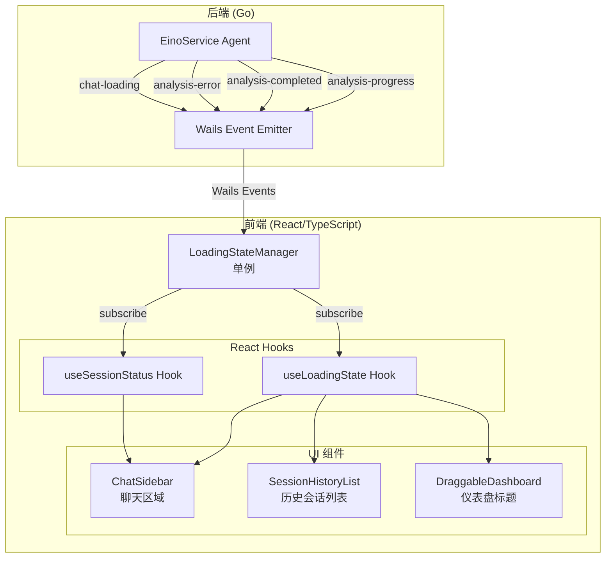

# Design Document: Multi-Session Analysis Status Indicator

## Overview

本设计文档描述了多会话分析状态指示器功能的技术实现方案。该功能扩展现有的 `LoadingStateManager` 以支持多会话并发分析状态管理，并在三个关键位置（聊天区域、历史会话列表、仪表盘标题）提供视觉状态反馈。

设计遵循以下原则：
- **单一数据源**: `LoadingStateManager` 作为所有加载状态的唯一真实来源
- **事件驱动**: 通过订阅机制实现状态变化的响应式更新
- **独立性**: 每个会话的状态相互独立，不会相互干扰
- **向后兼容**: 保持与现有代码的兼容性

## Architecture



## Components and Interfaces

### 1. LoadingStateManager (增强)

扩展现有的 `LoadingStateManager` 以支持更丰富的状态信息和订阅机制。

```typescript
// src/frontend/src/managers/LoadingStateManager.ts

export interface SessionLoadingState {
    threadId: string;
    isLoading: boolean;
    startTime: number;
    progress?: {
        stage: string;      // 当前阶段: 'initializing' | 'analyzing' | 'generating' | 'complete'
        progress: number;   // 进度百分比 0-100
        message: string;    // 显示消息
        step: number;       // 当前步骤
        total: number;      // 总步骤数
    };
    error?: {
        code: string;
        message: string;
    };
}

export interface LoadingStateManagerInterface {
    // 状态管理
    setLoading(threadId: string, loading: boolean): void;
    updateProgress(threadId: string, progress: SessionLoadingState['progress']): void;
    setError(threadId: string, error: SessionLoadingState['error']): void;
    clearSession(threadId: string): void;
    
    // 状态查询
    isLoading(threadId: string): boolean;
    getSessionState(threadId: string): SessionLoadingState | undefined;
    getLoadingThreadIds(): Set<string>;
    getLoadingCount(): number;
    
    // 订阅机制
    subscribe(listener: LoadingStateListener): () => void;
    subscribeToSession(threadId: string, listener: SessionStateListener): () => void;
}

type LoadingStateListener = (loadingThreadIds: Set<string>) => void;
type SessionStateListener = (state: SessionLoadingState | undefined) => void;
```

### 2. useLoadingState Hook (增强)

增强现有的 React Hook 以提供更多状态信息。

```typescript
// src/frontend/src/hooks/useLoadingState.ts

export interface UseLoadingStateResult {
    loadingThreadIds: Set<string>;
    loadingCount: number;
    isAnyLoading: boolean;
    isLoading: (threadId: string) => boolean;
    getProgress: (threadId: string) => SessionLoadingState['progress'] | undefined;
    getError: (threadId: string) => SessionLoadingState['error'] | undefined;
}

export function useLoadingState(): UseLoadingStateResult;
```

### 3. useSessionStatus Hook (新增)

专门用于单个会话状态的 Hook。

```typescript
// src/frontend/src/hooks/useSessionStatus.ts

export interface UseSessionStatusResult {
    isLoading: boolean;
    progress: SessionLoadingState['progress'] | undefined;
    error: SessionLoadingState['error'] | undefined;
    startTime: number | undefined;
    elapsedTime: number;  // 已用时间（毫秒）
}

export function useSessionStatus(threadId: string | null): UseSessionStatusResult;
```

### 4. AnalysisStatusIndicator 组件 (新增)

可复用的状态指示器组件。

```typescript
// src/frontend/src/components/AnalysisStatusIndicator.tsx

export interface AnalysisStatusIndicatorProps {
    threadId: string;
    variant: 'inline' | 'compact' | 'full';  // 不同显示模式
    showMessage?: boolean;
    showProgress?: boolean;
    className?: string;
}

export const AnalysisStatusIndicator: React.FC<AnalysisStatusIndicatorProps>;
```

### 5. GlobalAnalysisStatus 组件 (新增)

仪表盘标题区域的全局状态指示器。

```typescript
// src/frontend/src/components/GlobalAnalysisStatus.tsx

export interface GlobalAnalysisStatusProps {
    className?: string;
}

export const GlobalAnalysisStatus: React.FC<GlobalAnalysisStatusProps>;
```

## Data Models

### SessionLoadingState

```typescript
interface SessionLoadingState {
    threadId: string;           // 会话唯一标识
    isLoading: boolean;         // 是否正在加载
    startTime: number;          // 开始时间戳
    progress?: {
        stage: string;          // 阶段标识
        progress: number;       // 进度 0-100
        message: string;        // 显示消息
        step: number;           // 当前步骤
        total: number;          // 总步骤
    };
    error?: {
        code: string;           // 错误代码
        message: string;        // 错误消息
    };
}
```

### 后端事件数据结构

```typescript
// analysis-progress 事件
interface AnalysisProgressEvent {
    threadId: string;
    stage: string;
    progress: number;
    message: string;
    step: number;
    total: number;
}

// analysis-completed 事件
interface AnalysisCompletedEvent {
    threadId: string;
    messageId: string;
    success: boolean;
}

// analysis-error 事件
interface AnalysisErrorEvent {
    threadId: string;
    code: string;
    message: string;
}

// chat-loading 事件 (增强)
interface ChatLoadingEvent {
    threadId: string;
    loading: boolean;
}
```

## Sequence Diagram


## Correctness Properties

*A property is a characteristic or behavior that should hold true across all valid executions of a system—essentially, a formal statement about what the system should do. Properties serve as the bridge between human-readable specifications and machine-verifiable correctness guarantees.*

Based on the prework analysis, the following correctness properties have been identified:

### Property 1: Session State Independence

*For any* set of concurrent analysis sessions with distinct Thread_IDs, modifying the loading state of one session SHALL NOT affect the loading state of any other session.

**Validates: Requirements 1.5, 2.3, 4.1**

### Property 2: Loading State Lifecycle

*For any* analysis session, the state transitions SHALL follow the lifecycle: not_loading → loading → (complete | error), and the final state SHALL correctly reflect whether the analysis succeeded or failed.

**Validates: Requirements 1.1, 1.3, 4.2, 4.3**

### Property 3: Progress Update Propagation

*For any* progress update event with a valid Thread_ID, the LoadingStateManager SHALL update the corresponding session's progress state, and all subscribers SHALL receive the updated state.

**Validates: Requirements 1.2, 3.4**

### Property 4: Error State Handling

*For any* error event with a valid Thread_ID and error information, the LoadingStateManager SHALL set the session's error state with the provided error details, and the session SHALL no longer be in loading state.

**Validates: Requirements 1.4, 5.3**

### Property 5: Event Routing Correctness

*For any* backend event (progress, completed, error) with a Thread_ID, the event SHALL update only the session matching that Thread_ID, leaving all other sessions unchanged.

**Validates: Requirements 5.1, 5.2, 5.4**

### Property 6: Global Status Aggregation

*For any* state of the LoadingStateManager, the global loading indicator SHALL be visible if and only if at least one session is in loading state (loadingCount > 0).

**Validates: Requirements 3.1, 3.2**

### Property 7: Subscription Notification

*For any* state change in the LoadingStateManager, all registered subscribers SHALL be notified with the updated state, and session-specific subscribers SHALL only receive updates for their subscribed Thread_ID.

**Validates: Requirements 4.4**

### Property 8: Cleanup and Timeout

*For any* session that is deleted or exceeds the timeout duration while in loading state, the LoadingStateManager SHALL remove the session's state and notify subscribers of the removal.

**Validates: Requirements 4.5, 4.6**

### Property 9: Session Switch State Display

*For any* session switch operation, the UI SHALL immediately display the correct loading state (loading/not loading) for the newly active session based on the LoadingStateManager's current state.

**Validates: Requirements 5.5**

## Error Handling

### 1. 网络/后端错误

- **场景**: 后端分析过程中发生错误
- **处理**: 
  - 后端发送 `analysis-error` 事件
  - `LoadingStateManager` 更新会话状态为错误状态
  - UI 显示错误消息，提供重试选项

### 2. 超时处理

- **场景**: 分析任务超过预设时间（默认 2 分钟）
- **处理**:
  - `LoadingStateManager` 自动清除超时的加载状态
  - UI 显示超时提示
  - 记录日志以便调试

### 3. 会话删除时的清理

- **场景**: 用户删除正在分析的会话
- **处理**:
  - 先取消后端分析任务
  - 清除 `LoadingStateManager` 中的会话状态
  - 更新全局状态指示器

### 4. 事件丢失/乱序

- **场景**: 网络问题导致事件丢失或乱序
- **处理**:
  - 使用时间戳验证事件顺序
  - 忽略过期的状态更新
  - 超时机制作为兜底

### 5. 组件卸载时的清理

- **场景**: React 组件在分析进行中被卸载
- **处理**:
  - 在 `useEffect` 清理函数中取消订阅
  - 避免对已卸载组件的状态更新

## Testing Strategy

### 单元测试

单元测试用于验证具体示例和边界情况：

1. **LoadingStateManager 测试**
   - 测试 `setLoading` 方法正确更新状态
   - 测试 `updateProgress` 方法正确更新进度
   - 测试 `clearSession` 方法正确清理状态
   - 测试订阅/取消订阅机制

2. **React Hooks 测试**
   - 测试 `useLoadingState` 返回正确的状态
   - 测试 `useSessionStatus` 返回特定会话的状态
   - 测试状态变化时的重新渲染

3. **组件测试**
   - 测试 `AnalysisStatusIndicator` 在不同状态下的渲染
   - 测试 `GlobalAnalysisStatus` 的显示/隐藏逻辑

### 属性测试

属性测试用于验证通用属性在所有输入下都成立。使用 `fast-check` 库进行属性测试。

**配置要求**:
- 每个属性测试运行最少 100 次迭代
- 测试标签格式: **Feature: multi-session-analysis-status, Property {number}: {property_text}**

**属性测试用例**:

1. **Property 1: Session State Independence**
   - 生成随机数量的会话 ID
   - 随机设置各会话的加载状态
   - 验证修改一个会话不影响其他会话

2. **Property 5: Event Routing Correctness**
   - 生成随机事件（progress/completed/error）
   - 验证事件只更新目标会话

3. **Property 6: Global Status Aggregation**
   - 生成随机的会话状态组合
   - 验证全局状态与加载会话数量的一致性

4. **Property 8: Cleanup and Timeout**
   - 设置短超时时间
   - 验证超时后状态被正确清理

### 集成测试

1. **端到端流程测试**
   - 模拟完整的分析流程
   - 验证状态在各组件间正确传播

2. **并发场景测试**
   - 同时启动多个分析任务
   - 验证各会话状态独立且正确

### 测试工具

- **Jest**: 单元测试框架
- **React Testing Library**: React 组件测试
- **fast-check**: 属性测试库
- **Mock Service Worker (MSW)**: 模拟后端事件
