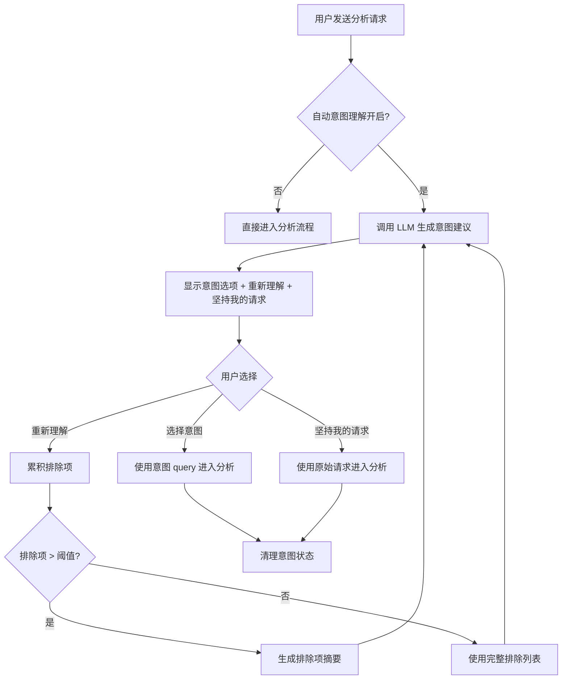

# 设计文档：可重复意图理解

## 概述

本设计文档描述"可重复意图理解"功能的技术实现方案。该功能允许用户在发送分析请求后，通过 LLM 生成多个意图解释，并支持无限次"重新理解"循环，同时提供"坚持我的请求"选项直接使用原始输入。

## 架构



## 组件和接口

### 后端组件 (Go)

#### 1. IntentSuggestion 结构体（已存在）

```go
// IntentSuggestion represents a possible interpretation of user's intent
type IntentSuggestion struct {
    ID          string `json:"id"`
    Title       string `json:"title"`
    Description string `json:"description"`
    Icon        string `json:"icon"`
    Query       string `json:"query"`
}
```

#### 2. ExclusionSummarizer 组件（新增）

```go
// ExclusionSummarizer handles summarization of excluded intent suggestions
type ExclusionSummarizer struct {
    threshold    int    // 触发摘要的阈值，默认 6
    maxLength    int    // 摘要最大长度，默认 500
}

// NewExclusionSummarizer creates a new summarizer
func NewExclusionSummarizer() *ExclusionSummarizer

// NeedsSummarization checks if exclusions need to be summarized
func (s *ExclusionSummarizer) NeedsSummarization(exclusions []IntentSuggestion) bool

// SummarizeExclusions generates a summary of excluded suggestions
func (s *ExclusionSummarizer) SummarizeExclusions(exclusions []IntentSuggestion) string
```

#### 3. GenerateIntentSuggestionsWithExclusions（简化重构）

```go
// GenerateIntentSuggestionsWithExclusions generates intent suggestions
// excluding previously rejected ones
func (a *App) GenerateIntentSuggestionsWithExclusions(
    threadID string,
    userMessage string,
    excludedSuggestions []IntentSuggestion,
) ([]IntentSuggestion, error)
```

### 前端组件 (React/TypeScript)

#### 1. 意图状态管理

```typescript
// State
const [intentSuggestions, setIntentSuggestions] = useState<IntentSuggestion[]>([]);
const [excludedIntentSuggestions, setExcludedIntentSuggestions] = useState<IntentSuggestion[]>([]);
const [isGeneratingIntent, setIsGeneratingIntent] = useState(false);
const [pendingMessage, setPendingMessage] = useState<string>('');
const [pendingThreadId, setPendingThreadId] = useState<string>('');
const [intentMessageId, setIntentMessageId] = useState<string>('');

// Refs (避免闭包问题)
const intentSuggestionsRef = useRef<IntentSuggestion[]>([]);
const excludedIntentSuggestionsRef = useRef<IntentSuggestion[]>([]);
const pendingMessageRef = useRef<string>('');
const pendingThreadIdRef = useRef<string>('');
const intentMessageIdRef = useRef<string>('');
```

#### 2. formatIntentSuggestions 函数（重新实现）

```typescript
/**
 * 格式化意图建议为 Markdown 显示
 * @param suggestions 意图建议列表
 * @param excludedCount 已排除的选项数量
 * @param originalRequest 用户原始请求
 * @param t 国际化翻译函数
 * @returns 格式化后的 Markdown 字符串
 */
function formatIntentSuggestions(
    suggestions: IntentSuggestion[],
    excludedCount: number,
    originalRequest: string,
    t: (key: string) => string
): string
```

#### 3. handleRetryIntentUnderstanding 函数（重新实现）

```typescript
/**
 * 处理"重新理解"按钮点击
 * 1. 将当前意图建议添加到排除列表
 * 2. 调用后端生成新的意图建议
 * 3. 更新 UI 显示
 */
async function handleRetryIntentUnderstanding(): Promise<void>
```

#### 4. handleStickToOriginal 函数（新增）

```typescript
/**
 * 处理"坚持我的请求"按钮点击
 * 1. 使用原始请求进入分析流程
 * 2. 清理所有意图相关状态
 */
async function handleStickToOriginal(): Promise<void>
```

#### 5. clearIntentState 函数（新增）

```typescript
/**
 * 清理所有意图相关状态
 */
function clearIntentState(): void
```

## 数据模型

### 意图建议格式

```typescript
interface IntentSuggestion {
    id: string;          // 唯一标识符
    title: string;       // 简短标题（最多 10 个字）
    description: string; // 详细描述（最多 30 个字）
    icon: string;        // 图标（emoji）
    query: string;       // 具体的分析查询
}
```

### 排除项摘要格式

```
已排除的分析方向：
- 时间趋势分析（月度、季度、年度对比）
- 分类维度分析（按产品、地区、客户类型）
- 统计汇总（总量、平均值、排名）
请从其他角度理解用户意图。
```

## 正确性属性

*正确性属性是一种特征或行为，应该在系统的所有有效执行中保持为真——本质上是关于系统应该做什么的形式化陈述。属性作为人类可读规范和机器可验证正确性保证之间的桥梁。*

### Property 1: 排除项累积正确性

*For any* 意图理解会话，当用户点击"重新理解"按钮 N 次后，排除列表应包含之前所有轮次生成的意图建议总数。

**Validates: Requirements 2.1, 2.2, 2.3**

### Property 2: 状态清理正确性

*For any* 意图理解会话，当用户选择某个意图或点击"坚持我的请求"后，所有意图相关状态（intentSuggestions、excludedIntentSuggestions、pendingMessage、pendingThreadId、intentMessageId）应被清空。

**Validates: Requirements 3.3, 4.2, 8.2**

### Property 3: 意图显示格式正确性

*For any* 意图建议列表，格式化输出应按顺序包含：所有意图选项、"重新理解"按钮、"坚持我的请求"按钮。

**Validates: Requirements 1.2, 3.1, 5.1**

### Property 4: 摘要机制正确性

*For any* 排除项列表，当数量超过阈值时，生成的摘要长度应不超过 500 字符，且摘要应被用于 LLM 提示词而非完整列表。

**Validates: Requirements 6.1, 6.3, 6.4, 6.5**

### Property 5: 意图建议数量正确性

*For any* 意图生成请求，返回的意图建议数量应在 3-5 个之间（除非 LLM 无法生成足够的建议）。

**Validates: Requirements 1.1**

### Property 6: 原始请求保留正确性

*For any* 意图理解会话，当用户点击"坚持我的请求"时，应使用用户的原始请求文本进入分析流程，而非任何意图建议的 query。

**Validates: Requirements 3.2**

### Property 7: 国际化文本完整性

*For any* 意图理解相关的 UI 文本键，应同时存在于中文和英文翻译中。

**Validates: Requirements 9.1**

## 错误处理

### LLM 调用失败

```typescript
try {
    const suggestions = await GenerateIntentSuggestionsWithExclusions(
        threadId, userMessage, excludedSuggestions
    );
    // 处理成功响应
} catch (error) {
    // 显示错误提示
    setToast({
        message: t('intent_generation_failed'),
        type: 'error'
    });
    // 提供"坚持我的请求"选项
    showStickToOriginalOption();
}
```

### 空响应处理

```typescript
if (!suggestions || suggestions.length === 0) {
    // 显示友好提示
    const emptyMessage = t('no_more_suggestions');
    // 自动显示"坚持我的请求"选项
    showStickToOriginalOnly(originalRequest);
}
```

### 排除项过多警告

```typescript
if (excludedSuggestions.length >= 15) {
    setToast({
        message: t('too_many_exclusions_warning'),
        type: 'warning'
    });
}
```

## 测试策略

### 单元测试

1. **ExclusionSummarizer 测试**
   - 测试阈值判断逻辑
   - 测试摘要生成逻辑
   - 测试长度限制

2. **formatIntentSuggestions 测试**
   - 测试正常格式化
   - 测试空列表处理
   - 测试排除数量显示

3. **状态管理测试**
   - 测试状态累积
   - 测试状态清理
   - 测试 refs 同步

### 属性测试

使用 fast-check (TypeScript) 和 testing/quick (Go) 进行属性测试：

1. **Property 1**: 排除项累积正确性
   - 生成随机的意图建议列表
   - 模拟多次"重新理解"操作
   - 验证排除列表长度

2. **Property 2**: 状态清理正确性
   - 生成随机的意图状态
   - 触发清理操作
   - 验证所有状态为空

3. **Property 3**: 意图显示格式正确性
   - 生成随机的意图建议
   - 调用格式化函数
   - 验证输出包含所有必要元素

4. **Property 4**: 摘要机制正确性
   - 生成超过阈值的排除项
   - 调用摘要函数
   - 验证摘要长度和内容

### 集成测试

1. **完整流程测试**
   - 测试从发送请求到选择意图的完整流程
   - 测试多次"重新理解"循环
   - 测试"坚持我的请求"流程

2. **边界情况测试**
   - 测试 LLM 返回空列表
   - 测试 LLM 调用超时
   - 测试排除项过多场景
