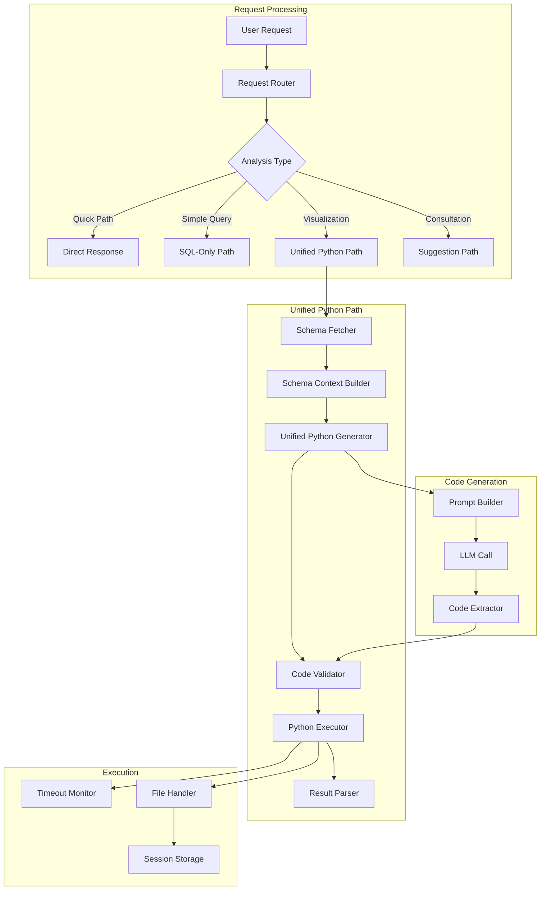

# Design Document: Unified Python Analysis

## Overview

本设计文档描述了统一Python分析流程优化的技术实现方案。核心目标是将现有的多次LLM调用流程（请求分类→Schema获取→SQL生成→数据处理/可视化）合并为单次LLM调用，直接生成包含完整分析流程的Python代码。

### 当前问题

现有流程存在以下问题：
1. **多次LLM调用**：典型分析需要3-4次LLM调用，每次都有网络延迟
2. **上下文切换开销**：每次调用都需要重新传递上下文
3. **中间结果传递**：SQL结果需要传回LLM再生成Python代码

### 优化方案

新方案将：
1. 一次性获取Schema上下文
2. 单次LLM调用生成完整Python代码（包含SQL执行、数据处理、可视化）
3. 直接执行Python代码得到最终结果

预期效果：从3-4次LLM调用减少到1次，响应时间减少60-70%。

## Architecture



## Components and Interfaces

### 1. UnifiedPythonGenerator

统一Python代码生成器，负责一次性生成完整的分析代码。

```go
// UnifiedPythonGenerator generates complete Python analysis code in a single LLM call
type UnifiedPythonGenerator struct {
    chatModel     model.ChatModel
    dsService     *DataSourceService
    promptBuilder *AnalysisPromptBuilder
    codeValidator *CodeValidator
    logger        func(string)
    metrics       *AnalysisMetrics
}

// GenerateAnalysisCode generates complete Python code for data analysis
func (g *UnifiedPythonGenerator) GenerateAnalysisCode(
    ctx context.Context,
    userRequest string,
    dataSourceID string,
    schemaContext *SchemaContext,
) (*GeneratedCode, error)

// GeneratedCode represents the output of code generation
type GeneratedCode struct {
    Code           string   // Complete Python code
    SQLQueries     []string // Extracted SQL queries for validation
    OutputType     string   // Expected output type: text, table, chart
    EstimatedTime  int      // Estimated execution time in ms
    Assumptions    []string // Assumptions made during generation
}


### 2. SchemaContextBuilder

Schema上下文构建器，负责构建LLM友好的Schema信息。

```go
// SchemaContextBuilder builds optimized schema context for code generation
type SchemaContextBuilder struct {
    dsService    *DataSourceService
    cache        *SchemaCache
    maxTokens    int
    logger       func(string)
}

// SchemaContext represents the schema information for code generation
type SchemaContext struct {
    DataSourceID   string                 `json:"data_source_id"`
    DatabasePath   string                 `json:"database_path"`
    DatabaseType   string                 `json:"database_type"`
    Tables         []TableSchema          `json:"tables"`
    Relationships  []TableRelationship    `json:"relationships"`
    TokenCount     int                    `json:"token_count"`
}

// TableSchema represents a single table's schema
type TableSchema struct {
    Name        string         `json:"name"`
    RowCount    int            `json:"row_count"`
    Columns     []ColumnInfo   `json:"columns"`
    SampleData  []map[string]interface{} `json:"sample_data"`
}

// ColumnInfo represents column metadata
type ColumnInfo struct {
    Name     string `json:"name"`
    Type     string `json:"type"`
    IsPK     bool   `json:"is_pk"`
    IsFK     bool   `json:"is_fk"`
    RefTable string `json:"ref_table,omitempty"`
}

// TableRelationship represents a relationship between tables
type TableRelationship struct {
    FromTable  string `json:"from_table"`
    FromColumn string `json:"from_column"`
    ToTable    string `json:"to_table"`
    ToColumn   string `json:"to_column"`
}

// BuildContext builds schema context for the given data source
func (b *SchemaContextBuilder) BuildContext(
    ctx context.Context,
    dataSourceID string,
    userRequest string,
) (*SchemaContext, error)

// PrioritizeTables selects most relevant tables based on user request
func (b *SchemaContextBuilder) PrioritizeTables(
    tables []string,
    userRequest string,
    maxTables int,
) []string
```

### 3. AnalysisPromptBuilder

分析提示词构建器，负责构建高质量的代码生成提示词。

```go
// AnalysisPromptBuilder builds prompts for unified code generation
type AnalysisPromptBuilder struct {
    templates map[string]*CodeTemplate
}

// CodeTemplate represents a code template for specific analysis types
type CodeTemplate struct {
    Name        string
    Description string
    Structure   string // Template structure with placeholders
    Examples    []string
}

// BuildPrompt constructs the complete prompt for code generation
func (b *AnalysisPromptBuilder) BuildPrompt(
    userRequest string,
    schemaContext *SchemaContext,
    outputFormat string,
) string

// GetTemplate returns the appropriate template for the analysis type
func (b *AnalysisPromptBuilder) GetTemplate(analysisType string) *CodeTemplate
```

### 4. CodeValidator

代码验证器，负责验证生成代码的安全性和正确性。

```go
// CodeValidator validates generated Python code for safety and correctness
type CodeValidator struct {
    allowedImports   []string
    forbiddenPatterns []string
    maxCodeLength    int
}

// ValidationResult represents the result of code validation
type ValidationResult struct {
    Valid       bool
    Errors      []string
    Warnings    []string
    SQLQueries  []string // Extracted SQL queries
    HasChart    bool
    HasExport   bool
}

// ValidateCode checks the generated code for safety and correctness
func (v *CodeValidator) ValidateCode(code string) *ValidationResult

// ValidateSQLQueries ensures all SQL queries are read-only
func (v *CodeValidator) ValidateSQLQueries(queries []string) error

// ExtractSQLQueries extracts SQL queries from Python code
func (v *CodeValidator) ExtractSQLQueries(code string) []string
```

### 5. AnalysisMetrics

分析指标收集器，负责收集性能指标。

```go
// AnalysisMetrics tracks performance metrics for analysis requests
type AnalysisMetrics struct {
    mu              sync.Mutex
    schemaFetchTime time.Duration
    codeGenTime     time.Duration
    executionTime   time.Duration
    llmCallCount    int
    toolCallCount   int
    startTime       time.Time
}

// RecordSchemaFetch records schema fetch timing
func (m *AnalysisMetrics) RecordSchemaFetch(duration time.Duration)

// RecordCodeGeneration records code generation timing
func (m *AnalysisMetrics) RecordCodeGeneration(duration time.Duration)

// RecordExecution records Python execution timing
func (m *AnalysisMetrics) RecordExecution(duration time.Duration)

// IncrementLLMCalls increments the LLM call counter
func (m *AnalysisMetrics) IncrementLLMCalls()

// GetSummary returns a summary of all metrics
func (m *AnalysisMetrics) GetSummary() *MetricsSummary

// MetricsSummary represents aggregated metrics
type MetricsSummary struct {
    TotalDuration    time.Duration `json:"total_duration_ms"`
    SchemaFetchTime  time.Duration `json:"schema_fetch_ms"`
    CodeGenTime      time.Duration `json:"code_gen_ms"`
    ExecutionTime    time.Duration `json:"execution_ms"`
    LLMCallCount     int           `json:"llm_call_count"`
    ToolCallCount    int           `json:"tool_call_count"`
    BaselineEstimate time.Duration `json:"baseline_estimate_ms"`
    Improvement      float64       `json:"improvement_percent"`
}
```

### 6. RequestRouter

请求路由器，负责选择最优执行路径。

```go
// RequestRouter routes analysis requests to the optimal execution path
type RequestRouter struct {
    classifier *RequestClassifier
    logger     func(string)
}

// ExecutionPath represents the chosen execution path
type ExecutionPath string

const (
    PathQuick       ExecutionPath = "quick"        // No LLM needed
    PathSQLOnly     ExecutionPath = "sql_only"     // Direct SQL execution
    PathUnified     ExecutionPath = "unified"      // Unified Python generation
    PathMultiStep   ExecutionPath = "multi_step"   // Traditional multi-step
    PathConsultation ExecutionPath = "consultation" // Suggestion only
)

// RouteRequest determines the optimal execution path
func (r *RequestRouter) RouteRequest(
    userRequest string,
    dataSourceInfo string,
) ExecutionPath

// ShouldUseUnifiedPath checks if unified Python path is appropriate
func (r *RequestRouter) ShouldUseUnifiedPath(userRequest string) bool
```

## Data Models

### Code Template Structure

```python
# === UNIFIED ANALYSIS CODE TEMPLATE ===
# This template is used by the LLM to generate complete analysis code

import sqlite3
import pandas as pd
import matplotlib.pyplot as plt
import matplotlib
matplotlib.use('Agg')
plt.rcParams['font.sans-serif'] = ['Microsoft YaHei', 'SimHei', 'DejaVu Sans']
plt.rcParams['axes.unicode_minus'] = False
import json
import os

# Database path (injected at runtime)
DB_PATH = "{database_path}"
SESSION_DIR = "{session_dir}"

def main():
    conn = None
    try:
        # 1. Connect to database
        conn = sqlite3.connect(DB_PATH)
        
        # 2. Execute SQL query
        sql = """
        {sql_query}
        """
        df = pd.read_sql_query(sql, conn)
        
        # 3. Data processing
        {data_processing}
        
        # 4. Visualization (if needed)
        {visualization}
        
        # 5. Output results
        {output}
        
    except sqlite3.Error as e:
        print(f"数据库错误: {e}")
    except pd.errors.EmptyDataError:
        print("查询结果为空")
    except Exception as e:
        print(f"分析错误: {e}")
    finally:
        if conn:
            conn.close()

if __name__ == "__main__":
    main()
```

### Prompt Template

```markdown
你是一个数据分析专家。请根据用户请求生成完整的Python分析代码。

## 用户请求
{user_request}

## 数据库信息
- 数据库类型: SQLite
- 数据库路径: {database_path}
- 会话目录: {session_dir}

## 数据库Schema
{schema_context}

## 代码要求
1. 代码必须完整可执行，不需要任何修改
2. 使用sqlite3连接数据库，pandas处理数据
3. 如需可视化，使用matplotlib/seaborn，保存为chart.png
4. 所有输出使用中文
5. 包含完整的错误处理
6. 在finally块中关闭数据库连接

## 输出格式
只输出Python代码，不要其他解释。代码用```python和```包裹。

## 示例代码结构
{code_example}
```

### Analysis Type Patterns

```go
// VisualizationPatterns identifies requests that need visualization
var VisualizationPatterns = []string{
    "图", "chart", "可视化", "趋势", "分布", "对比",
    "柱状图", "折线图", "饼图", "散点图",
    "bar chart", "line chart", "pie chart", "scatter",
    "visualization", "plot", "graph",
}

// SimpleQueryPatterns identifies simple data queries
var SimpleQueryPatterns = []string{
    "查询", "列出", "显示", "有多少", "统计",
    "query", "list", "show", "count", "how many",
}

// ConsultationPatterns identifies consultation requests
var ConsultationPatterns = []string{
    "建议", "分析方向", "可以做什么分析",
    "suggest", "recommendation", "what analysis",
}
```

## Correctness Properties

*A property is a characteristic or behavior that should hold true across all valid executions of a system—essentially, a formal statement about what the system should do. Properties serve as the bridge between human-readable specifications and machine-verifiable correctness guarantees.*

### Property 1: Single LLM Call for Unified Analysis

*For any* data analysis request that is routed to the unified Python path, the system SHALL make exactly 1 LLM call for code generation, and the total tool call count SHALL be at most 2 (schema fetch + python execution).

**Validates: Requirements 1.1, 5.5, 8.2**

### Property 2: Generated Code Completeness

*For any* generated Python analysis code, the code SHALL include all required components: sqlite3 database connection, SQL query execution, pandas data processing, and (when visualization is requested) matplotlib chart generation. The code SHALL be executable without additional LLM interactions.

**Validates: Requirements 1.2, 1.4**

### Property 3: Schema Context Accuracy

*For any* generated SQL query within the Python code, all referenced table names and column names SHALL exist in the provided Schema_Context. The query SHALL only reference columns that are present in the schema.

**Validates: Requirements 1.3, 3.1, 3.3**

### Property 4: Code Template Structure Validation

*For any* generated Python code, the code SHALL contain: (1) import statements for required libraries, (2) database connection with parameterized path, (3) try-except blocks for error handling, (4) finally block with connection cleanup, and (5) Chinese error messages.

**Validates: Requirements 2.1, 2.2, 2.3, 2.4, 2.5**

### Property 5: Schema Caching Round-Trip

*For any* data source ID, if BuildContext is called twice within the cache TTL period, the second call SHALL return the same SchemaContext content as the first call and SHALL indicate a cache hit.

**Validates: Requirements 3.4**

### Property 6: Result Structure Completeness

*For any* successful Python code execution, the parsed Execution_Result SHALL include: text summary (always), data tables (if query returns data), and chart file paths (if visualization was generated). The result SHALL support text, markdown table, JSON, and image path formats.

**Validates: Requirements 4.1, 4.2, 4.5**

### Property 7: Request Routing Correctness

*For any* user request, the RequestRouter SHALL route: (1) visualization requests to unified Python path, (2) simple queries without visualization to SQL-only path, (3) consultation requests to suggestion path, and (4) quick path requests (time, calculation) to direct response.

**Validates: Requirements 5.1, 5.2, 5.3, 5.4**

### Property 8: Code Safety Validation

*For any* generated Python code, the CodeValidator SHALL verify: (1) code only accesses the specified database file and session directory, (2) code contains no system commands, file deletions, or unauthorized network operations, and (3) all SQL queries are read-only (SELECT statements only).

**Validates: Requirements 6.1, 6.2, 6.3**

### Property 9: Execution Timeout Enforcement

*For any* Python code execution, the system SHALL enforce a timeout limit. If execution exceeds the timeout, the system SHALL terminate the process and return an error. If code attempts unsafe operations, execution SHALL be blocked.

**Validates: Requirements 6.4, 6.5**

### Property 10: Performance Metrics Logging

*For any* analysis request using the unified path, the system SHALL log timing metrics for schema fetch, code generation, and execution phases. Upon completion, the system SHALL log total duration and emit progress updates during long-running analyses.

**Validates: Requirements 8.1, 8.3, 8.4, 8.5**

## Error Handling

### Code Generation Errors

| Error Condition | Handling Strategy |
|----------------|-------------------|
| LLM timeout | Return error with retry suggestion |
| Invalid code generated | Log error, attempt regeneration with simplified prompt |
| Code too long (>500 lines) | Truncate and warn, suggest breaking into steps |
| Missing schema context | Return error with schema fetch suggestion |

### Code Validation Errors

| Error Condition | Handling Strategy |
|----------------|-------------------|
| Unsafe code detected | Block execution, return security error |
| Non-SELECT SQL detected | Block execution, return read-only error |
| Invalid imports | Remove unsafe imports, warn user |
| Syntax errors | Return error with fix suggestions |

### Execution Errors

| Error Condition | Handling Strategy |
|----------------|-------------------|
| Database connection failure | Return error with path verification suggestion |
| SQL execution error | Return error with SQL syntax hints |
| Python runtime error | Return error with stack trace and fix suggestions |
| Timeout exceeded | Terminate process, return timeout error |
| File I/O error | Return error with permission check suggestion |

### Result Parsing Errors

| Error Condition | Handling Strategy |
|----------------|-------------------|
| Empty output | Return warning, suggest query modification |
| Chart not generated | Return text results only, note missing chart |
| Invalid JSON output | Return raw text output |
| Encoding errors | Force UTF-8, replace invalid characters |

## Testing Strategy

### Unit Tests

Unit tests will focus on specific examples and edge cases:

1. **Code Generator Tests**
   - Test code generation for various analysis types
   - Test handling of ambiguous requests
   - Test code structure validation

2. **Schema Builder Tests**
   - Test schema context building
   - Test table prioritization
   - Test relationship detection

3. **Code Validator Tests**
   - Test SQL extraction
   - Test safety validation
   - Test import validation

4. **Request Router Tests**
   - Test routing for visualization requests
   - Test routing for simple queries
   - Test routing for consultation requests

### Property-Based Tests

Property-based tests will verify universal properties across all inputs. Each test will run a minimum of 100 iterations.

**Testing Framework**: Go's `testing/quick` package for property-based testing.

**Test Configuration**:
- Minimum 100 iterations per property test
- Each test tagged with property reference

**Property Test Implementation**:

```go
// Feature: unified-python-analysis, Property 1: Single LLM Call for Unified Analysis
func TestProperty_SingleLLMCall(t *testing.T) {
    generator := NewUnifiedPythonGenerator(mockModel, mockDS, nil)
    
    f := func(request string) bool {
        if request == "" {
            return true // Skip empty requests
        }
        
        metrics := NewAnalysisMetrics()
        generator.SetMetrics(metrics)
        
        _, err := generator.GenerateAnalysisCode(
            context.Background(),
            request,
            "test-ds",
            mockSchemaContext,
        )
        
        if err != nil {
            return true // Skip errors
        }
        
        summary := metrics.GetSummary()
        return summary.LLMCallCount == 1 && summary.ToolCallCount <= 2
    }
    
    if err := quick.Check(f, &quick.Config{MaxCount: 100}); err != nil {
        t.Error(err)
    }
}

// Feature: unified-python-analysis, Property 4: Code Template Structure Validation
func TestProperty_CodeTemplateStructure(t *testing.T) {
    validator := NewCodeValidator()
    
    f := func(code string) bool {
        if code == "" {
            return true
        }
        
        result := validator.ValidateCode(code)
        if !result.Valid {
            return true // Skip invalid code
        }
        
        // Check required components
        hasImports := strings.Contains(code, "import sqlite3") &&
                      strings.Contains(code, "import pandas")
        hasTryExcept := strings.Contains(code, "try:") &&
                        strings.Contains(code, "except")
        hasFinally := strings.Contains(code, "finally:")
        hasCleanup := strings.Contains(code, "conn.close()")
        
        return hasImports && hasTryExcept && hasFinally && hasCleanup
    }
    
    if err := quick.Check(f, &quick.Config{MaxCount: 100}); err != nil {
        t.Error(err)
    }
}

// Feature: unified-python-analysis, Property 5: Schema Caching Round-Trip
func TestProperty_SchemaCacheRoundTrip(t *testing.T) {
    builder := NewSchemaContextBuilder(mockDS, 30*time.Minute)
    
    f := func(dataSourceID string) bool {
        if dataSourceID == "" {
            return true
        }
        
        // First call
        ctx1, err1 := builder.BuildContext(
            context.Background(),
            dataSourceID,
            "test request",
        )
        if err1 != nil {
            return true
        }
        
        // Second call (should be cached)
        ctx2, err2 := builder.BuildContext(
            context.Background(),
            dataSourceID,
            "test request",
        )
        if err2 != nil {
            return true
        }
        
        // Verify same content
        return ctx1.TokenCount == ctx2.TokenCount &&
               len(ctx1.Tables) == len(ctx2.Tables)
    }
    
    if err := quick.Check(f, &quick.Config{MaxCount: 100}); err != nil {
        t.Error(err)
    }
}

// Feature: unified-python-analysis, Property 7: Request Routing Correctness
func TestProperty_RequestRoutingCorrectness(t *testing.T) {
    router := NewRequestRouter(nil)
    
    f := func(request string) bool {
        if request == "" {
            return true
        }
        
        path := router.RouteRequest(request, "")
        
        // Visualization requests should go to unified path
        if containsVisualizationKeyword(request) {
            return path == PathUnified
        }
        
        // Consultation requests should not go to unified path
        if containsConsultationKeyword(request) {
            return path == PathConsultation
        }
        
        return true // Other paths are acceptable
    }
    
    if err := quick.Check(f, &quick.Config{MaxCount: 100}); err != nil {
        t.Error(err)
    }
}

// Feature: unified-python-analysis, Property 8: Code Safety Validation
func TestProperty_CodeSafetyValidation(t *testing.T) {
    validator := NewCodeValidator()
    
    f := func(code string) bool {
        result := validator.ValidateCode(code)
        
        // Check for unsafe patterns
        hasSystemCmd := strings.Contains(code, "os.system") ||
                        strings.Contains(code, "subprocess")
        hasFileDelete := strings.Contains(code, "os.remove") ||
                         strings.Contains(code, "shutil.rmtree")
        hasNetwork := strings.Contains(code, "requests.") ||
                      strings.Contains(code, "urllib")
        
        if hasSystemCmd || hasFileDelete || hasNetwork {
            return !result.Valid // Should be invalid
        }
        
        return true
    }
    
    if err := quick.Check(f, &quick.Config{MaxCount: 100}); err != nil {
        t.Error(err)
    }
}
```

### Integration Tests

Integration tests will verify end-to-end flows:

1. **Unified Analysis Flow**
   - Submit visualization request
   - Verify single LLM call
   - Verify code execution
   - Verify chart generation

2. **Performance Comparison**
   - Compare unified path vs multi-step path
   - Measure timing improvements
   - Verify metrics logging

3. **Error Recovery**
   - Test with invalid schema
   - Test with failing code
   - Test timeout handling
