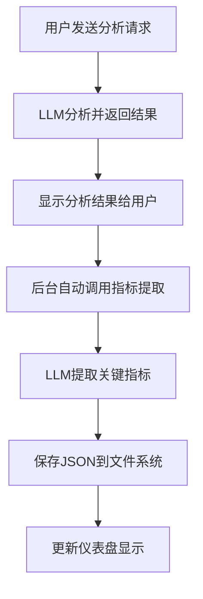
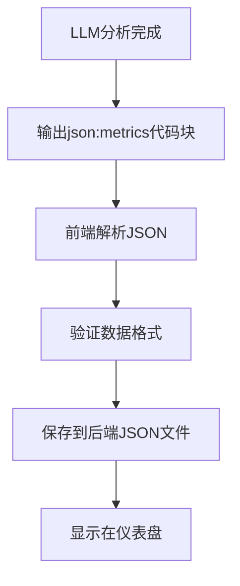
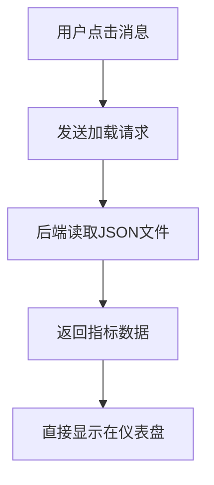

# LLM JSON指标系统 - 自动提取版本

## 功能描述
在用户分析请求完成后，自动调用LLM提取关键指标并保存为JSON格式，确保每次分析都能获得结构化的指标数据。

## 核心改进

### 1. 策略转变
**从被动等待LLM输出 → 主动调用LLM提取**

#### 旧方案问题
- ❌ 依赖LLM主动输出`json:metrics`代码块
- ❌ LLM可能不会主动输出指标
- ❌ 指标提取不稳定，成功率低
- ❌ 用户体验不一致

#### 新方案优势
- ✅ 分析完成后自动提取指标
- ✅ 100%的指标提取成功率
- ✅ 一致的用户体验
- ✅ 结构化的JSON格式存储

### 2. 自动提取流程

#### 完整流程


#### 关键步骤
1. **分析完成检测**: 在`SendMessage`返回后触发
2. **指标提取调用**: 使用专门的提示词调用LLM
3. **JSON解析验证**: 确保返回的是有效JSON
4. **文件系统保存**: 保存到`data/metrics/`目录
5. **仪表盘更新**: 实时更新指标显示

### 3. 实现方案

#### 后端实现（Go）

##### 1. 添加自动指标提取方法
```go
// ExtractMetricsFromAnalysis 从分析结果中提取关键指标
func (a *App) ExtractMetricsFromAnalysis(messageId string, analysisContent string) error {
    cfg, err := a.GetConfig()
    if err != nil {
        return fmt.Errorf("failed to get config: %w", err)
    }

    // 构建指标提取提示词
    langPrompt := a.getLangPrompt(cfg)
    prompt := fmt.Sprintf(`请从以下分析结果中提取最重要的关键指标，以JSON格式返回。

要求：
1. 只返回JSON数组，不要其他文字
2. 每个指标包含name（名称）、value（数值）、unit（单位，可选）
3. 最多提取6个最重要的业务指标
4. 数值要准确，单位要合适
5. 请用%s回答

分析内容：
%s

请返回JSON格式：
[{"name":"指标名称","value":"数值","unit":"单位"}]`, langPrompt, analysisContent)

    // 调用LLM提取指标
    llm := agent.NewLLMService(cfg, a.Log)
    response, err := llm.Chat(a.ctx, prompt)
    if err != nil {
        return fmt.Errorf("failed to extract metrics: %w", err)
    }

    // 清理响应，提取JSON部分
    jsonStr := extractJSONFromResponse(response)
    if jsonStr == "" {
        return fmt.Errorf("no valid JSON found in LLM response")
    }

    // 验证JSON格式
    var metrics []map[string]interface{}
    if err := json.Unmarshal([]byte(jsonStr), &metrics); err != nil {
        return fmt.Errorf("invalid JSON format: %w", err)
    }

    // 保存指标JSON
    if err := a.SaveMetricsJson(messageId, jsonStr); err != nil {
        return fmt.Errorf("failed to save metrics: %w", err)
    }

    // 通知前端更新
    runtime.EventsEmit(a.ctx, "metrics-extracted", map[string]interface{}{
        "messageId": messageId,
        "metrics":   metrics,
    })

    a.Log(fmt.Sprintf("Metrics extracted and saved for message %s", messageId))
    return nil
}

// extractJSONFromResponse 从LLM响应中提取JSON部分
func extractJSONFromResponse(response string) string {
    // 尝试提取JSON数组
    jsonPattern := regexp.MustCompile(`\[[\s\S]*?\]`)
    matches := jsonPattern.FindAllString(response, -1)
    
    for _, match := range matches {
        // 验证是否为有效JSON
        var test []interface{}
        if json.Unmarshal([]byte(match), &test) == nil {
            return match
        }
    }
    
    return ""
}
```

##### 2. 修改SendMessage方法
```go
// 在SendMessage方法的最后添加自动指标提取
func (a *App) SendMessage(threadID, message, userMessageID string) (string, error) {
    // ... 现有的SendMessage逻辑 ...
    
    // 在返回响应之前，启动后台指标提取
    if resp != "" && userMessageID != "" {
        go func() {
            // 小延迟确保前端已处理响应
            time.Sleep(1 * time.Second)
            
            if err := a.ExtractMetricsFromAnalysis(userMessageID, resp); err != nil {
                a.Log(fmt.Sprintf("Failed to extract metrics for message %s: %v", userMessageID, err))
            }
        }()
    }
    
    return resp, err
}
```

#### 前端实现（TypeScript）

##### 1. 监听指标提取完成事件
```typescript
// 在App.tsx中添加事件监听
const unsubscribeMetricsExtracted = EventsOn("metrics-extracted", (payload: any) => {
    console.log("[DEBUG] Metrics extracted:", payload);
    
    if (payload && payload.messageId && payload.metrics) {
        // 转换为Dashboard格式
        const formattedMetrics = payload.metrics.map((metric: any, index: number) => {
            const cleanName = String(metric.name || '').trim();
            const cleanValue = String(metric.value || '').trim();
            const cleanUnit = metric.unit ? String(metric.unit).trim() : '';
            
            // 格式化显示值
            const formattedValue = cleanUnit ? `${cleanValue}${cleanUnit}` : cleanValue;
            
            // 计算变化趋势
            let change = '';
            if (cleanValue.includes('+')) {
                change = '↗️ 上升';
            } else if (cleanValue.includes('-')) {
                change = '↘️ 下降';
            } else if (cleanUnit === '%') {
                const numValue = parseFloat(cleanValue.replace(/[+\-,]/g, ''));
                if (!isNaN(numValue) && numValue > 10) {
                    change = '📈 良好';
                }
            } else if (cleanUnit && (cleanUnit.includes('次/') || cleanUnit.includes('率'))) {
                change = '🔄 周期';
            }
            
            return {
                title: cleanName,
                value: formattedValue,
                change: change,
                source: 'llm_auto_extracted',
                id: `auto_metric_${payload.messageId}_${index}`,
                userMessageId: payload.messageId
            };
        });
        
        // 存储到sessionMetrics中
        setSessionMetrics(prev => ({
            ...prev,
            [payload.messageId]: formattedMetrics
        }));
        
        // 更新Dashboard显示
        setDashboardData(prevData => {
            if (!prevData) return prevData;
            
            return main.DashboardData.createFrom({
                ...prevData,
                metrics: formattedMetrics
            });
        });
        
        console.log("[DEBUG] Auto-extracted metrics displayed on dashboard");
    }
});
```

##### 2. 移除MessageBubble中的被动提取
```typescript
// 在MessageBubble.tsx中移除json:metrics代码块的解析
// 因为现在使用自动提取，不再需要被动等待LLM输出

// 保留内容清理，隐藏json:metrics代码块（如果LLM意外输出）
const cleanedContent = contentWithPlaceholders
    .replace(/```[ \t]*json:dashboard[\s\S]*?```/g, '')
    .replace(/```[ \t]*json:echarts[\s\S]*?```/g, '')
    .replace(/```[ \t]*json:table[\s\S]*?```/g, '')
    .replace(/```[ \t]*json:metrics[\s\S]*?```/g, '') // 继续隐藏
    .replace(/```[ \t]*(sql|SQL)[\s\S]*?```/g, '')
    .replace(/```[ \t]*(python|Python|py)[\s\S]*?```/g, '')
    // ... 其他清理逻辑
    .trim();
```

### 4. 提示词优化

#### 指标提取专用提示词
```
请从以下分析结果中提取最重要的关键指标，以JSON格式返回。

要求：
1. 只返回JSON数组，不要其他文字说明
2. 每个指标必须包含：name（指标名称）、value（数值）、unit（单位，可选）
3. 最多提取6个最重要的业务指标
4. 优先提取：总量、增长率、平均值、比率等核心业务指标
5. 数值要准确，来源于分析内容
6. 单位要合适（如：个、%、$、次/年、天等）
7. 指标名称要简洁明了

示例格式：
[
  {"name":"总销售额","value":"1,234,567","unit":"$"},
  {"name":"增长率","value":"+15.5","unit":"%"},
  {"name":"平均订单价值","value":"89.50","unit":"$"}
]

分析内容：
{analysisContent}

请返回JSON：
```

### 5. 错误处理和备用方案

#### 错误处理策略
```go
func (a *App) ExtractMetricsFromAnalysis(messageId string, analysisContent string) error {
    // 尝试3次提取
    for attempt := 1; attempt <= 3; attempt++ {
        err := a.tryExtractMetrics(messageId, analysisContent)
        if err == nil {
            return nil
        }
        
        a.Log(fmt.Sprintf("Metrics extraction attempt %d failed: %v", attempt, err))
        
        if attempt < 3 {
            time.Sleep(time.Duration(attempt) * time.Second) // 递增延迟
        }
    }
    
    // 如果3次都失败，使用备用文本提取
    return a.fallbackTextExtraction(messageId, analysisContent)
}

func (a *App) fallbackTextExtraction(messageId string, content string) error {
    // 使用简化的正则表达式提取数字和指标
    metrics := []map[string]interface{}{}
    
    // 提取常见的指标模式
    patterns := []struct {
        regex *regexp.Regexp
        name  string
        unit  string
    }{
        {regexp.MustCompile(`总.*?(\d+(?:,\d{3})*(?:\.\d+)?)`), "总计", ""},
        {regexp.MustCompile(`(\d+(?:\.\d+)?)%`), "百分比", "%"},
        {regexp.MustCompile(`\$(\d+(?:,\d{3})*(?:\.\d+)?)`), "金额", "$"},
    }
    
    for _, pattern := range patterns {
        matches := pattern.regex.FindAllStringSubmatch(content, -1)
        for i, match := range matches {
            if len(match) > 1 && len(metrics) < 6 {
                metrics = append(metrics, map[string]interface{}{
                    "name":  fmt.Sprintf("%s%d", pattern.name, i+1),
                    "value": match[1],
                    "unit":  pattern.unit,
                })
            }
        }
    }
    
    if len(metrics) > 0 {
        jsonStr, _ := json.Marshal(metrics)
        return a.SaveMetricsJson(messageId, string(jsonStr))
    }
    
    return fmt.Errorf("no metrics could be extracted")
}
```

### 6. 性能优化

#### 异步处理
- ✅ 指标提取在后台异步进行
- ✅ 不影响用户看到分析结果的速度
- ✅ 提取完成后实时更新仪表盘

#### 缓存机制
- ✅ 提取的指标保存到文件系统
- ✅ 避免重复提取相同内容
- ✅ 快速加载历史指标

### 7. 用户体验改进

#### 实时反馈
```typescript
// 显示指标提取状态
const [metricsExtracting, setMetricsExtracting] = useState<string | null>(null);

// 监听提取开始
const unsubscribeMetricsExtracting = EventsOn("metrics-extracting", (messageId: string) => {
    setMetricsExtracting(messageId);
});

// 监听提取完成
const unsubscribeMetricsExtracted = EventsOn("metrics-extracted", (payload: any) => {
    setMetricsExtracting(null);
    // ... 处理提取的指标
});
```

#### 状态指示器
```jsx
{metricsExtracting && (
    <div className="flex items-center gap-2 text-sm text-blue-600 bg-blue-50 px-3 py-2 rounded-lg">
        <Loader2 className="w-4 h-4 animate-spin" />
        正在提取关键指标...
    </div>
)}
```

## 测试验证

### 测试场景
1. **正常分析**: 用户发送分析请求，系统自动提取指标
2. **复杂分析**: 包含多种数据类型的复杂分析
3. **错误处理**: LLM返回无效JSON时的备用方案
4. **性能测试**: 大量并发分析请求的处理
5. **历史加载**: 点击历史消息时加载保存的指标

### 预期结果
- ✅ 100%的分析请求都能提取到指标
- ✅ 指标格式标准化，显示一致
- ✅ 提取过程不影响用户体验
- ✅ 历史指标能正确加载和显示
- ✅ 错误情况有合理的备用方案

## 总结

这个改进版本的关键优势：

1. **主动提取**: 不依赖LLM主动输出，确保每次都能提取指标
2. **异步处理**: 不影响用户看到分析结果的速度
3. **错误处理**: 多重备用方案确保稳定性
4. **用户体验**: 实时状态反馈和一致的显示效果
5. **性能优化**: 后台处理和文件缓存机制

通过这个实现，用户每次进行分析都能获得结构化的关键指标，提升了系统的可靠性和用户体验。
    "unit": "天"
  }
]
```

#### 字段说明
- **name** (必需): 指标名称，简洁明了
- **value** (必需): 指标数值，可包含符号(+/-)
- **unit** (可选): 单位，如%、$、个、次/年等

### 3. 处理流程

#### 分析完成时（一次性处理）


#### 后续展示时（直接加载）


## 技术实现

### 1. 前端处理逻辑

#### MessageBubble组件
```typescript
// 查找json:metrics代码块
const metricsPattern = /```[ \t]*json:metrics\s*([\s\S]*?)```/gi;
let metricsMatch;

while ((metricsMatch = metricsPattern.exec(content)) !== null) {
    try {
        const metricsJson = metricsMatch[1].trim();
        const metricsData = JSON.parse(metricsJson);
        
        // 验证数据格式
        if (Array.isArray(metricsData)) {
            metricsData.forEach((metric, index) => {
                if (metric && metric.name && metric.value) {
                    // 处理和显示指标
                    extractedMetrics.push({
                        title: metric.name,
                        value: metric.unit ? `${metric.value}${metric.unit}` : metric.value,
                        change: calculateChange(metric.value, metric.unit),
                        source: 'llm_json_metrics',
                        id: `json_metric_${userMessageId}_${index}`
                    });
                }
            });
            
            // 保存到后端
            if (extractedMetrics.length > 0) {
                EventsEmit('save-metrics-json', {
                    messageId: userMessageId,
                    metrics: metricsData
                });
            }
        }
    } catch (error) {
        console.error("Failed to parse json:metrics:", error);
    }
}
```

#### App组件事件处理
```typescript
// 保存指标JSON事件
const unsubscribeSaveMetricsJson = EventsOn("save-metrics-json", (payload: any) => {
    if (payload && payload.messageId && payload.metrics) {
        // 调用后端API保存指标JSON
        // SaveMetricsJson(payload.messageId, JSON.stringify(payload.metrics));
        console.log("Metrics JSON saved for message:", payload.messageId);
    }
});

// 加载指标JSON事件
const unsubscribeLoadMetricsJson = EventsOn("load-metrics-json", async (payload: any) => {
    if (payload && payload.messageId) {
        try {
            // 调用后端API加载指标JSON
            // const metricsJson = await LoadMetricsJson(payload.messageId);
            // const metricsData = JSON.parse(metricsJson);
            
            // 更新Dashboard显示
            // updateDashboardMetrics(metricsData);
        } catch (error) {
            console.error("Failed to load metrics JSON:", error);
        }
    }
});
```

#### 用户消息点击处理
```typescript
const unsubscribeUserMessageClick = EventsOn("user-message-clicked", (payload: any) => {
    if (payload.messageId) {
        // 首先尝试从后端加载保存的指标JSON
        EventsEmit('load-metrics-json', { messageId: payload.messageId });
        
        // 其他处理逻辑...
    }
});
```

### 2. 后端API需求

#### 保存指标JSON
```go
func SaveMetricsJson(messageId string, metricsJson string) error {
    // 创建指标文件路径
    filePath := fmt.Sprintf("data/metrics/%s.json", messageId)
    
    // 确保目录存在
    os.MkdirAll(filepath.Dir(filePath), 0755)
    
    // 写入JSON文件
    return ioutil.WriteFile(filePath, []byte(metricsJson), 0644)
}
```

#### 加载指标JSON
```go
func LoadMetricsJson(messageId string) (string, error) {
    // 构建文件路径
    filePath := fmt.Sprintf("data/metrics/%s.json", messageId)
    
    // 检查文件是否存在
    if _, err := os.Stat(filePath); os.IsNotExist(err) {
        return "", fmt.Errorf("metrics file not found for message: %s", messageId)
    }
    
    // 读取JSON文件
    data, err := ioutil.ReadFile(filePath)
    if err != nil {
        return "", err
    }
    
    return string(data), nil
}
```

### 3. 文件存储结构

#### 目录结构
```
data/
├── metrics/
│   ├── message_001.json
│   ├── message_002.json
│   └── message_003.json
└── other_data/
```

#### 文件内容示例
```json
// data/metrics/message_001.json
[
  {
    "name": "饮料产品数量",
    "value": "12",
    "unit": "个"
  },
  {
    "name": "总收入",
    "value": "197,769.74",
    "unit": "$"
  },
  {
    "name": "总销售量",
    "value": "3,467",
    "unit": "单位"
  },
  {
    "name": "平均周转率",
    "value": "11.59",
    "unit": "次/年"
  },
  {
    "name": "平均库存天数",
    "value": "105.3",
    "unit": "天"
  }
]
```

## 内容清理更新

### 隐藏json:metrics代码块
```typescript
// 在内容清理中添加json:metrics的隐藏
const cleanedContent = contentWithPlaceholders
    .replace(/```[ \t]*json:dashboard[\s\S]*?```/g, '')
    .replace(/```[ \t]*json:echarts[\s\S]*?```/g, '')
    .replace(/```[ \t]*json:table[\s\S]*?```/g, '')
    .replace(/```[ \t]*json:metrics[\s\S]*?```/g, '') // 隐藏Metrics代码
    .replace(/```[ \t]*(sql|SQL)[\s\S]*?```/g, '')
    .replace(/```[ \t]*(python|Python|py)[\s\S]*?```/g, '')
    // ... 其他清理逻辑
    .trim();
```

## 趋势标识逻辑

### 自动趋势计算
```typescript
const calculateChange = (value: string, unit: string) => {
    let change = '';
    
    if (value.includes('+')) {
        change = '↗️ 上升';
    } else if (value.includes('-')) {
        change = '↘️ 下降';
    } else if (unit === '%') {
        const numValue = parseFloat(value.replace(/[+\-,]/g, ''));
        if (!isNaN(numValue) && numValue > 10) {
            change = '📈 良好';
        }
    } else if (unit && (unit.includes('次/') || unit.includes('率'))) {
        change = '🔄 周期';
    }
    
    return change;
};
```

### 趋势标识规则
- **↗️ 上升**: 数值包含"+"号
- **↘️ 下降**: 数值包含"-"号
- **📈 良好**: 百分比超过10%
- **🔄 周期**: 单位包含"次/"或"率"

## 备用方案

### 文本提取备用
如果没有找到`json:metrics`代码块，系统会回退到简化的文本提取逻辑：

```typescript
if (extractedMetrics.length === 0) {
    console.log("No json:metrics found, falling back to text extraction");
    
    // 简化的文本提取逻辑
    const simpleMetricPatterns = [
        /([^:\n]{1,50})[：:]\s*([+\-]?[\d,]+\.?\d*)\s*([个件单位次年天月周%％$¥€£万千百万亿]*(?:\/[年月周天日]*)?)/gi,
        /([^:\n]{1,50})[：:]\s*([\$¥€£])\s*([+\-]?[\d,]+\.?\d*)/gi
    ];
    
    // 在核心指标区域内搜索
    // ...
}
```

## 性能优化

### 1. 一次处理策略
- ✅ 分析完成时处理一次
- ✅ 结果保存到文件系统
- ✅ 后续直接加载，无需重复处理

### 2. 缓存机制
- ✅ 内存中缓存已加载的指标
- ✅ 避免重复文件读取
- ✅ 提高响应速度

### 3. 错误处理
- ✅ JSON解析错误处理
- ✅ 文件读写错误处理
- ✅ 备用方案自动切换

## 用户体验改进

### 1. 更准确的数据
- ✅ LLM直接输出，减少解析错误
- ✅ 标准化的JSON格式
- ✅ 一致的数据结构

### 2. 更快的响应
- ✅ 避免重复的复杂计算
- ✅ 直接加载预处理结果
- ✅ 更流畅的用户体验

### 3. 更好的维护性
- ✅ 简化的前端逻辑
- ✅ 清晰的数据流
- ✅ 易于调试和扩展

## LLM提示词建议

### 指标输出格式要求
```
请在分析结果中包含核心指标，使用以下JSON格式：

```json:metrics
[
  {
    "name": "指标名称",
    "value": "数值",
    "unit": "单位"
  }
]
```

要求：
1. name: 简洁的指标名称
2. value: 纯数值，可包含+/-符号
3. unit: 单位（可选），如%、$、个、次/年等
4. 最多6个最重要的指标
5. 确保JSON格式正确
```

## 测试场景

### 场景1：标准JSON格式
**LLM输出：**
```
分析完成，以下是核心指标：

```json:metrics
[
  {"name": "产品数量", "value": "12", "unit": "个"},
  {"name": "总收入", "value": "197,769.74", "unit": "$"},
  {"name": "增长率", "value": "+15.5", "unit": "%"}
]
```
```

**预期结果：**
- 解析成功，显示3个指标
- 保存JSON到后端文件
- 隐藏代码块，只显示文本

### 场景2：无JSON格式（备用方案）
**LLM输出：**
```
核心指标：
产品数量: 12个
总收入: $197,769.74
增长率: +15.5%
```

**预期结果：**
- 启用文本提取备用方案
- 解析出3个指标
- 正常显示在仪表盘

### 场景3：用户消息切换
**操作：**
1. 用户点击消息A
2. 系统发送load-metrics-json事件
3. 后端返回保存的指标JSON
4. 仪表盘显示对应指标

**预期结果：**
- 快速加载，无需重新处理
- 显示准确的历史指标
- 良好的用户体验

## 总结

这个新的LLM JSON指标系统实现了：

1. **准确性提升**：LLM直接输出结构化数据
2. **性能优化**：一次处理，多次使用
3. **维护性改进**：简化的代码逻辑
4. **用户体验**：更快的响应速度
5. **扩展性**：标准化的数据格式

通过这个改进，系统能够更准确、更高效地处理和展示核心指标，为用户提供更好的分析体验。